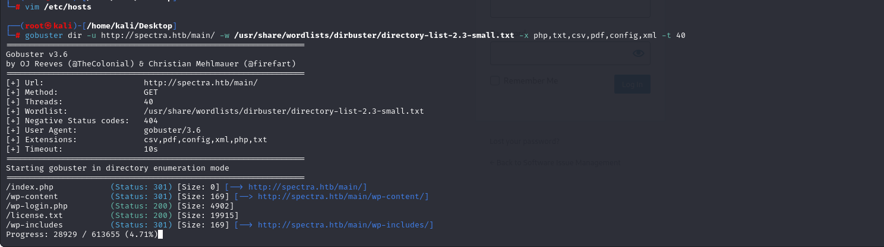

# [Spectra](https://app.hackthebox.com/machines/Spectra)

```bash
nmap -p- --min-rate 10000 10.10.10.229 -Pn 
```


After discovering open ports, let's do greater nmap scan.

```bash
nmap -A -sC -sV -p22,80,3306 10.10.10.229
```


There's home page after visiting this ip address about `Testing` field.

I see that this ip address is resolved into `spectra.htb` domain, let's add this into `/etc/hosts` file.


While looking at `/testing` endpoint, I see a lot of files here.


There's file called `wp_config.php.save` which have sensitive credentials.


devtest: devteam01


While looking at main page, I can't find anything.


Let's do `directory enumeration` via `gobuster` tool.

```bash
gobuster dir -u http://spectra.htb/main/ -w /usr/share/wordlists/dirbuster/directory-list-2.3-small.txt -x php,txt,csv,pdf,config,xml -t 40 
```



While I try login via above credentials, it didn't worked, I changed username from `devtest` into `administrator`, and IT WORKED.


Let's upload our webshell into some location for target web application.


I click `Plugins` -> `Plugin-Editor` and edit file called `akismet.php` , means I add my webshell code into here.


Let's browse our webshell via `curl` command.

```bash
curl http://spectra.htb/main/wp-content/plugins/akismet/akismet.php?cmd=id
```


Let's add our reverse shell here, but `URL-ENCODED`, I use [revshells](https://www.revshells.com/).


I paste this payload into web application.


I got reverse shell from port (1337).


Let's make interactive shell.
```bash
python3 -c 'import pty; pty.spawn("/bin/bash")'
Ctrl+Z
stty raw -echo; fg
export TERM=xterm
export SHELL=bash
```


I found interesting file called `autologin.conf.orig` on `/opt` directory.


I read file called `passwd` from `/etc/autologin` directory.


Maybe this password of one user from this time.

Password: SummerHereWeCome!!

There's possible users are listed below.
```bash
chronos
katie
nginx
root
user
```

Let's check this password via this user means `Password Spray` attack by using `crackmapexec` tool.

```bash
crackmapexec ssh 10.10.10.229 -u users -p 'SummerHereWeCome!!' --continue-on-success
```


That's password of `katie` user.

katie: SummerHereWeCome!!


user.txt


For privilege escalation, I just run `sudo -l` command and see privileges of this user.


I found this [blog](https://isharaabeythissa.medium.com/sudo-privileges-at-initctl-privileges-escalation-technique-ishara-abeythissa-c9d44ccadcb9) for privilege escalation.

This binary executes files from `/etc/init` folder.

I change content of `test.conf` file from this folder like below.

So that I give `SUID` privilege to `/bin/bash` binary to get root shell.

Let's run `initctl` binary.
```bash
sudo /sbin/initctl start test
```


If we type `/bin/bash -p` to terminal, we got root shell.

root.txt

