# [Stocker](https://app.hackthebox.com/machines/stocker)

```bash
nmap -p- --min-rate 5000 10.10.11.196 -Pn  
```

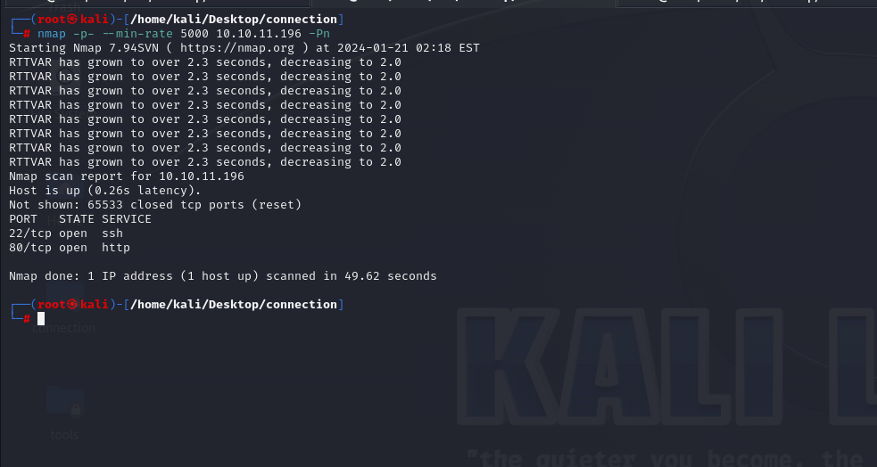


After discovering open ports, let's do greater nmap scan.

```bash
nmap -A -sC -sV -p22,80 10.10.11.196  
```

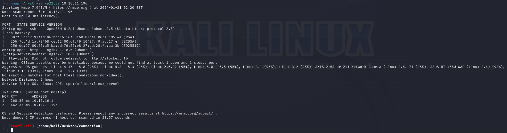


From nmap scan, we also see this ip address is resolved into `stocker.htb`, let's add this into `/etc/hosts` file.

Our web application is like that.


Let's do subdomain enumeration via `ffuf` command.
```bash
ffuf -u http://10.10.11.196 -H "Host: FUZZ.stocker.htb" -w /usr/share/seclists/Discovery/DNS/subdomains-top1million-20000.txt -mc all -ac
```

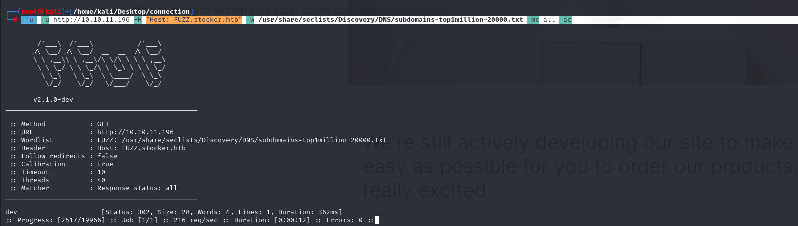

Let's add `dev.stocker.htb` into `/etc/hosts` file also.

We have application and login page confronts us.

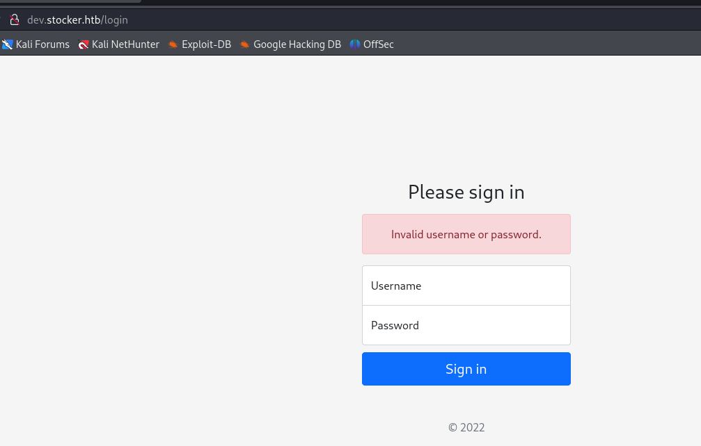

Let's look at requests via `zap` try to add injections.

That's results of `wapanalyzer`.

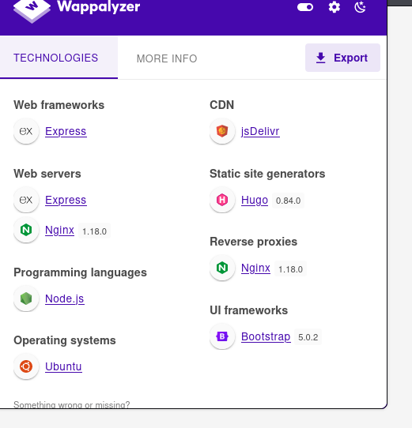


Request&Response body is like that.

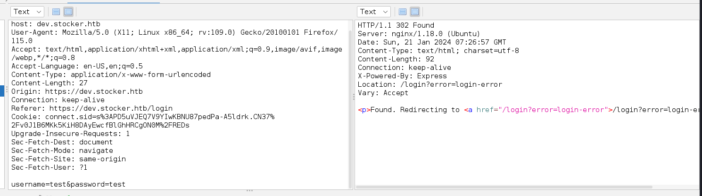


From my enumeration, it is `MERN` application, that's why we can inject `JSON` data and it will be `NoSQLI` payloads.

To do this,

1.First, we need to change `Content-Type` header into `application/json`.

2.Then, enter data as `JSON` standard.

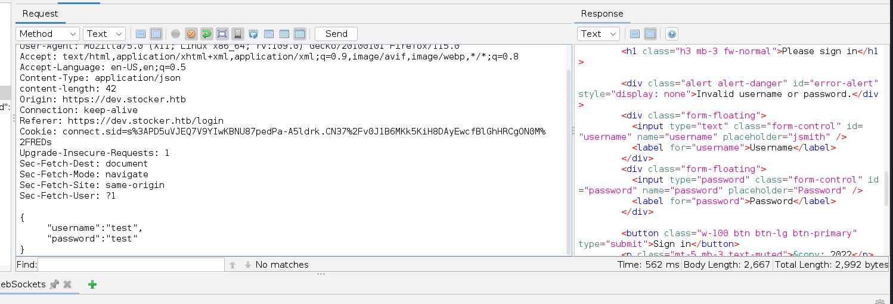


Now, it's time to add `NoSQLI` payloads as below which means `not equal` to this value.
```json
{"username":{"$ne": "dr4ks"}, "password": {"$ne":"dr4ks"}}
```

Now, we are successfully bypass authentication.

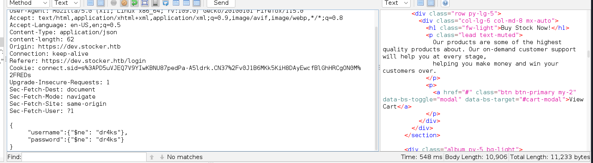


We have such an application after authentication.

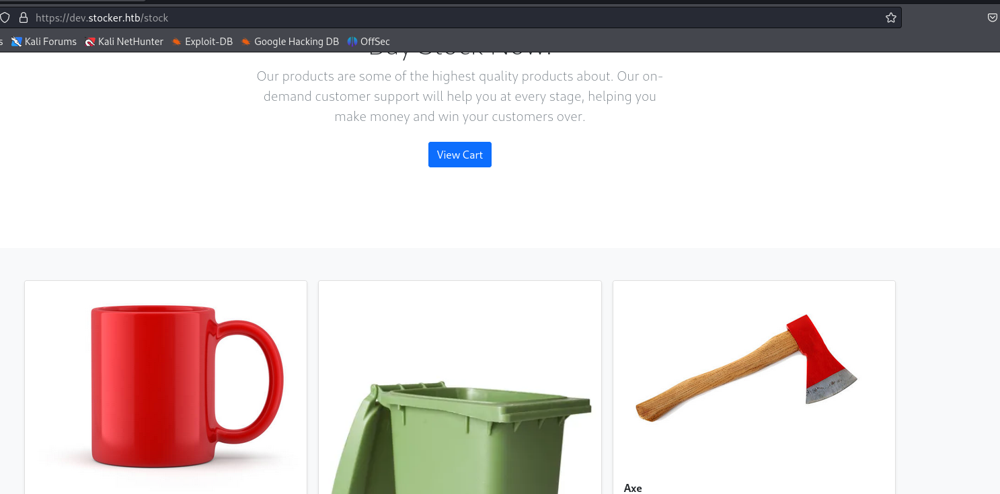


There's feature that after buying some item, there's PDF file generated which actually information of item about your payment.

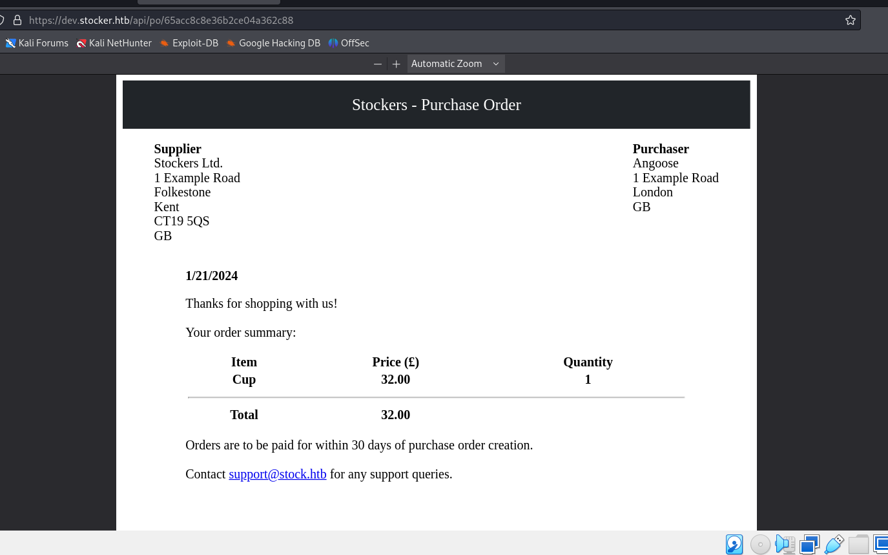


I looked at all requests while this processis happening and find interesting `/api/order` endpoint.

Let's inject some data into here.

I just delete some value of keys in `json` structure and see that where application is running.

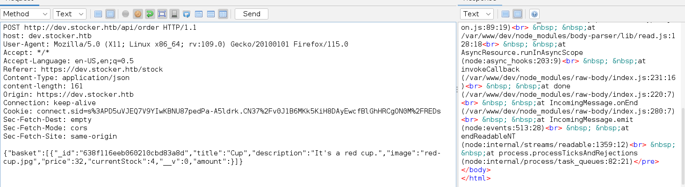


Let's inject some payloads to write into `.pdf` file. For below payload, I add `\`(backslash) due to escaping `"` characters.

```bash

```

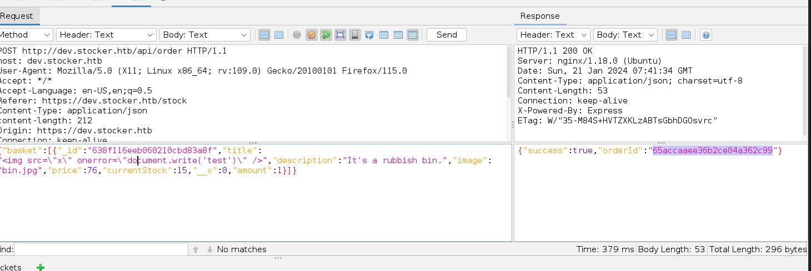


It gives me orderId, while browsing this id, I see that `test` word is written into `.pdf` file.

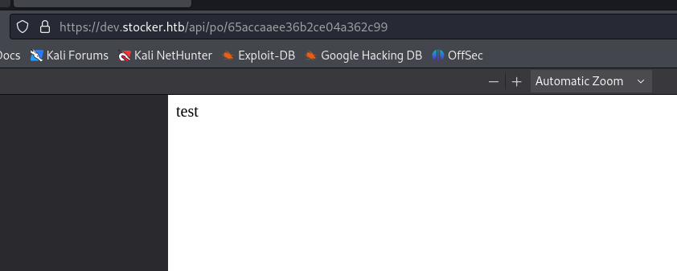


Now, let's add payload to read `index.js` file of application.
```html
</iframe>')\" />
```

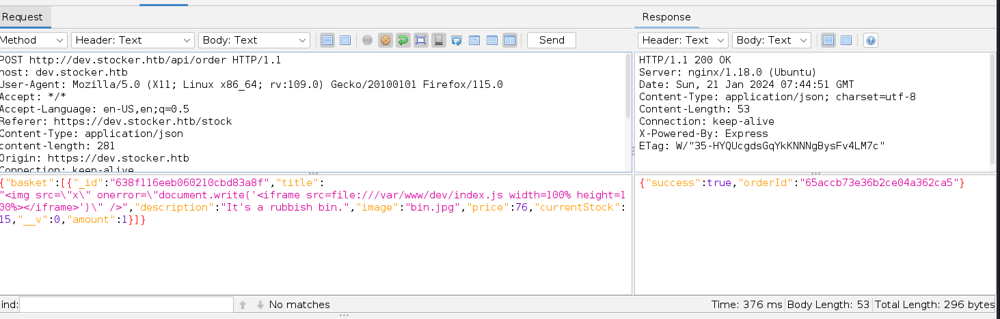


I read content of this file by browsing this `orderID`.

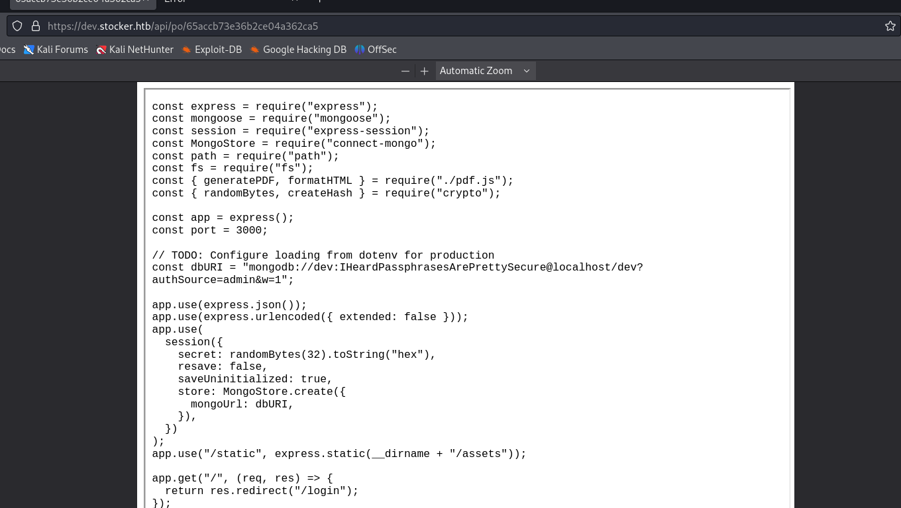


From here, I see `hard-coded` credentials.

dev:IHeardPassphrasesArePrettySecure


I also read file `/etc/passwd` to get usernames of machine, that's why it will be password of `angoose` user.

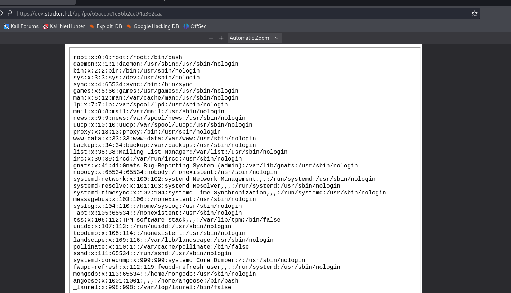


angoose: IHeardPassphrasesArePrettySecure


Let's connect into machine via `ssh`.


user.txt

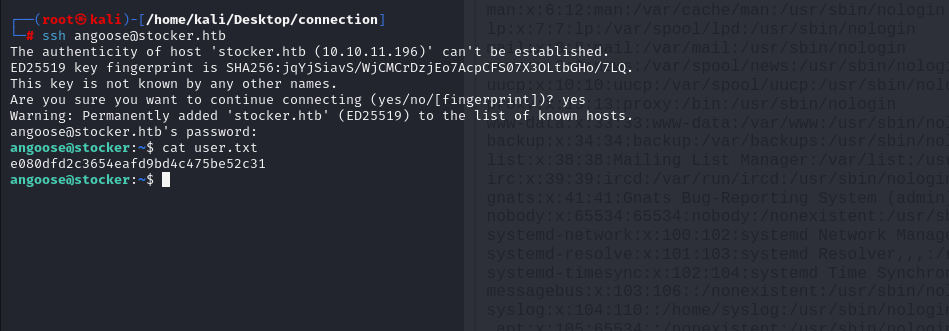


For privilege escalation, I just check `sudo -l` command's result.

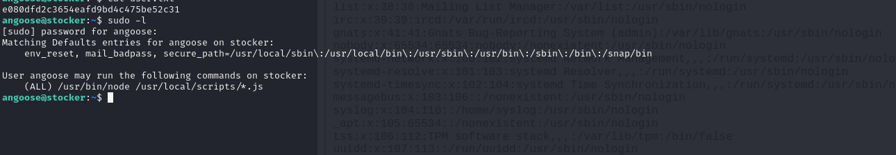

It means, I can run `.js` file via `root` permission, for that I will write malicious `.js` file which copies `/bin/bash` and gives `SUID` permission.

```js
require('child_process').exec('cp /bin/bash /tmp/dr4ks; chown root:root /tmp/dr4ks; chmod 4777 /tmp/dr4ks')
```

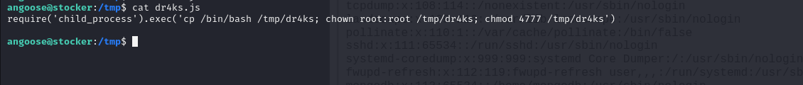

Let's execute this malicious script.
```bash
sudo node /usr/local/scripts/../../../tmp/dr4ks.js 
```

After execution, let's check `SUID` privilege is enabled or not via `ls -al /tmp/dr4ks`.

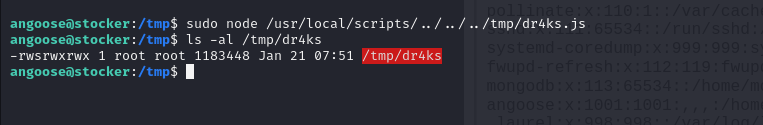

We can run this copied `bash` file via `-p` option.


root.txt

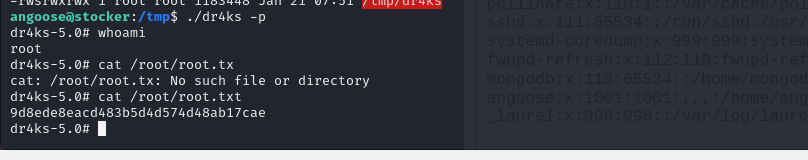