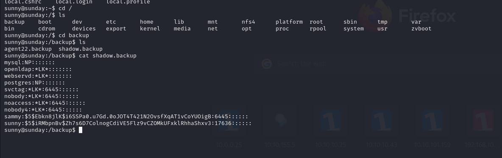

# [Sunday](https://app.hackthebox.com/machines/sunday)

```bash
rustscan 10.10.10.76
```


We see the open ports (79,111,515,22022) for our target, let's do nmap scan.

```bash
nmap -A -sC -sV -p79,111,515,22022 10.10.10.76 -Pn
```


From here we can see logins to Finger service.


Let's check finger service via 'finger' command.


Let's use this [script](http://pentestmonkey.net/tools/finger-user-enum/finger-user-enum-1.0.tar.gz) to enumerate users from Finger service.

```bash
./finger-user-enum.pl -U /usr/share/seclists/Usernames/Names/names.txt -t 10.10.10.76
```


We also detected on nmap scan that port 22022 runs ssh server, let's try to login with sunny:sunday credentials.


It worked, we are in.


After enumeration, we find interestning file 'shadow.backup'



We grab password hash from here, let's crack this with hashcat tool.

```bash
hashcat -m 7400 hash.txt --wordlist /usr/share/wordlists/rockyou.txt
```


We find password that is 'cooldude!'.


Now we can switch to 'sammy' user with this credentials (sammy: cooldude!)


user.txt


After making some enumeration, I see that we have privilege like this ( (ALL) ALL ).

For using this , I just do **`sudo -s`** and enter password of sammy user and be root.


root.txt

