# [SwagShop](https://app.hackthebox.com/machines/swagshop)

```bash
nmap -p- --min-rate 10000  10.10.10.140 -Pn
```

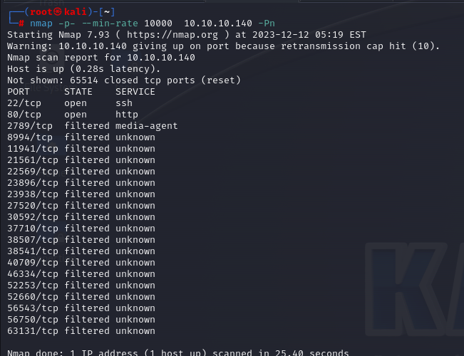

After knowing open ports(22,80), let's do greater nmap scan.

```bash
nmap -A -sC -sV -p22,80 10.10.10.140 -Pn 
```

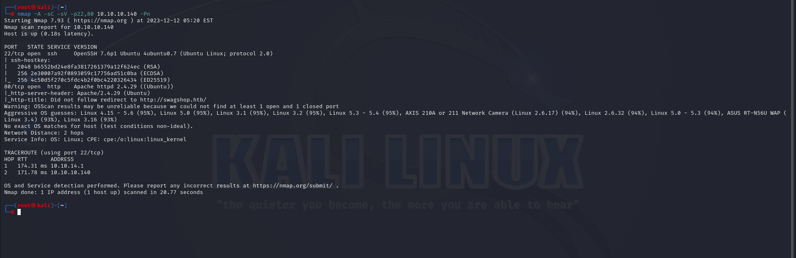


Directory brute-forcing.

```bash
gobuster dir -u http://10.10.10.140 -w /usr/share/dirbuster/wordlists/directory-list-2.3-medium.txt -t 40 -x php
```

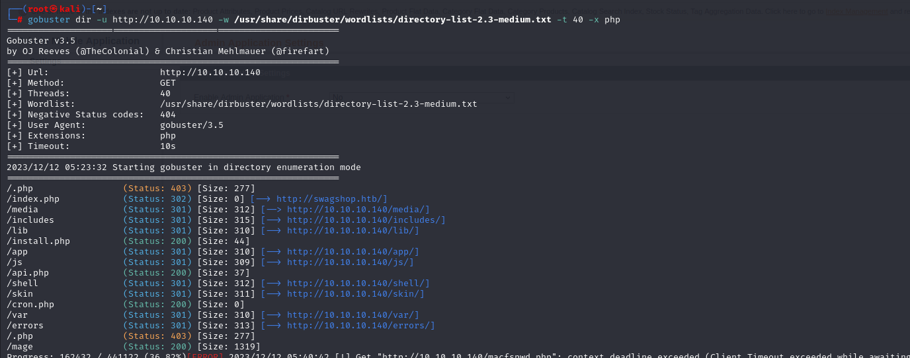

I need to add 'swagshop.htb' into **'/etc/hosts'** file.


I see that it is '**Magento**' application.

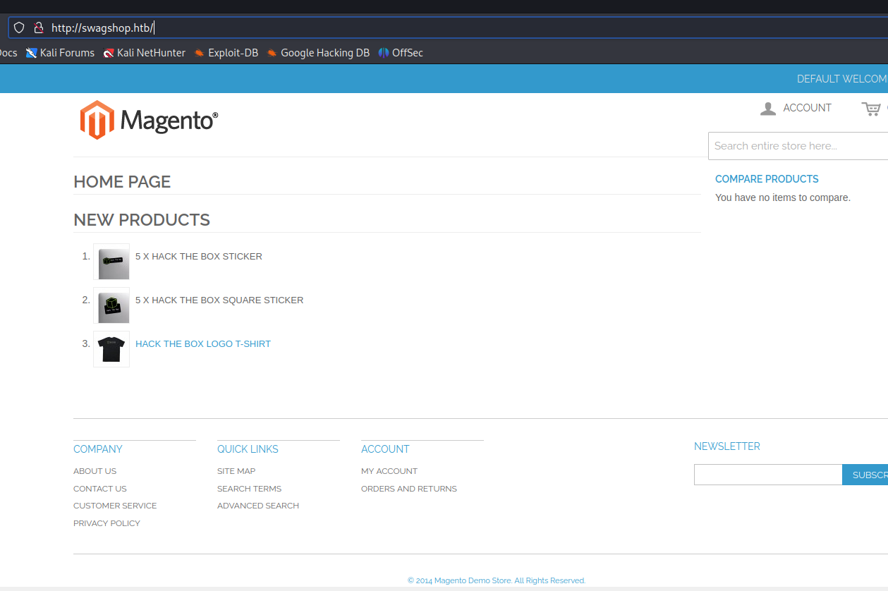

I also see '/index.php/admin' from Directory Brute-forcing. For this, I found exploit whose CVE id is CVE-2015-1397. I need to use [it](https://www.exploit-db.com/exploits/37977)


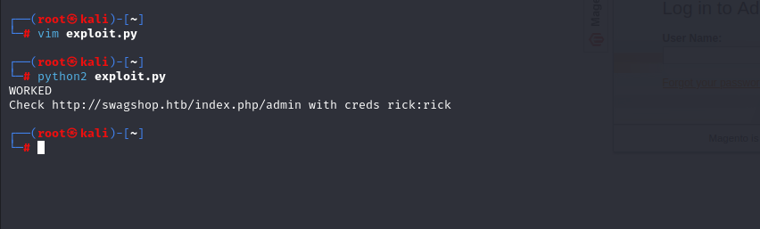


Now, I am on the Admin Panel.


First, we need to make 'YES' for 'Template Settings'

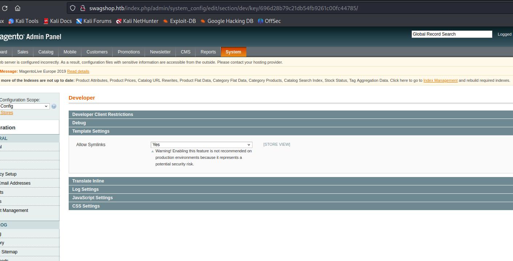


Then to bypass file upload restriction, we need to add 'GIF98 ' header into our malicious php reverse shell.

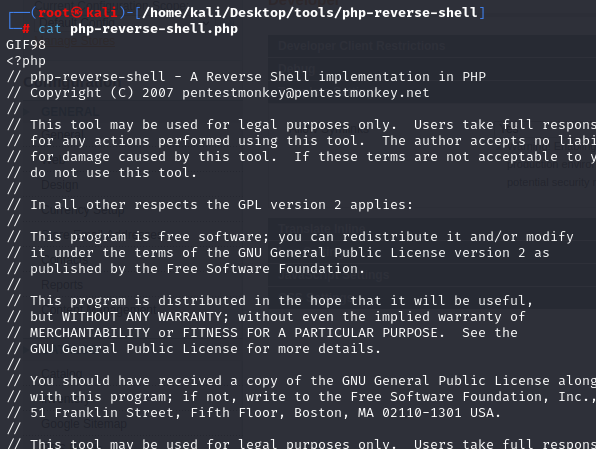

Also we need to change file extension from '.php' into '.php.png'

Now, we need to add 'Category'.

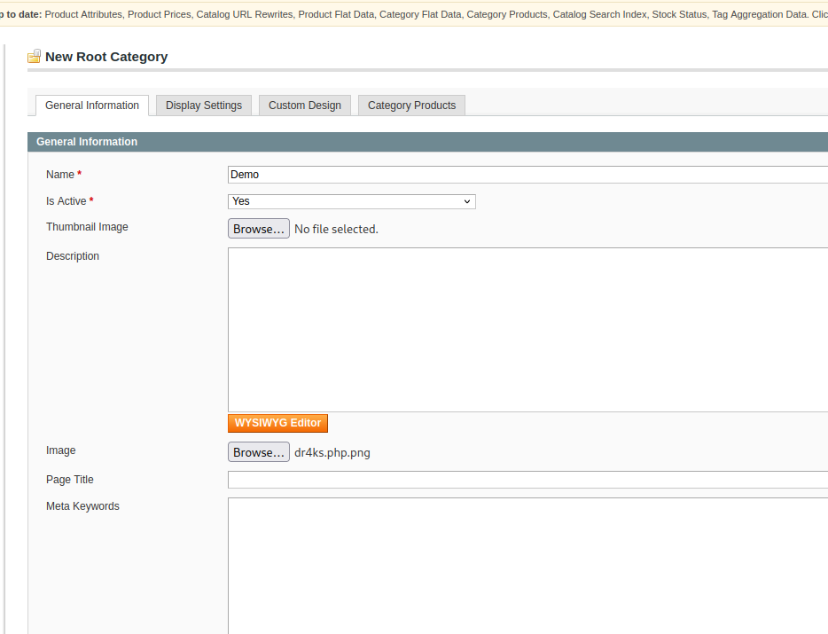


Now, we need to add Template.

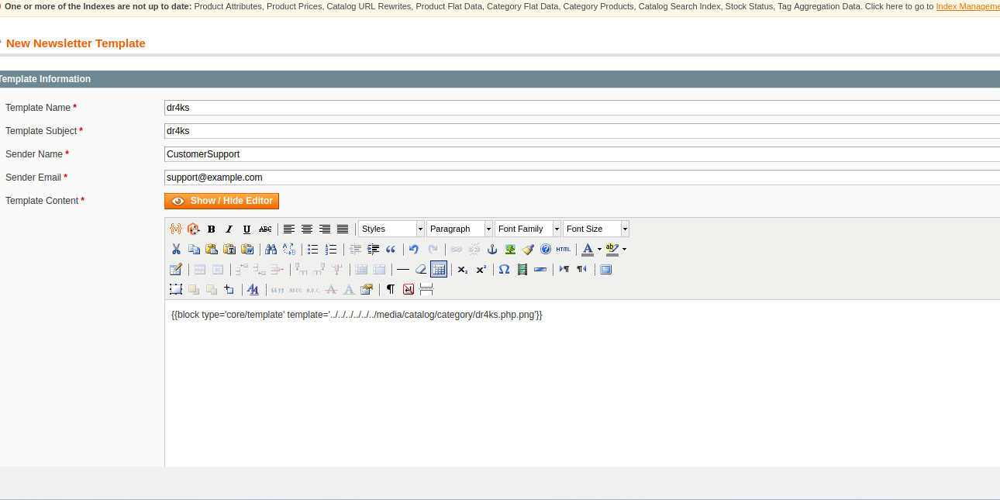


While we click 'Preview Template', our malicious php file will be exeuted.

I got reverse shell.

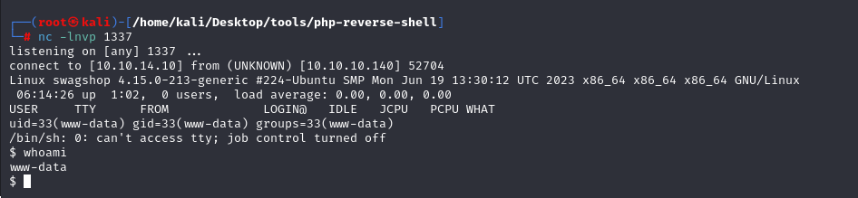


Let's make interactive shell.

```bash
python3 -c 'import pty; pty.spawn("/bin/bash")'
Ctrl+Z
stty raw -echo; fg
export TERM=xterm
export SHELL=bash
```

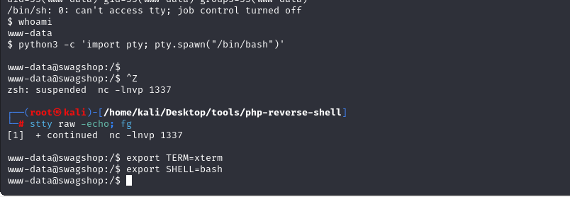

user.txt

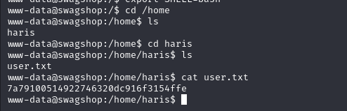


For privilege escalation, I just typed `sudo -l` command into Terminal.

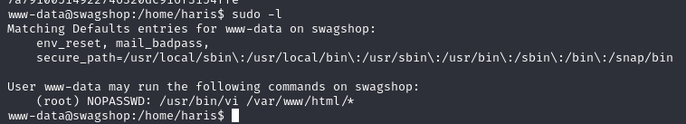


I see that my user has sudo privilege for `vi` binary. Let's search privesc technique from Gtfobins.

I found exploit from [Gtfobins](https://gtfobins.github.io/gtfobins/vi/#shell)

```bash
sudo /usr/bin/vi /var/www/html/*
:sh #got root shell
```

root.txt

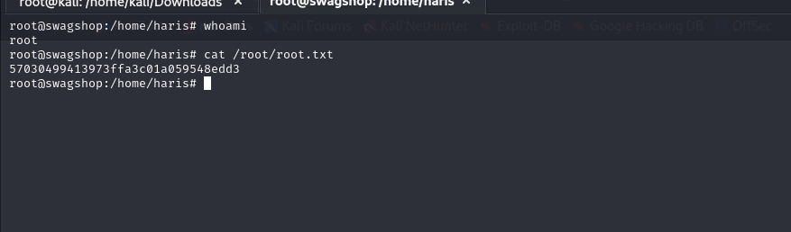