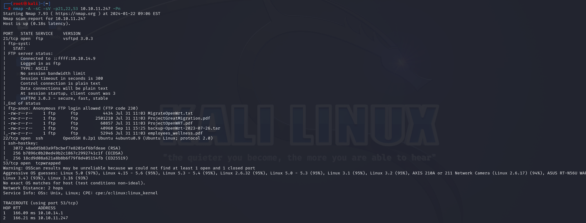

# [Wifinetic](https://app.hackthebox.com/machines/Wifinetic)

```bash
nmap -p- --min-rate 10000 10.10.11.247 -Pn
```


After detection of open ports, we can do greater nmap scan.

```bash
nmap -A -sC -sV -p21,22,53 10.10.11.247 -Pn 
```




As you see from input `anonymous` access is allowed to FTP service. Let's login and get some interesting data.

I got 'backup-OpenWrt-2023-07-26.tar' file from here.


After extraction, I found `wireless` file from `/etc/config` folder.


Let's login into machine via `netadmin` credentials.

netadmin: VeRyUniUqWiFIPasswrd1!


Let's connect into machine via `ssh` by using this credentials.

user.txt


For privilege escalation, I look at capabilities via `getcap -r 2>/dev/null` cmdlet.


We have capability for `reaver` command, we can do `WPS PIN Attack` via this [blog](https://www.hackthebox.com/blog/wps-pin-attacks-and-cracking-wps-with-reaver)


First, we need to get `interface` and `BSSID` value, for this we need to run `ip a s` command.


That's last one `mon0` interface and '02:00:00:00:02:00' value.

Let's start cracking via `reaver`.

```bash
reaver -i mon0 -b 02:00:00:00:00:00 -vv -c 1
```


I got password and pin from this attack.

That's password of `root` user.

root: WhatIsRealAnDWhAtIsNot51121!


root.txt


